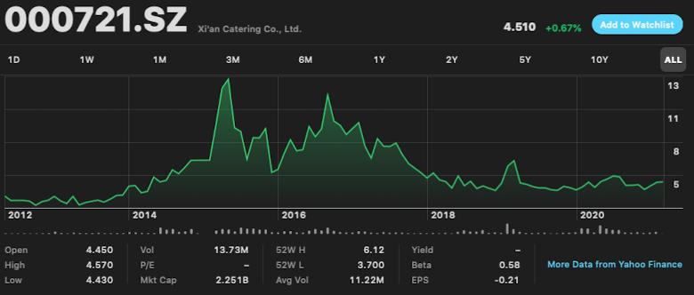
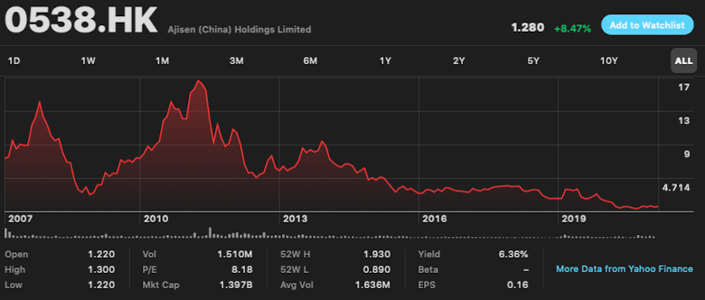
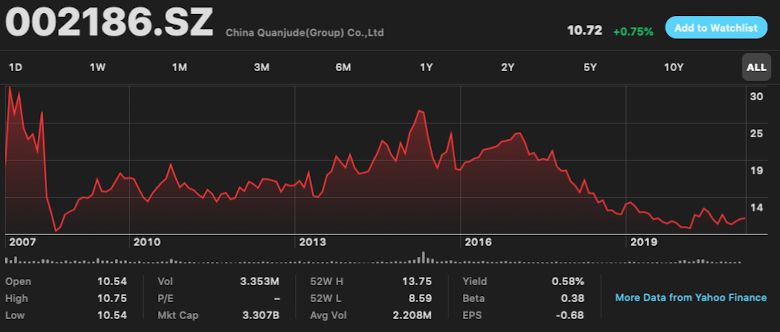

### [Source](https://xueqiu.com/5804298856/165749191)

整个餐饮行业没法出牛股，肯德基背后是房地产连锁赶上不动产升值，现在卖给中国投资人店铺升值黄金年代过去了，以后也不见得日子会好过，广州酒楼有工业化食品撑着还好。西安饮食，味千，鄂湘情，全聚德已经全部没落。租个昂贵的店铺，请大量员工卖点汉堡，包子，烤鸭，中餐是没办法让投资者发财的，个体户开餐饮风险可控可以发财。一旦上市要满足投资需求业绩增长要大量开店扩张是个高风险事业，整个行业是高房价的受害者，竞争激烈没任何护城河。

### 西安饮食

---

### 味千

---

### 全聚德

