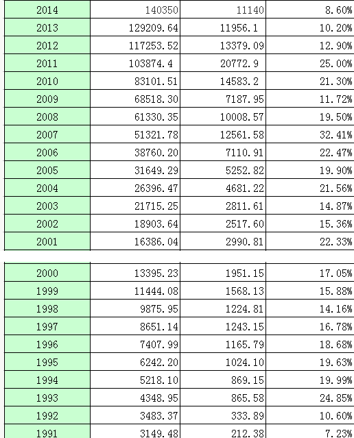
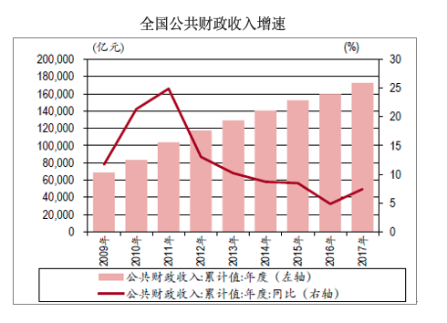

### [Source](http://headsalon.org/archives/1547.html)

2011.01.21

>这篇文章写于十年前，作者的担心已经成为事实。但2011年之后，中国财政收入的增速在大幅下滑，2020年较2019年甚至出现了负增长（当然是基于特殊情况），但2008年人们那么困难，财政收入仍然维持高速增长。中国这届政府对市场制度的维护功不可没，当然这也意味着长远来看铁饭碗不是一个好选择。接下来会附上几张图片，本来可以用 R 优化一下，以后再说吧。

日前，统计局和财政部同时发布了2010年度经济和财政数据，财政收入增速两倍于GDP增长率，已持续多年的财政扩张大幅超出经济增长的趋势，看来已难以扭转；尽管工薪群体和民营企业对日益沉重的税费已苦不堪言，经济学界对财政膨胀失控的警告也不绝于耳，但财税系统的专家们却仍继续宣称中国的税负水平偏低，然而，他们列举的理由是苍白无力的。

社科院财贸所、国务院发展研究中心等多家机构和学者的测算，都显示税负水平已超过1/3，这还没算上国企凭借行政性垄断每年获取的数万亿垄断租金；退一步讲，即便我们采信财政部学者的1/4这个数字，拿它与发达国家的数字直接对比，从而得出税负不高的结论，也是根本错误的。

首先，发达国家的财政支出中包含了很大比例的福利支出，而在中国财政中这一比例可以忽略不计；其次，这些政府所提供的公共服务的数量和质量都远远超出我们所能享受到的；最后，进入国库的税收只是政府给国民所带来负担的一部分，还有大量寻租收入和交易费用在账面上是看不到的，而这些负担的高低取决于行政效率和廉洁程度。

高税负和相应的财政膨胀，不仅带来直接的痛苦，弱化劳动、生产和投资激励，更糟糕的是，它和大规模国有化一样，将恶化整个社会的制度结构、激励机制和价值氛围，而一旦它为自己创造出庞大的受益群体之后，便很难再逆转。

近些年来，改革开放前期那种鄙弃铁饭碗、崇尚自主自立、以开拓和创业为荣的潮流，正在迅速消退，政府机关和垄断国企的职位再度成为众人争抢的金饭碗，这是社会激励机制上的大倒退，而随着财政不断膨胀，财政供养的人口在数量和地位上都将继续上升，旧的国有分配机制将再度成为资源分配、身份地位和价值评估的决定性力量，这一趋势与市场化进程是水火不容的。

中国财政历来具有“养人财政”的特性，即它的大部分开支都被用来维持人员和机构本身的存在和支付他们的耗费，只有少部分用于机构的法定公共服务目标，这一特点在地方政府表现尤为突出；养人财政的出现是因为对预算缺乏立法约束，而正因为缺乏约束，它会自动膨胀直至将可用预算耗尽，所以我们看到，尽管近年来财政收入始终以20%以上的年率高速增长，但预算依然年年赤字。

当然，财政膨胀总有一天会停下来，但那是在税基开始萎缩之时；当人才都在排队抢金饭碗，民企在税负重压下失去投资兴趣之后，那么，在下一个经济下行期中，财政将发现萎缩了的税基不再能供养已高度膨胀了人员；此时，国企将面临巨大压力来提供更多的岗位，而条件只能是放任它们进入原本已经退出的那些行业，但这样一来税基便会继续萎缩，这一循环最终将导致全面的再国有化。

如果养人财政仅仅是把钱发给财政所供养的人群，那倒还好些，实际上，机构为了获得合法性和体现存在价值，必须为自己找些事做，而最能显示重要性并令人难以忽视其存在的，就是审批、检查和处罚了，换句话说，就是为个人生活和企业经营设置障碍，由此而给国民和企业带来的成本，以及它所压抑的生产、投资和创新，代价远远高出它直接收取的税费。

对于企业和投资者来说，中国的营商和投资环境，在法治成熟度、程序透明度、行政效率和廉洁程度上，都没有多大吸引力，是低廉的劳动与土地价格和优惠的税赋补偿了这些方面的不足，才会导致过去十几年的投资热潮和民企扩张；现在看来，这两项补偿都已经或正在消失，而迅速膨胀的财政和行政机构规模又会进一步扩大原先的劣势，近来业界对投资环境的恶化前景所暴露出的担忧和非议，并非空穴来风。

各国的历史经验都表明，财政膨胀是条单行道，金饭碗给出去容易收回来难，人员精简吃力不讨好且少有成功案例；在西方，现代国家的发育经历几百年，随着政府日益变大，司法系统和市场制度也逐渐完善，财政扩张和国家发育是同步进行的，而中国的法治建设和政府体系现代化才刚刚开了个头，但财政扩张的空间却已早早耗尽，这将使得日后的制度建设缺乏必要的财政支持。

