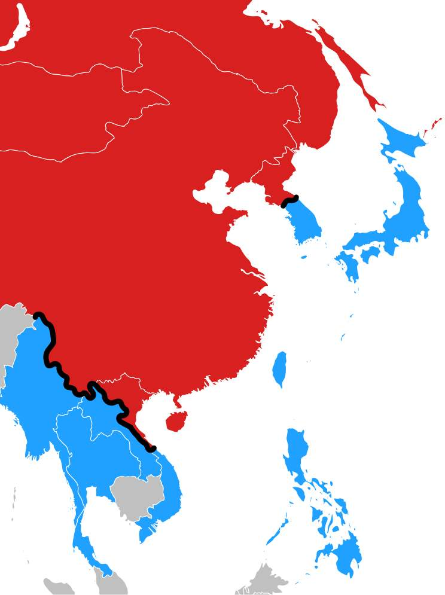
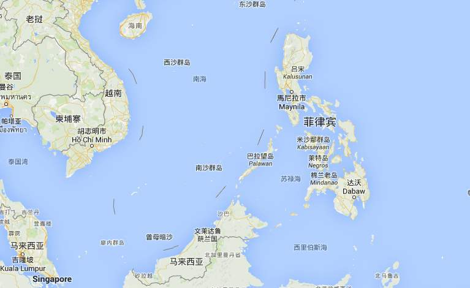
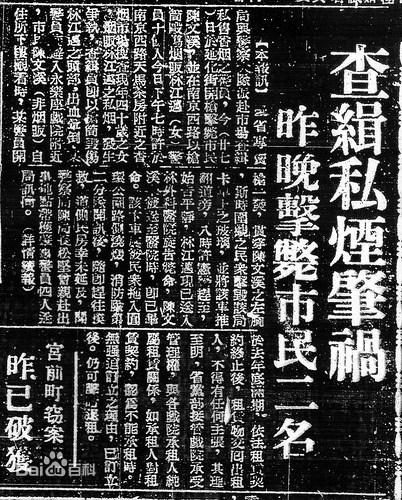
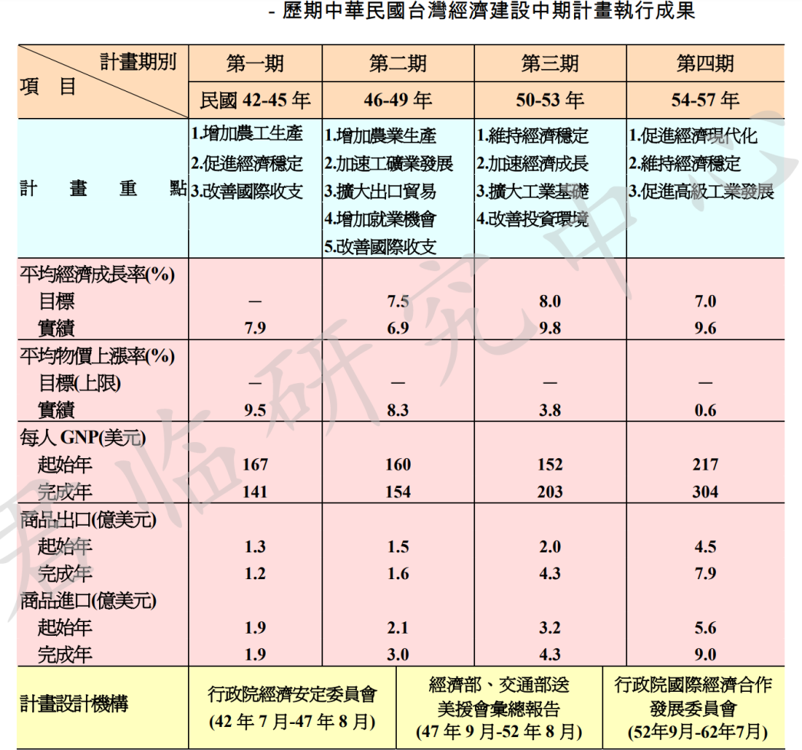

[Source](http://www.zhushiyao.com/?p=37691)

> 傍美姿势，道德主义，而不是价值观外交

 这段时间，中美谈判推迟，到取消，再到商定通话，一波三折。
虽然现在民族主义情绪高涨，揭批美帝的文章满天飞，但说归说，大家都竖起耳朵，言不由衷的紧盯着中美之间那些事。

内心里，从庙堂到民间，都认同“没有一条理由把中美关系搞坏。”

为什么要搞好关系呢，曾负责入世谈判的官员就打了个很中国的比喻：

“和一把手的关系处理好了，你的日子就好过，这跟在一个单位中的情况类似，二把手和一把手的关系处坏了，不仅三把手、四把手、五把手离你远远的，如果大家知道你和一把手关系不好的话，连司机都敢欺负你。”

也许这就是所谓的“傍美”吧，但类似表述，早已有之。

70年代末打开国门，“傍美”就作为一条定律被提出。

1979年1月，历史上最重要的访美启程，在太平洋的上空，陪同访美的社科院美研所所长问，刚提出改革开放，为什么就急着要访问美国？

他想了想，答道：

“我观察了很多年，得出一个结论，在过去几十年里，凡是和美国关系好的国家都富起来了。”

总体上，定律没有错，但魔鬼在细节中。

二战后，老牌殖民帝国全线收缩，亚非拉地区民族解放和独立运动风起云涌。

各路党派、政客、军人们粉墨登场，在过去的殖民地、传统社会建立起一个个国家，在联合国登记了球籍。

尽管他们打着各式旗号，举着不同的主义，也许胸怀理想，又或许各怀鬼胎。

但至少有一点相同：

宣称要建立富强的现代文明国家。

可70多年过去，大部分国家失败了，成功的国家寥寥无几。

写《历史的终结》的福山，在目睹“自由民主制未能够征服世界”后，反思数十载，又写了在方舱医院中那位小伙读的那本《政治秩序的起源》。

从终结走向起源，这一次，他的问题是——“为什么自由民主制尚未能够征服世界？”

依然高举资本主义道路和理论自信的福山，还是认为，拥有现代自由民主制的国家更容易成功。

而现代自由民主，需要结合在稳定的平衡中的“福山三件套”：

1. the state; （国家构建）

2. the rule of law; （法治）

3. accountable government.（能被问责的责任政府）

三件套是怎么来的呢？

在芒格推荐的《国富国穷》中，作者的视角放在现代世界的形成时期，并提出一个“傍英定律”。

与谁同行，决定国家的命运，欧洲发达国家基本上都是受到英国的影响。

甚至英国的前殖民地都发展的不错，而拉丁美洲到现在为止，都受西葡文化的拖累。

不过这个定律似乎不准，因为很容易找到反例。

作为前殖民地的印度，宗主国给印度留下了一整套的英式自由民主制度，可发展就远不如香港。

摊开世界地图可以发现，战后崛起的国家和地区，无非是东亚四小龙和以色列。

四小龙里的香港和新加坡，似乎就有“三件套”，作为英国人的遗产，留下了法治传统和高效率的文官系统。

但有意思的是，韩国和台湾，就和“三件套”不太相符。

这两个在六七十年代经济起飞的国家和地区，既没有英美殖民统治，也没有西方文化底蕴，更没有民主，更别提什么XZ。

既然是六七十年代，那就有必要看看冷战时期的亚洲势力范围。

可以看出，尽管四小龙内部制度截然不同，但都面临着严重的外部问题。

要么处在冷战前线；

要么面临外部威胁。

韩国在朝鲜战争中险被金将军赶下大海，委员长则是败退孤岛，苟延残喘。

换言之，都急迫需要美国提供保护和援助。

香港情况有些曲折，本来宋美龄做通了罗斯福夫人的工作，枕头风一吹，罗斯福就嚷嚷着要将香港交还中国。

可委员长日记中那个“狭隘浮滑自私顽固”的丘吉尔从中作梗，说想收回香港，除非over my dead body。

当然，英国继续占着香港，就避免了同大陆一起被关入铁幕，也为新中国留下一扇与西方世界交往的窗口。

战后英国工党上台，大搞国有化，被评“工党误国”，年老色衰的大英帝国对殖民地的强力控制，也难以为继。

冷战开始，美国扛起了前英帝国东亚领地的保护责任。

假如美帝不来挑这个头，很难说香港能保住其自由港的地位。

而离前线很远的新加坡，看似安全，实际上夹在东南亚反华人的各类神棍政权包围圈中，又占据黄金海道。

所以新加坡政治上紧跟美国，充当美国在东南亚的代言人，就一点也不奇怪。

想当年我国对新加坡“美帝国主义走狗”评价，一点也不冤。

在阿拉伯世界包围圈中的以色列，那就更不用提了。

而那些不太需要美国的国家，就不行。

典型如菲律宾和印度。

作为美国和英国的前殖民地，两国都照搬了宗主国的法律、制度，乃至文化。

尽管咖喱味很浓，印度也算拥有高比例英语人口。

菲律宾，那更是全盘美式，即便在贫民窟中，也是满口美式英语。

别看印度现在跟美帝眉来眼去，但历史上美国选择了巴基斯坦，印度其实选了苏联当靠山。

印度有两大敌人，巴基斯坦和中国。

一个迫在眉睫但不算危险，一个虽然危险但山高皇帝远。

可见，散装印度对外援和保护的需求，并不迫切。

远离冷战前线的菲律宾，离大陆很远，与周边国家隔海相望。

既然能挟洋自重，那也对美国的保护，需求不高。

美国对菲律宾反而有些一厢情愿。

无论是殖民的历史纠葛，还是控制关键航道上的要点式扩张，又或是抵抗CP在东南亚的扩张，乃至越战的后方基地，在菲美关系中，美国更加主动。

但然并卵，浓眉大眼的杜特尔特还不是叛变了革命。

到此，可以姑且小结一下：

所谓“傍美”本身，并不能保证国家崛起，现代化转型成功。

真正的关键，在于“傍美姿势”。

只有当国家面临迫在眉睫的安全问题，才会心甘情愿的需要美国，从而接受美国的改造。

当然，事情也没那么简单。

众所周知，美国人有个毛病，喜欢满世界推销他们的理念。

但不是他们现行的制度，而是他们理想中的理念，无视理想与现实的差距。

正所谓外交是内政的延伸。

按照亨廷顿对美国政治的解读。

**理想与现实之间的鸿沟，一直是美国政治的中心话题，存在道统和治统之争。**

即：美国人普遍信仰自由、民主、平等和个人主义理想，但这些理想与现有制度存在一定差距。

例如一支强大的美国军队，就不符合美国的理想，因为强大的军队可能会镇压人民。

作为一个民权国家，美国社会深刻、广泛地信仰平等和自由。

只有这些，才使得美国这个多种族国家完成“the state”（国家构建）。

其实核心价值观的作用，也是类似。

失去这些理想，失去为实现理想而付出的努力，美国就会变成没有存在意义、没有集体认同、没有政治文化，甚至没有自己历史的国家。

而这些理想和追求，从根本上带有反政府、反权威的特色。

以至于其规范秩序和既存秩序间的矛盾，比其他国家大得多。

传统的印度显然比现代的美国更加不平等，但显然，现代的美国也比传统的印度更加不和谐。

那么自由的政治理想与半自由的政治体制之间，就始终存在紧张关系。

美国政治也就注定“乱糟糟”。

面对鸿沟，美国人形成了四种心态：

道德主义、犬儒主义、冷漠自满、自欺欺人。

所谓道德主义，就是美式“实践是检验真理的唯一标准”，正视理想与体制现实之间的鸿沟，并努力消除裂痕。

其他三种则是否认、忽视、忍受。

就像人吃饱了才会瞎折腾一样，也正是因为改造对象存在迫在眉睫的安全问题，所谓危机倒逼。

美国人才会践行道德主义，实事求是的进行改造。

我国台湾省，就是一个绝佳的例子。

前几十年的台湾，由一个军事强人主导的列宁式政党实行专制统治。

没有民主，法治无从谈起，XZ更是天方夜谭。

但硬是崛起了。

这不仅出乎大陆意料，也出乎所有政治学家和经济学家的意料。

大陆人民了解台湾的经济改革，一般看《台湾经济改革故事》。

书写的不错，但拔高了以尹仲容为代表的台湾技术官僚在改革中的作用，夸大了国民党政工官僚的博大胸襟。

不知有意还是无心，作者忽略了美国在台湾崛起中起到的决定性作用。

要知道，从1950年6月朝鲜战争爆发到1960年代中期，台湾接受的美援总额达41.5亿美元。

50年代，台湾GDP仅在16亿左右徘徊。

美援到来前，台湾财政赤字高达14.5%，1951年就陡降至4.7%，通货膨胀更是从88%降低至个位数。

正所谓吃人嘴软，拿人手短，手握重金，美国人才能理直气壮的干涉台湾内政。

国共两党，是中国革命的双生子，这两个列宁式的政党，都领过卢布，深受苏联影响，满脑子都是计划经济。

实际上，从45年台湾光复到50年，台湾搞的就是以公营企业为主、决策当局严格管控的统制经济体系。

引起台湾严重撕裂的“二二八事件”，起因于烟酒专卖局查缉私烟，与民争利，暴力执法引起。

此时的台湾经济，和大陆国统区经济一样，处于恶性通胀的崩溃旋涡之中。

50年1月，美国公开宣布，不再介入中国内战，不会向台湾提供军事援助和军事顾问。

但6月朝鲜战争打响，美国改变远东战略，第七舰队开往台湾海峡。

这下，就算捏着鼻子，也要援助委员长了。

随着美援的大规模到来，亚细亚弃儿的命运开始迅速逆转。

没过几年，国民党就进行了第一次财经大辩论，开始“改革开放”，经济体制开始向市场转轨。

很难说这是巧合。

不难想象，没有美国人的提携，或者说监督，百年烂党怎么可能在经济改革上打败他的宿敌。

美援不是简单撒币，与美援一同来台的，还有“三驾马车”——“大使馆”、经援使团、军援顾问团。

他们的工作不是简单的美援派拨。

实际上，其中心任务是帮助台湾建立具有长远发展潜力的经济。

怎么帮助呢？

刚开始，美国政府训令是：

“不应该公开地或暗地里向中国人发布命令”

但很快，驻台机构就让上峰收回“建议而不命令”的训令，改为：

“更具强制性的政策”

背后逻辑很有意思，因为委员长那帮党棍军棍，拿了钱就想买枪买炮，做的都是“反攻大陆”的迷梦。

委员长可以白日做梦，可美国人并不想买单。

所以军援顾问团的工作重点，就是敦促台湾当局裁减军队和限制其军费开支。

当然，要“强制性”的具体介入台湾经济建设，还需要一个“杠杆”。

由技术官僚主导的，与美驻台机构对口的美援运用委员会，就是最重要的“杠杆”，负责设计和协调台湾总体经济发展计划与政策。

论级别和影响力，这个机构大致相当于大陆的中央财经委员会。

一向瞧不起国民党，半心半意援助的美国，最烦国民党的政工官僚，一般会把技术官僚视为国民党政权中的健康成份。

而技术官僚也倚重这种关系，加强自己在国民党政权中的地位。

值得一提的是，美援会独立于国民党政权正常的立法和行政程序，日常行政开支直接来自美援，不在国民党当局行政经费中拨取。

最小化了党棍军棍的干扰。

通过这种“杠杆”，美国完成了对台湾内部事务的渗透。

更关键的在于渗透细节。

美驻台机构在提供政策建议，参与政策制定时，并没有刻意遵循西方自由市场经济的理念和原则。

因为他们在实际工作中发现：

由于缺乏必要的经济和制度基础，马歇尔计划的经验无法照搬到欠发达的台湾。

推行发展援助计划必须通过和倚重当地政府。

岛上的美国官员清楚，他们最终目的是帮助国民党生存下来。

为此，只能用经济实用主义，而非抽象的美式自由民主观念去处理问题。

他们推动台湾经济发展的方向，大体上与国民党技术官僚想法一致，并与之一道设计和推动了台湾版的“五年计划”——“经建计划”。

共同促成了后来在美国受到广泛批评的“干预主义”或“国家社会主义”的工业化政策、战略和制度体制。

这就是我们所熟悉的东亚模式，国家强力介入经济，从进口替代，到外汇跳贬，进而建立出口导向型经济，渐进式完成了工业化，最终完成市场化的全面转轨。

60年代，台湾经济继续保持增长两位数以上的增长率。

1970年，以美元计价的台湾的GDP已经是1960年的3倍多。

70年代，台湾的经济腾飞，1973年，经济增长率高达29.89%；而1974年达到了惊人的34%。

1980年，以美元计价的台湾GDP达422亿美元，十年间翻了7倍之多。

实际上，日后的大陆也复制了台湾曾走过的路。

总体上，台湾建立了市场经济得以运行的制度基础，诸如人身自由和私有财产，维护了国内和对外的自由贸易。

问题也就来了。

一个半计划经济的台湾做到了，为什么印度菲律宾、甚至拉美的右翼威权政府没有做到？

很简单，宣称走资本主义道路，和建立市场制度，两码事。

需要一个支持自由市场的“法统”来规范政府行为，压制权力干扰，维持市场秩序，确保市场经济路线不偏不斜。

这个“法统”，要么来自内生的政治结构，要么来自外部强加的约束。

然而，产生内生“法统”的条件极为苛刻，概率极低。

所以几乎只能指望外部约束——也就是美国。

要抵御外部威胁，必然需要维持与美国的良好关系。

当政者被迫接受美国的制度标准，其中包括人身、财产保护、自由贸易，甚至起码的政治自由。

无意间，美国既当了总设计师又当裁判员，扮演了规则制订者和最终裁判者的角色。

所以说，东亚的经济奇迹，不能只顾东亚国家的努力，也要考虑美国在远东的历史行程。

如果我们用“傍美姿势”的视角来审视国际形势，我们担忧的是：

印度是否也悟出了“傍美姿势”的精髓？

自中美关系急转直下以来，印度也开启了暴走模式，所谓疫情转移危机，那只是表象。

当前，印十万大军集结班公湖，十一月就要封山了，战与不战，只在一念之间。

印度人很清楚，散装印度打不赢一场群架，更别说一场边界冲突，印度无法对抗强大的中国。

但并不妨碍他们赌上一场国运。

掉到粪坑里的狗也是狗，是麻烦的纠缠者。

交上这一面战败的“投名状”。

一来，塑造一个强敌，可以强化民族意识，加强统治集团对国家控制能力；

二来，“苦肉计”可能让美国在印太战略上加码；

三来，战败凝聚共识，从庙堂到民间，印度可能放弃莫名其妙的骄傲，彻底接受美国的全面改造。

如果通过一场战争，让印度从“消极傍美”转变到“积极傍美”。

在中国边陲，崛起一个拥有大量年轻人口的强国，虎视眈眈。

一定不是中国人希望看到的。

