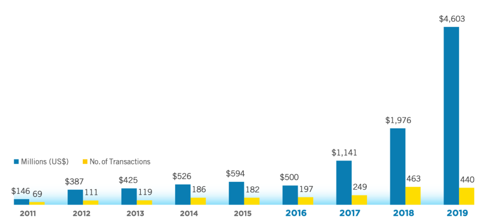
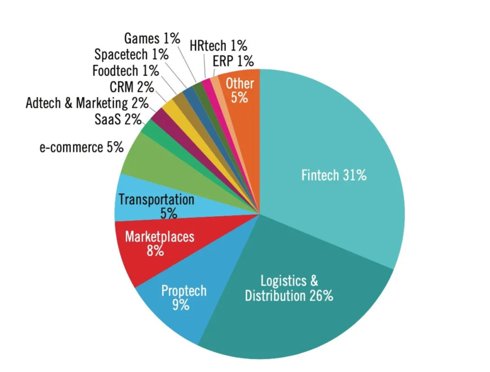
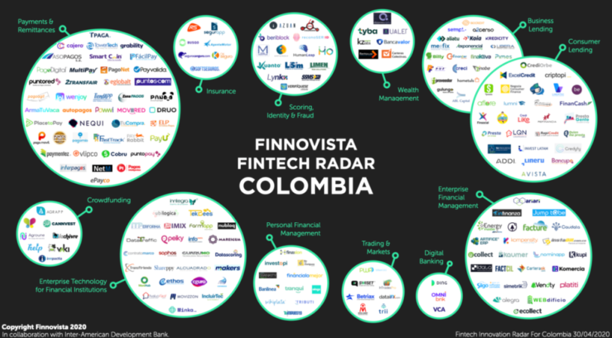
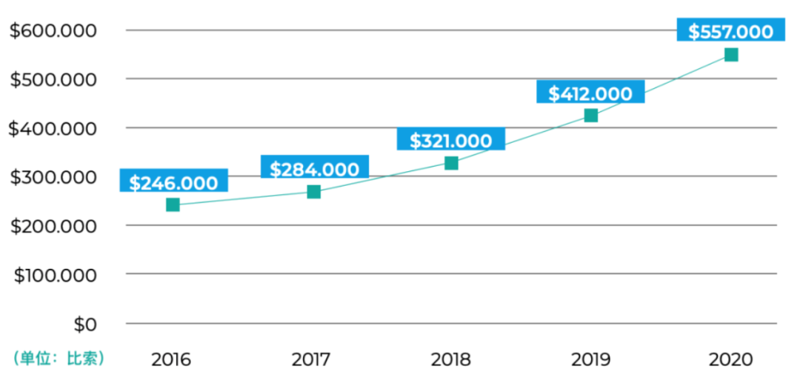

### [Source](https://www.36kr.com/p/1151684607394945)

> 这篇文章图片问题没有搞定，不知道为什么

>如今的哥伦比亚，是拉美经济发展最稳定、营商环境最佳、最具创新活力、吸引VC投资最多的国家之一。

今年2月初，哥伦比亚独角兽 Rappi 宣布正式推出 Rappi Bank 和 Rappi Travel。Rappi Bank 帮助客户管理账单、进行支付和贷款，类似国内的“支付宝”，而 Rappi Travel 则像是拉美版的“携程”。

诞生于2016年的跑腿服务平台 Rappi，从最初的送外卖，到衣食住行吃喝玩乐的电商平台，到共享出行的入口平台，再到移动支付的互金平台。5年狂吸17亿美元 VC 资金，已经扩张到9个拉美国家。成为拉美的超级互联网帝国，只是时间问题。

Rappi 的飞速发展应证了拉美近2年创投市场的腾飞，19年拉美创投融资额超46亿美元，其中哥伦比亚仅一国融资额就高达10.9亿美元，为拉美第二大创投融资国，远超墨西哥、阿根廷、智利等国家。

## 哥伦比亚宏观经济格局

哥伦比亚是拉美第4大经济体，国土面积约是英国的5倍，人口近5000万，根据世界银行数据，2019年 GDP 年增长率约3.3%。如今的哥伦比亚，是拉美经济发展最稳定、营商环境最佳、最具创新活力、吸引 VC 投资最多的国家之一。

2010年，哥伦比亚颇具战略眼光的信息科技部长 Molano 颁布了一项宏大的互联网发展政策，名曰“数字生活计划”。这项互联网战略的结果是喜人的：哥伦比亚成为拉美第一个实现全国互联网全覆盖的国家，也是拉美第一个用上 4G 通讯网络的国家。城镇的互联网渗透率从17%跃升到了100%，小微企业的互联网渗透率从7%上升到了70%，全民互联网渗透率从35%上升到65%，数百万计的家庭得到了政府的互联网补贴，数百万的中小学生在学校用上了 PC、平板等电子设备。政府的这项“数字生活计划”在达沃斯被以教科书案例来展示，政府也因此获得了全球最佳科技政策奖。

## 哥伦比亚投资机会

### Fintech

在拉美创投众多明星赛道中，Fintech 独领风骚，占据了约三分之一的融资额。哥伦比亚，作为拉美互联网创新的先驱，则是 Fintech 发展的风向标。

（来源：LAVCA Industry Data）

（来源：Finnovista）

根据 Finnovista 发布的最新数据，哥伦比亚 Fintech 板块增长达26％。在目前活跃的200家初创公司中，今年初获660万美元融资的 Aflore 引起了广泛关注。位于哥伦比亚首都波哥大的 Aflore 是由 Polymath Ventures 孵化的金融科技公司，被选为全球50家领先的金融普惠公司，去年曾获 Accial Capital 1000万美元投资。自2014年以来，Aflore 向个人和企业发放贷款超过2.5万笔，总价值近2000万美元。

Aflore 是一家正在改变哥伦比亚人贷款方式的公司，其独创的“顾问委员会”模式是成功的关键之一：“我们拥有一种创新模式，即通过顾问网络提供贷款。这些顾问是客户和 Aflore 之间的桥梁，他们负责向周围亲密的朋友，家人和熟人提供财务服务，并且每获批一笔贷款，顾问就会赚取佣金。”

### 配送应用 

说起疫情期间迅猛扩张的板块，就不能不提到配送行业。据 statista 调查，哥伦比亚最受欢迎的配送应用是超级应用 Rappi 和 Domicilio。作为拉美近年来发展最快的公司之一，Rappi 仅在波哥大就拥有25,000多名送货员，疫情期间占领了哥伦比亚61%的配送市场。据 Rappi 总经理 Matías Lask 称，疫情前，该公司 APP 月下载量约为1万次，但到2020年7月疫情严重时，需求暴增，应用程序总下载量已达60万次。

### 电商

作为拉美唯一拥有电子商务部的国家，哥伦比亚政府对电商发展给予了充分的重视。2020年上半年，拉丁美洲的电子商务销售额增长率达到了惊人的230％。在五千万哥伦比亚人中，将近3400万是在这个期间开始使用互联网，其中，约有2200万成为在线购物买家。目前，哥伦比亚被认为是拉美第四大电子商务市场，预计到2022年将产生60亿美元的电子商务销售额。

2020年，哥伦比亚人均电商消费支出为557,000比索（约合150美元）。纵向来看，该数据与2016年的246,000比索（约合69美元）相比增长了125％；横向来看，哥伦比亚的人均数额已超拉丁美洲的平均水平（约132美元）。

（来源：Black Sip）

目前哥伦比亚市占率最高的几家电商平台都是非本地公司，包括阿根廷的 Mercadolibre 和 Mercadoshops、巴西的Dafiti和墨西哥的 Linio，这也从侧面反映出哥伦比亚市场的开放程度和拉美电商的活跃程度。在本地，哥伦比亚具有代表性的电商初创公司包括提供数字转型服务的 BlackSip 和社交电商 Elenas。

### 互联网医疗健康

疫情加速了在线应用和数字技术在哥伦比亚各个领域的普及。其中，互联网医疗和在线教育已实现了显著增长，并为寻求机遇的投资者和外国科技公司带来了难得的机会。由于疫情封锁，在学习和医疗方面，人们越来越多地转向线上服务。

据 statista 统计，截至2020年5月，拉美在线医疗预约总数达到近150万，哥伦比亚的各类在线医疗平台也在疫情期间得到了飞速发展。2020年9月，1Doc3 总共获得了69万次访问；疫情期间，doc-doc 平台上在线预约量增加了300％；专注隐形眼镜的平台 Lentesplus 目前已获约3170万美元融资，是哥伦比亚获融资额最高的 Health-tech 公司之一。

## 哥伦比亚 VC 生态概览

### 哥伦比亚主要 VC 及 CVC

哥伦比亚头部 VC 机构
1. Acumen LatAm Capital Partners（ALCP）：ALCP 专注早期阶段，重点投资哥伦比亚、秘鲁和中美洲的农业、教育和能源等领域。投资组合包括SunColombia，Crehana 和 Levee 等公司。

2. Ewa Capital：前身为 Mountain Nazca Colombia，是一家由女性领导的风投基金。投资重点在教育、医疗保健、金融服务和零售。投资组合包括 Platzi，Mercqueo 和 1DOC3 等公司。

3. InQlab：InQLab 投资种子阶段和 A 轮，每笔平均投资金额为30万美元。投资组合包括 Lentesplus，Laika 和 Mesfix 等公司。

4. Impulsum Ventures：专注于种子轮投资。投资组合包括 Sempli 和 Vozy 等公司。

5. Magma Partners：起源于智利，在哥伦比亚、墨西哥、美国和中国均设有办事处。投资组合包括 Truora 和 Omnibank 等公司。

6. Odiseo：得到国内外投资者广泛支持的风投基金。投资组合包括 Mesfix 等公司。

7. Velum Inverlink：专注于拉美初创企业种子轮投资。投资组合包括 OFI，Hogaru 和 Merqueo 等公司。

### 哥伦比亚头部 CVC 机构

根据 Wayra 的研究，仅在2019年，哥伦比亚的企业就向初创公司投资了5000万美元（其中50％流向风投）。与其他国家不同，哥伦比亚的企业非常愿意投资于初创公司，而不仅仅是通过商业联盟进行合作。

1. Bancolombia Ventures：Bancolombia 的风投部门。Bancolombia 是哥伦比亚最大的银行之一。投资组合包括 Plug＆Play Fintech 等公司。

2. FCP Innovation：4000万美元的投资基金，重点关注应用于公共服务领域的高科技创新企业。投资组合包括 Leal，Choice 和 Playvox 等公司。

3. Veronorte：主要投资于保险、健康和金融服务领域的公司，以及能源、基础设施和建筑领域的公司。投资组合包括 Alkanza 和 Acsendo 等公司。

### 企业加速器/孵化器

1. Antwerp Ventures：专注于食品和饮料行业的初创公司，种子阶段累计投资约为1.5万美元。

2. BICTIA：由挪威政府资助，主要投资于技术型企业（人工智能、大数据、物联网、电子商务等），去年旗下公司销售额超5.5万美元，过去三年的增长率超20％。旗下创业公司包括 Ruedata 等。

3. CorporaciónVentures：哥伦比亚初创公司加速器。旗下创业公司包括Going，Coschool 和 Holi 等。

4. Polymath Ventures：Polymath 是全球少数集创业设计、孵化、投融资、运营、和创新咨询于一体的新型企业。旗下公司覆盖金融、出行、电商、房地产等多个行业，在拉美多个国家开展业务。旗下创业公司包括 Aflore，Elenas 和 Vincu 等。

5. Rockstart：起源于荷兰的创业加速器和风投基金，在哥伦比亚设有办事处。重点关注人工智能、区块链和传感器等前沿技术。旗下创业公司包括 La Manicurista和 Foody 等。

### 政府创新机构

1. Apps.co：由哥伦比亚信息技术和通信部组建，旨在促进技术类初创企业的创建和发展。专注于移动应用程序、软件和内容开发领域。自创建以来，Apps.co已经与2,175个团队和公司达成合作。旗下创业公司包括 Peiky，Vozy和Datagran等。

2. iNNpulsa Colombia：是哥伦比亚政府、工商部及旅游部合作创办的企业家创新机构，负责促进哥伦比亚初创企业的发展。旗下创业公司包括 Ecobot，Paqua和 Smart Coin 等。 

3. Ruta N：哥伦比亚第二大城市麦德林的商业创新中心，其创立是为了推广技术和创新以及先进的商业理念。

### 天使投资人

哥伦比亚的创业生态系统中，投资天使人和家族办公室十分活跃。

1. B2 资本：B2 资本由Rappi的联合创始人 Andrés Bilbao，以及 Truora 的联合创始人 Daniel Bilbao 创建。

2. INVX：位于麦德林和波哥大的风投基金。投资组合包括 OFI，TPaga 和 Foody 等公司。

3. Red de Ángeles Inversionistas：位于麦德林，在全国多个城市进行了近50笔投资。投资组合包括 Ayenda，Liftit 和 Rebus 等公司。

4. Ventura：总部位于哥伦比亚的家庭办公室，主要投资拉美、中美洲和墨西哥的初创企业。投资组合包括 Rappi，Truora 和 Vueltap 等公司。

### 国际投资者纷纷押注哥伦比亚

2019年3月，软银宣布设立50亿美元的 Softbank Innovation Fund（SIF），用于定向投资拉美的科技企业。消息一出，全球资本掀起了一波进军拉美的热潮，使得当年拉美初创企业获得的 VC 融资总额相比2018年翻了2.3倍。同年4月，Softbank向哥伦比亚跑腿平台Rappi投资10亿美元，这是拉美科技公司中迄今最大的一笔融资。2020年2月软银宣布为上述 SIF 追加10亿美元，又在一年后注资2亿美元成立了面向拉美科技企业的特殊目的收购公司（SPAC）。

阿里巴巴、滴滴、腾讯等中国互联网巨头也陆续布局。近日，阿里巴巴与哥伦比亚政府创新创业服务平台 Ruta N 达成合作，内容包括建立IT中心、为约200名企业主提供培训、孵化当地企业，计划将“拉美硅谷”——哥伦比亚第二大城市麦德林打造为拉美电商中心。

阿里巴巴

据世界银行报告，受疫情影响的哥伦比亚经济有望在2021-2022年迎来复苏反弹，特别是在科技产业的助力下。复苏向好的经济环境下，企业生态系统的建立、政府的支持、国际资本的涌入，都势必会给哥伦比亚带来实现超越的机会。

