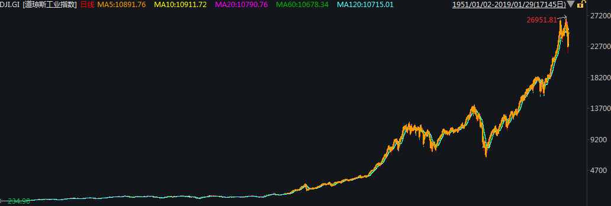
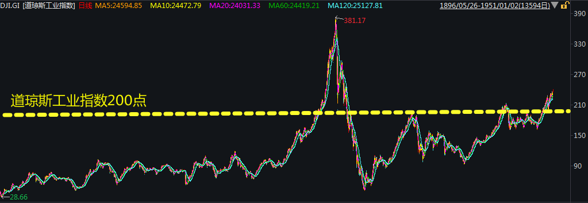
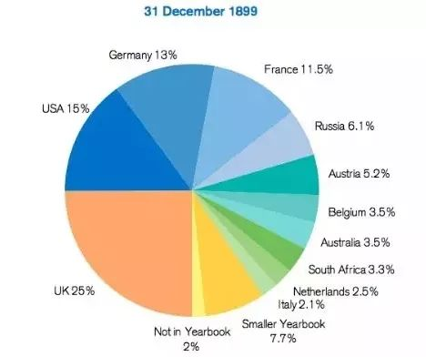
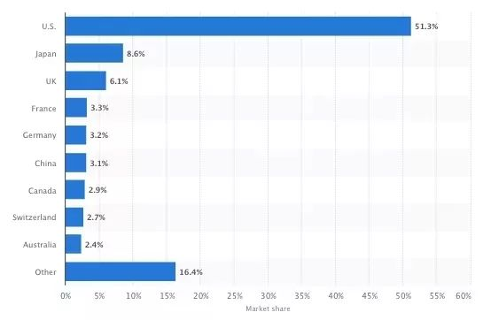
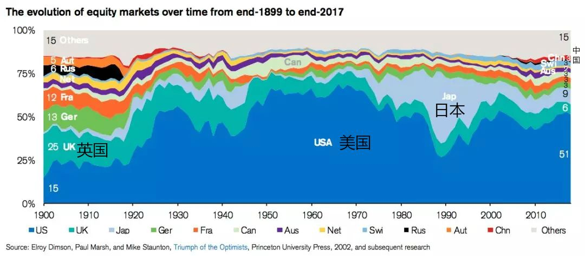
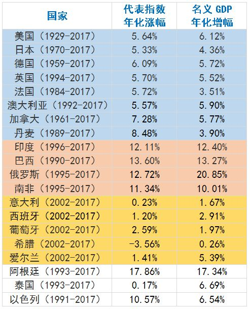
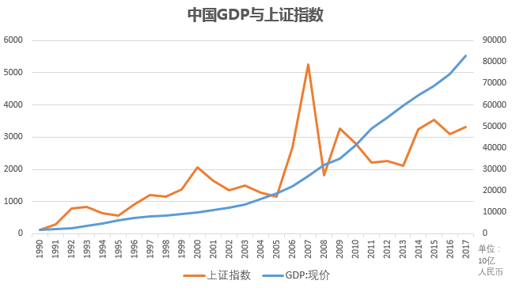

### [Source](https://www.sohu.com/a/377644392_120157024)

>宪政：人们的权力不能被随意剥夺；征税需要征得纳税人同意；由国家暴力所提供的普遍保护体系。经济自由化。普通法体系（将资产转变为资本）。小政府

>我不同意这篇文章的结论，不是要相信国家，而是要相信复杂系统自发涌现的秩序，这些底层秩序能够鼓励人们合作，压制人们内心的邪恶，创造出繁荣。背离这些基本规律的国家也会经济衰退。所以说投资不是赌国运，而是赌宪政演化和自由市场（制度层面）。【技术、自然条件、文化和基因在此不做过多阐述】

巴菲特说过：投资就是投国运，投资家应该是爱国者。

巴菲特在昨天公布的2019年致股东信中再次表示，回顾他77年的投资历史，他和芒格高兴地承认，伯克希尔的成功在很大程度上只是搭了美国经济的顺风车（即“美国顺风”）。

其认为那些因为各种负面新闻大头条而怀疑美国经济前景、放弃股市的人应该想想这个国家取得的成就：1942年对美国股市投入的100万美元到现在（77年时间）将变成52亿美元。如果投资者为了寻求“保护”放弃股市购买黄金，那么他的获益将缩水99%。

巴菲特称伯克希尔下一个77年的成功也一定将来自“美国顺风”。

## 什么是国运？

投资圈有个很著名的段子：

三个人坐电梯，一个不停原地跑，一个不停撞头，一个不停做俯卧撑。

电梯到顶后，三人被问到：你们是怎么上来的？

一个说我跑上来的，一个说我撞头撞上来的，一个说我做俯卧撑上来的。

在投资圈看来，真正让他们快速上楼的“电梯”，就是国运。

还没明白？那再具体一点：

>每个人的财富积累，一定不要以为是你多有本事，财富积累完全来源于经济周期运动的时间给你的机会。
——周金涛

这种机会，就叫国运。

为什么说投资就是投国运？

这话既然出自巴菲特，那就先从他身上找原因。

## 不听话的学生

1951年的春天，道琼斯工业指数在250点左右波动，格雷厄姆教授对哥伦比亚大学商学院的学生们说：

>自1896年道琼斯工业指数诞生以来，几乎每一年都会出现在200点以下交易的情况。他建议学生们等到指数再次到200点以下后，有了足够的安全边际后再进场。

格雷厄姆的建议在学生当中具有很高的可信度，传说有学生一边上他的课，一边在市场上执行他在课堂上给出的建议，盈利不仅可以覆盖学习期间的所有费用，毕业后还能留下一笔不小的人生启动资金。

然而，在格雷厄姆一生中最优秀的一个学生，在1951年毕业后并没有听从导师的建议。

那个学生就是巴菲特。

而自1951年之后，道琼斯工业指数再也没有回到过200点…

1951年后道琼斯指数再也没有低于过200点

数据来源：wind

半个世纪后巴菲特接受《华尔街日报》采访，回忆到格雷厄姆给他这一建议时称：

>当时我手里大约有1万美元，如果我当时听从了他的建议（等200点的底），我现在手里应该也就只有1万美元。

格雷厄姆这不是在毕业的时候特意坑学生们么？

当然不是，格雷厄姆在做出这一建议时具有很好的历史经验和数据的支撑。

从美股1951年之前半个世纪的历史来看， 确实就像格雷厄姆所“忠告”的那样，指数在围绕200点上下波动，根据安全边际的原则，确实应在等200点以下后再买入会比较安全。

1951年前道琼斯工业指数的历史走势 数据来源：wind

但是1951年毕业的巴菲特这次并没有听从导师的建议，而是“满仓做多”，这才有了后来的传奇故事。

不过，若不是生在美国的话，巴菲特很可能成不了股神。

为何俄罗斯没有投资大师？

巴菲特大学毕业开始全身心投入股票事业后，美国在二战胜利后奠定的西方第一强国（且根本没有所谓的第二和第三在竞争）的地位所带来的国运优势，完全反映在了股票市场上。

来看一组数据：

1899年12月31日，在全球股票市场中美国市场的占比仅为15%，当时大英帝国仍在的英国占到25%，德法分别占13%和11.5%。

1899年各国股市占全球的比重 数据来源：wind

但到了2017年年底，美国股市已经占到了全球份额的51.3%。

2017年全球股票市场各国占比 数据来源：wind

纵观1899年和现在各国股市在全球的比重，俨然一副当时和现在国力国运的“镜像图”。

下面这张图把这种演变表现得更为明显。

1900年以来全球股票市场各国占比变化 数据来源：wind

俄罗斯是一个反面的例子。

1899年，当时表面强大的俄罗斯帝国占全球市场的份额紧随其他欧美列强之后，占6.1%。

但是1905年输掉了日俄战争，1917年又爆发了十月革命，在此后的冷战中作为苏联主体部分节节败退，最终又遭受苏联解体冲击的俄罗斯，百年来国运一直在衰落。

截止2017年，其股票的市值在全球份额中已经仅剩0.78%，仅比泰国和沙特多一点。

2018年9月俄罗斯股票市场市值与其他国家对比

为啥投资大师大多都是美国人，或者是在美国做投资的？你可曾听过俄罗斯出过投资大师？

股票最终拼的是国运。若想投资做得好，生在哪很重要。

对此，巴菲特有清醒的认识：

>我的财富还要拜以下三点所赐：生在美国，一点幸运基因，以及广泛的兴趣。我和我的孩子都有幸赢得了“卵巢彩票”。
——巴菲特演讲《我为什么捐掉99%的财富》

投资时，请相信国运

有一个大数据统计——20个国家近百年的股市与经济增长情况。

观察数据，我们可以得出这么几个结论：

☆ 股市的长期表现和经济增长基本吻合，“经济是不断发展的，股市长期而言是上涨的”在绝大多数国家都得到了印证；

☆ 遭遇经济危机的国家，股市表现往往不佳，比如泰国（东南亚金融危机）、希腊（欧债危机）；

☆ 有的国家能战胜危机，恢复增长，股市屡创新高（美国），而有的国家在泡沫破灭后，很长时间也未能恢复，股市因此低迷（日本）。

最后回到中国，回到我们的A股。

虽然一直被吐槽，但A股的实际表现还是客观反映了中国经济的增长。

1990年到2017年，上证指数上涨24.91倍，年化涨幅12.81%；同期名义GDP增长42.82倍，年化涨幅15.03%。

数据来源：wind

对此，巴菲特有着非常清醒的判断：

>你去问问过去的238年中(即美国建国以来)，有谁是通过押注国家衰落而成功的？

>将我们国家的现状与1776年(建国时)对比一下，你简直不敢相信自己的眼睛。就我有生之年来讲，美国人均产出翻了6倍。我的父母在1930年绝对想不到儿子今天所能看到的世界...

>我们市场经济的动力机制仍将继续发挥它的魔力。要收获总要经历挫折，不可能一帆风顺。但确定无疑的是，美国明天会更好。

>——2015年巴菲特致股东信

把美国换成中国，这段话同样适用。

投资，就请相信祖国未来会继续繁荣昌盛。

