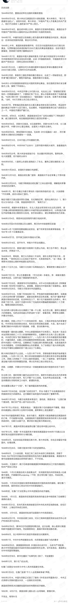

1. 中国人民在1945到1949，再到1979年之间所经历的这一切都会在阿富汗上演吧。当年，美国没有下定决心帮助国民党，建立亲美政权，后来让亲苏政权占了优势。后面的故事想必不需要我介绍了。在阿富汗，美国也在撤兵，塔利班已经占领了80%的阿富汗领土，而亲美政权节节败退。同样的故事又上演了。

2. 另外再带大家回顾一下真实的历史：

3. 就我个人认为中苏交恶，中美建交这件事情是推动中国这几十年高速发展的重要且深层次的原因。这仍然是傍美定律的体现。

4. 你无条件信任谁，谁就会利用你的信任来欺骗你。老乡，国人，政府，学术权威，有钱人，老外，诺贝尔奖获得者，大学教授、马斯克（骗人买狗狗币）等等，所以要有自己的判断，建立自己的科学方法论。

5. 按我在之前的文章中所写的，任何的方法都只是临时的、片面的、在一定区域内起作用，这与我今天读的书和书评不谋而合，使用任何的模型都要考虑它的适用条件，There is no global optimal solution but local extreme solution。

6. 另外，很高兴看到微博上有人与我观点相同，所谓的教育回报率高其实是因为整个中国百废待兴，高增长带来的学什么都有不错工作的年代十分罕见。也难怪欧美国家的名校硕士也就那点收入（3万美元），但是读书贷款需要30--40万美元。而且所谓的读书改变命运这种东西显然是不了解资本主义和自由市场的人才说的话。

7. 左晖也认为读书并没有那么重要。人的确需要学知识，但是在实践中的学习更重要。另外，他也强调不能选已经过了山顶，正在往下走的行业，比如现在的房地产行业、化工、原材料、大多数制造业。要这么说的话，党国没什么行业不是在走下坡路了，去海外吧（尤其是东欧）。