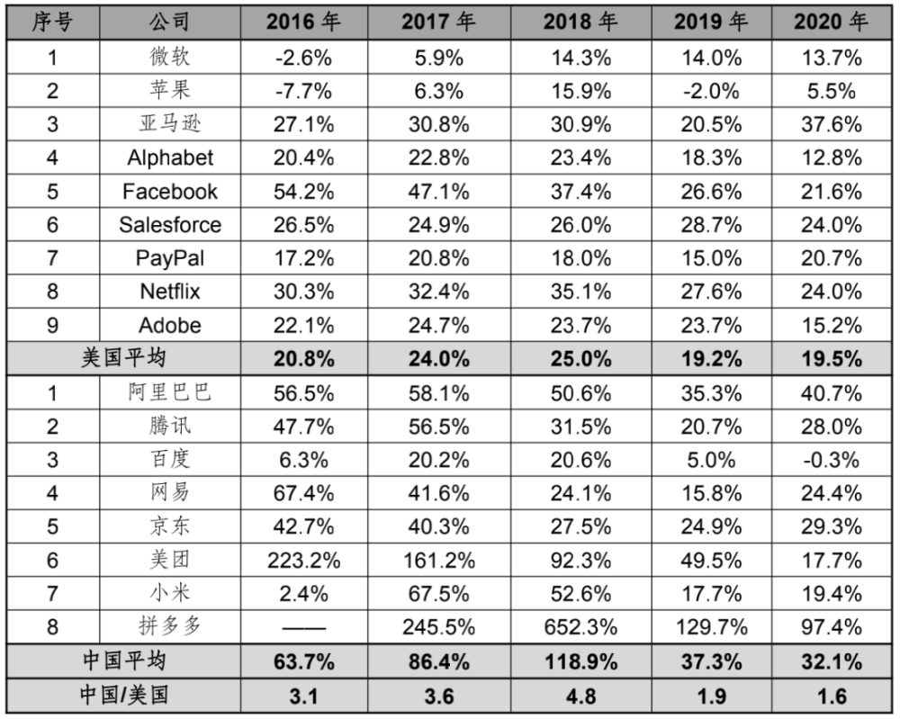
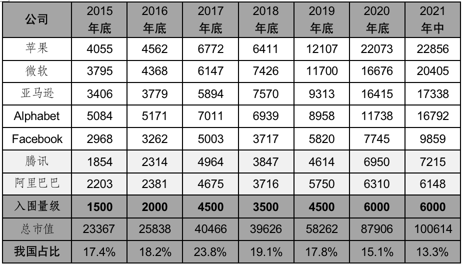
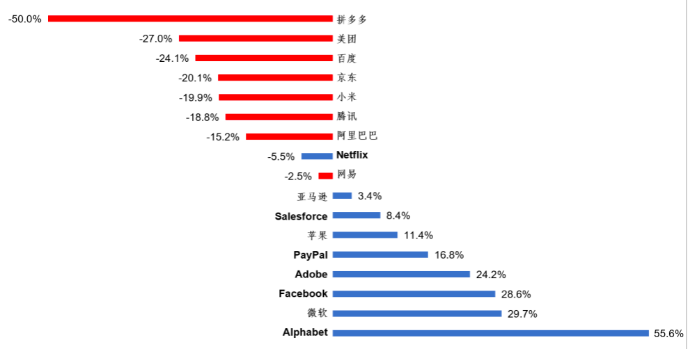
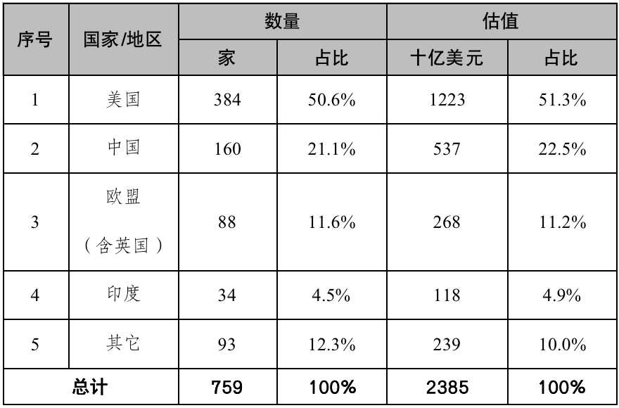
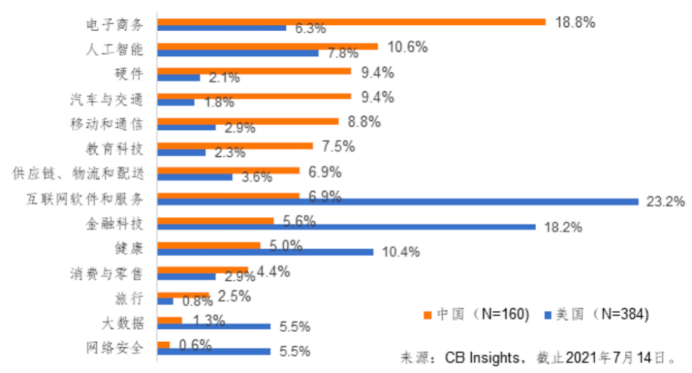
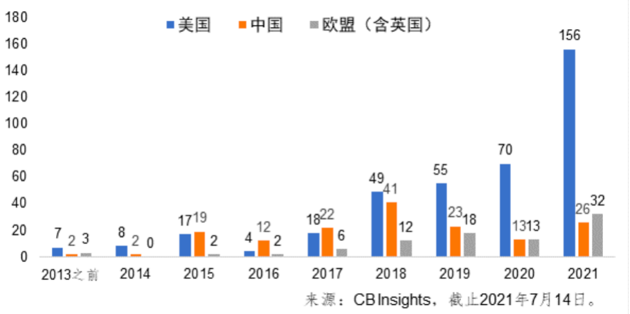

>这篇文章我收藏过，但后来无法打开，很多有价值的东西就这样出现又消失，更不要说还有很多压根就没有出现过。

[Source](https://www.chinahot.org/science/133097/%E8%AD%A6%E6%83%95%E4%B8%AD%E7%BE%8E%E6%95%B8%E5%AD%97%E7%B6%93%E6%BF%9F%E5%B7%AE%E8%B7%9D%E6%8B%89%E5%A4%A7.html)

[Source](https://3g.163.com/dy/article/GGR4H6100539BX8Z.html)

# 警惕中美數字經濟差距拉大

閆德利 騰訊研究院資深專家

## 我國數字經濟居世界第二位，但與第一名差距明顯

關於我國數字經濟的國際競爭力，智庫和學者的說法較多、數據較多。根據上海社科院數據（2021），我國在數字產業競爭力評價中位居第一位，遠超美國；根據信通院數據，我國數字經濟規模已連續多年位居世界第二位，但與美國差距明顯；聯合國貿發會議（UNCTAD，2019）認為：「中美兩國共同領導著全球數字經濟發展。」我們認為，我國數字經濟總體實力居世界第二位，是比較合理的，也是應該的。

然而，與最高水平相比，我國還存在較大差距。2020年，我國GDP已達到美國的70.3%（來源：世界銀行），而數字經濟規模僅相當於美國的39.4%（來源：信通院）。2019年，我國有14家企業進入全球數字經濟百強企業榜單（來源：福布斯），而進入財富世界500強排行榜前100位的企業數量更多，有24家。在很多關鍵指標上，我國是第二位，但美國仍數倍於我。根據聯合國貿發會議（UNCTAD，2019）數據，在全球70個最大數字平台中，美中所占市值分居前二位，但美國是我國的3倍；根據Tech Nation數據，2020年我國科技領域風險投資額是第二位，但美國是我國的3倍多；根據Synergy Research數據（2021），全球共有597個超大規模數據中心，美國擁有的數量是我國的4倍。

數字領域的差距往往比較大，這是客觀規律。值得警惕的是，中美數字經濟由先前的「保持相同節奏，實現同步發展」到近年的「差距日趨拉大，開始分化發展」。拐點出現在2019年左右，我國上市公司和獨角獸出現優勢減少、差距拉大的情況。

## 收入：2019年我國增速優勢開始減少

長期以來，我國網際網路公司收入增長速度快於美國。2016-2018年，我國8家主要網際網路公司的收入平均增速不斷加快，相較於美國9大網際網路公司的優勢不斷增強，2018年達到美國的4.8倍。此後我國的平均增速開始大幅下降，2019年8家主要網際網路公司的收入增速竟然全部放緩，這極為少見。我國相較於美國的優勢也開始減小，2019年下降到美國的1.9倍，2020年降為1.6倍。如下表所示。

數據來源：騰訊研究院根據各公司財報整理，2021年7月

註：部分公司的財年不是自然年。對此表中的年度，微軟是截止當年6月，蘋果是截止當年9月，Adobe是截至當年11月，Salesforce是截至次年1月，阿里巴巴是截至次年3月。數據有四捨五入。

相較於上表中的其他企業，拼多多是一家新公司，增速非常迅猛，且波動性較大，其歷史數據只能追溯到2017年。如果不考慮拼多多，用另外7家公司與美國9家相比，我國從2016年開始平均增速就逐年放緩，由2016年的63.7%下降到2020年的22.7%。我國相對於美國的優勢也逐年減弱，由2016年是美國的3.1倍降低至2020年的1.2倍。2020年，我國僅以3.2個百分點的微弱優勢快於美國。

## 市值：2018年底我國占比開始下滑，當前處於最低水平

近些年，市值排在全球前7位的網際網路科技公司一直是蘋果、微軟、亞馬遜、谷歌、Facebook、騰訊和阿里巴巴這7家，其後的幾家與第7名存在較大差距。這可算作網際網路的第一梯隊，基本反映了主要國家的總體水平。2015-2017年，我國在前7名中的市值占比呈逐年上升趨勢，由17.4%上升到23.8%。從2018年開始則逐年降低，到今年年中已降至13.3%，是近些年的最低水平。如下表所示。

單位：億美元，按2021年7月15日匯率計算

數據來源：騰訊研究院，2021年7月

以今年為例，我們清晰看到中美呈現分化發展的趨勢。年初至今，美國9大網際網路公司中，有8家股價正增長（唯有Netflix小幅下跌），其中有4家增幅在20%以上；有7家於今年7月達到史上最高市值（另外2家是Netflix和Salesforce，最高值分別是在今年1月和去年）。我國8家主要網際網路公司均是股價下跌，其中有4家跌幅在20%以上。以原點為中心，各公司股價變動情況呈現出比較完美的對稱性。不幸的是，原點的一邊是中國公司，另一邊是美國公司。如下圖所示。

數據截至2021年8月4日）

註：對同時在美國和香港上市的企業，採用美股數據。

從代表公司看，蘋果的市值在2015年底相當於我國當時最大的2家公司（阿里巴巴、騰訊）之和，現在則超過我國前十名之和（騰訊、阿里巴巴、美團、拼多多、京東、小米、快手、網易、百度、滴滴）。以一抵十的不只蘋果，微軟也是。

## 新生獨角獸：被美國狠狠甩下，被歐盟逆轉反超

獨角獸代表著未來，是數字經濟創新活力的體現。根據CB Insights數據，截至2021年7月14日全球共有759家獨角獸企業，總估值約為23850億美元。其中，美國獨冠全球，其數量和估值均占世界的一半以上。我國緊隨其後，共有160家獨角獸（大陸155家，香港5家），占世界的21.1%；總估值為5370億美元，占世界的22.5%。從總量來看，獨角獸在各國呈階梯分布，相鄰名次國家保持成倍差距――美國是我國的2倍多，我國是歐盟（含英國，下同）的2倍，歐盟是印度的2倍多。如下表所示。

數據來源：CB Insights，2021年7月14日

就行業分布來看，中美之間也呈現明顯差異。我國的獨角獸較多分布在電子商務、硬體、汽車與交通、移動和通信、教育科技、供應鏈/物流和配送等領域，而美國較多分布在網際網路軟體和服務、金融科技、健康、大數據和網絡安全等領域。如下圖所示。

從獨角獸誕生時間來看，情況大大不妙。與上市公司市值一樣，2015-2017年也是我國獨角獸的高光時刻，每年新生數量都居世界第一位。2018年也不錯，雖屈居第二位，但仍和美國相當。2019年，我國新生獨角獸數量斷崖式下跌，而美國仍保持逐年快速增多，中美差距開始拉大。2019年美國新生獨角獸數量是我國的2.4倍，2020年變成5.4倍，今年變成6倍。今年僅半年時間，美國就誕生了156家獨角獸，超過了我國大陸現有之總和（155家）。我國年度新生獨角獸數量不僅被美國狠狠甩下，還被歐盟逆轉反超。我國原先領先歐盟一個量級，2019年兩者差距大幅縮小，2020年實現持平，今年歐盟（32個）則反超我國（26個）。如下圖所示。

獨角獸不是一日長成的。在美國今年新生獨角獸中，有48.1%是在2013-2016年創立，有66.7%是在2012-2017年創立。我們需要注意，2019年是結果的分水嶺。只能是在此之前的幾年時間內我國初創企業成長情況不理想，才導致這一結果。

## 結語

我國曾錯失三次工業革命，造成百年屈辱。習近平總書記指出「信息化為中華民族帶來了千載難逢的機遇」「大數據是信息化發展的新階段」。我國牢牢抓住信息化發展和數字革命興起的歷史機遇，一路高歌猛進，實現了從站起來、富起來到強起來的偉大飛躍，迎來了實現中華民族偉大復興的光明前景。馬克思指出，事物發展是前進性與曲折性的統一，方向是前進上升的，道路是迂迴曲折的。數字經濟想必也是這樣，呈螺旋式上升或波浪式前進。當前發展雖遇低谷，但我們有理由相信，憑藉中華民族的勤勞和智慧，經過刮骨療傷和深度糾偏後的數字經濟必將獲得更加頑強的生命力，邁向新的輝煌，助力全面建成社會主義現代化強國的第二個百年奮鬥目標。讓我們共同期待！

---

# 腾讯发文表示中美数字经济差距正在拉大，随后自行删除

中国科技巨头腾讯控股删除了其一名研究人员周五发表的一篇文章，该文章讨论了中国与美国在数字经济方面不断扩大的差距，并强调了科技行业的重要性。

删除该文章的时间是周五晚间有消息称北京海淀区检察院对腾讯公司提起公益诉讼后的几个小时，该区检察院称微信上的“青少年模式”不符合保护未成年人的法律。

这篇题为《警惕中美数字经济差距拉大》的文章说，2016年至2018年快速增长的国内大型科技公司，现在成长正在放缓，在收入和市值方面都落后于美国的公司。

文章称，中国的科技产业正处于低谷，中国必须“紧紧抓住信息化发展和数字革命的历史机遇”，避免重蹈覆辙，错过产业革命。

这篇由腾讯研究院高级研究员闫德利撰写的文章，于周五晚间发表在腾讯网站和腾讯研究院的官方账号上。之后被从这两个平台上删除。

文章称，腾讯和阿里巴巴分别是世界上第六和第七大互联网公司，到今年年中，其市值占全球科技行业前七大公司总市值的13.3%，比2017年底的23.8%显著下降，甚至低于2015年底所占的17.4%。

文章还对该行业的收入增长发出了警告。中国的大型科技公司——包括腾讯和阿里巴巴，过去的收入增长速度明显高于海外竞争对手。

2018年，这些大型科技公司的收入增长速度平均为118.9%，而美国前九大科技公司的收入增长平均仅为25%。这一差距在2019年和2020年有所缩小，当时中国公司的平均增长率分别为37.3%和32.1%，而美国公司的平均增长率为19.2%和19.5%。

中国企业的平均增长主要是由拼多多的快速上升拉动，其在2018年增长了652.3%。不过，根据该文章的数据，在过去三年收入增速下降的公司中，中国公司所占比例更大。

这篇文章的发表和迅速删除，显示中国科技行业目前正处于敏感的时期。自去年年底以来，中国针对大型科技公司发布了一系列新的监管措施和法规，涉及从反垄断到数据安全等一系列问题。

