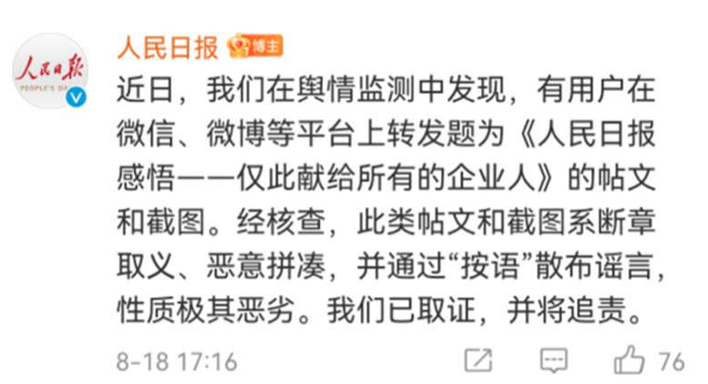

[Source](https://www.msn.cn/zh-cn/lifestyle/lifestyle/%e6%96%ad%e7%ab%a0%e5%8f%96%e4%b9%89%e3%80%81%e6%81%b6%e6%84%8f%e6%8b%bc%e5%87%91%ef%bc%8c%e8%87%aa%e5%aa%92%e4%bd%93%e6%89%93%e7%9d%80%e5%ae%98%e5%aa%92%e6%97%97%e5%8f%b7%e9%80%a0%e8%b0%a3%e5%a4%aa%e6%81%b6%e5%8a%a3/ar-AANyQKW?ocid=mmx)

近日，在微信群和朋友圈里广泛流传着一篇题为《人民日报感悟——仅此献给所有的企业人》的文章，引发不少议论。其实，《人民日报》并没有发过这篇文章。

8月18日下午，人民日报在其微博评论区辟谣：“近日，我们在舆情监测中发现，有用户在微信、微博等平台上转发题为《人民日报感悟——仅此献给所有的企业人》的帖文和截图。经核查，此类帖文和截图系断章取义、恶意拼凑，并通过“按语”散布谣言，性质极其恶劣。我们已取证，并将追责。”

{width=80%}

网上热传的这篇文章实际上是假借《人民日报》的名义传播。近年来，类似的自媒体盗用权威媒体名号、传播虚假信息来骗取网友信任的案例不少见。

2016年，一篇题为《转：请立即停止使用微波炉》的文章曾在网上疯传，网传此文出处是《人民日报》，文中列举数项微波炉对人体有害并且会致癌的证据。

实际上，《人民日报》从未刊发过任何有关“叫停使用微波炉”的文章。相反，《人民日报》早在2012年就对“微波炉致癌”的说法辟过谣。2012年5月16日，《人民日报》第4版刊发了《微波炉加热食品会致癌吗？专家表示，只要使用得法，不会对人体造成危害》一文。

2017年初，微信上流传着一篇长文称：“最新消息：据解放日报报道：从1月1日起，企业退休人员养老金将按人均月增487元的标准上调，为历年来最大……”实际上，《解放日报》从未发表过上述文章，且当时上海也没有关于“养老金调整”的消息。

不仅传统官媒被冒用，连国家机关、政务新媒体也被造谣者盯上了。

2020年2月7日，群众举报：有人冒用大连市新型冠状病毒感染的肺炎疫情防控指挥部的名义，伪造政务新媒体“大连发布”微信页面截图，在网上散播“大连市延迟本市企业复工”等虚假信息。2月8日，庄河市公安局将犯罪嫌疑人赵某平（男，27岁，丹东人）抓获。经审讯，赵某平对其2月7日故意炮制“权威发布！大连市延迟本市企业复工！”虚假信息，并发布至多个微信群的违法犯罪事实供认不讳。当时，赵某平因涉嫌寻衅滋事罪被庄河市公安局依法采取刑事强制措施。

2017年8月8日，四川九寨沟地震后，西安市公安局网络安全保卫支队工作发现，有网民发布“2017年8月9日凌晨3时陕西、甘肃、青海等地将还有余震发生”、落款为“中国地震四川分局”的谣言信息。

当晚，支队会同公安莲湖分局立即展开调查，于8月9日上午11时在西安市莲湖区西稍门附近一公司内将涉嫌散布谣言的违法嫌疑人陈某某（男，27岁，宁夏彭阳县人，系某文化传播公司员工）抓获。经审查，陈某某交代四川地震发生后，其公司微信群中有同事发布的九寨沟发生地震的图片及文字信息，出于和同事开玩笑的目的，陈某某在该微信群中编发了一条信息内容为“通知，经中国地震局四川分局正式测定：8月8日21时19分在四川阿坝州九寨沟县（北纬33.20度，东经103.82度）发生7.0级地震，震源深度20千米为余震。可能在2017年08月09日03时左右会再次发生余震，届时陕西西安、汉中、安康，甘肃兰州、张掖，青海西宁等地将会有所波及。有请广大人民群众注意人身安全”的信息。为了增强信息的可信度，陈某某编造了发布单位为“中国地震局四川分局”，部分同事信以为真，在微信朋友圈进行发布，在网络上引起了迅速传播。当时，西安市公安局对陈某某以涉嫌扰乱公共秩序依法行政拘留。

除了被冒用，还有人故意泼脏水、扣帽子，直接对官媒的报道断章取义、片面解读甚至恶意攻击。

2020年7月8日，《检察日报》发文《营造良好网络生态，平台亟须强化自净》称：据微博管理员消息，“@打不死的爆裂风车”等一批账号因存在攻击国家机关、攻击中央媒体及干扰企业正常运营的行为，现根据有关社区规则已被关闭。上述被关闭的账号在微博上长期以狙击知名艺人为目标，线上教唆，线下聚集，演绎了一个利用网络群体行为扰乱法治的反面案例。一些网络大V（其中不乏职业黑粉）通过模板化引导，组织网民以网络举报、电话骚扰等方式，规模化肆意攻击国家机关、新闻媒体，甚至干扰复工复产期间企业的正常运营。他们和一些所谓的意见领袖（KOL）断章取义、片面解读《检察日报》等媒体的多元化发声，通过制造虚假的“官方定性”蒙蔽年轻网民，还造谣污名化教师等多个群体，并频繁挑动网络群体对立。

如今，只要在某个网络平台上注册一个账号就能随意发声，几乎每个人面前都有一个麦克风。类似的假冒权威媒体、政府部门发布的网络谣言也出现了不少，传播甚广、影响恶劣。打击网络谣言，不仅需要网民提高辨别力，更需要平台加强审核，以及网络管理部门的重拳出击。

