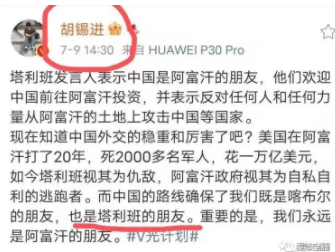
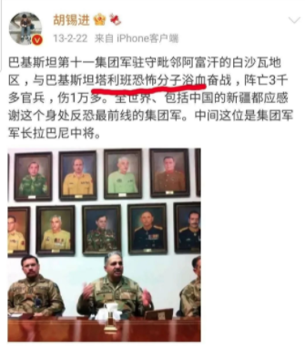
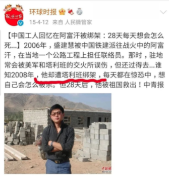

[Source](https://weibo.com/ttarticle/x/m/show/id/2309634669727170756822?_wb_client_=1)

>诸位先试想一下，如果有个二流子吃喝嫖赌无恶不作，打哑巴、骂聋子、扒老太太裤衩子，然后说跟...

诸位先试想一下，如果有个二流子吃喝嫖赌无恶不作，打哑巴、骂聋子、扒老太太裤衩子，然后说跟你是朋友，你会不会高兴？

傻逼才会高兴，对吧。

但胡锡进就不这么想，因为被恐怖组织「塔利班」认定为朋友，而高兴的手舞足蹈，兴高采烈——这让心智正常的众人看的一头雾水：这特么有什么好高兴的？跟流氓称兄道弟，就这么自豪吗？

恐怖组织塔利班都干过什么事，我就不多说了，屠杀平民，炸毁遗迹，无差别恐怖袭击……可以说是全人类的罪人。而跟塔利班「哥俩好」的胡总编也被全网狂喷，几乎骂成了狗，有朋友劝我也跟着骂几句：「你看这个胡锡进为了叼盘，简直连人性都泯灭了……」

我却微微一笑：「你们啊，都上了他的当了。」

朋友一愣：「什么意思？」

我说：「像胡锡进这种体制里混出来的人精，什么该说什么不该说，他自己心里没数吗？这就是他故意的，通过这种言论，表明自己的立场和身份，相当于纳了一份投名状。越多人骂他，他越高兴，说不定这会儿都已经高潮了。」

朋友揣摩道：「你是说，他是故意做出这种姿态，给上面的人看的？」

我点头道：「没错。胡锡进用这种方式，再一次让上面坚信了，这是一条好狗，而且是为了主子什么都能咬的好狗。」

朋友咋舌道：「太狠了吧。至于做到这个份上吗？」

我叹息道：「没办法，竞争很激烈啊，兄弟。」

朋友疑惑：「这玩意还有竞争？」

我说：「当然了，这块市场早就开始内卷了。卢克文、金灿荣、司马南、李毅、张维为、陈平、占豪、周小平……哪个不是他的竞争对手？大家都在表忠心，这个时候，就要看谁叼盘叼的更有新意了。」

朋友恍然大悟：「原来如此。看来这一轮比拼，胡锡进胜出了。」

我点点头：「没错。敢冒天下之大不韪，泯灭人性，把塔利班都搬出来了，胡总编确实棋高一着。连底线都不要了，这种人不赢才怪。」

写到这里，可能有人会提出异议：万一胡锡进就是打心眼里把塔利班当成朋友的呢？人家就是喜欢和流氓做朋友呢？

这是不可能的。这种人心里永远没有朋友，只有永远的利益。在2013年的时候，他还在赞美与「塔利班恐怖分子」浴血奋战的巴基斯坦集团军。

他掌管的环球时报，在2015年的时候，还怒斥塔利班绑架中国工人。

怎么几年不见，胡总编突然就转了操性，开始与塔利班称兄道弟了呢？

无他，叼盘而已。之前骂塔利班是叼盘，现在跟塔利班「哥俩好」也是叼盘。

世人皆称胡锡进为「胡叼盘」，看来并非浪得虚名。在叼盘这个手艺上，他已经登峰造极，无出其右者。

爱国生意不好做，镰刀越多越多，韭菜都不够用了。但我相信，凭借着一手出神入化的叼盘工夫，胡锡进永远不愁没饭吃。这是人家的本事，不服不行。

可能有的朋友又要问了：这年头，干什么不能混口饭吃，为什么一定要当狗呢？

呵呵，在这里，我只能借古人的一句话来回答了：「子非狗，安知狗之乐？」