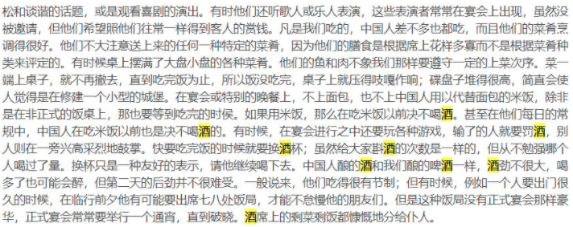
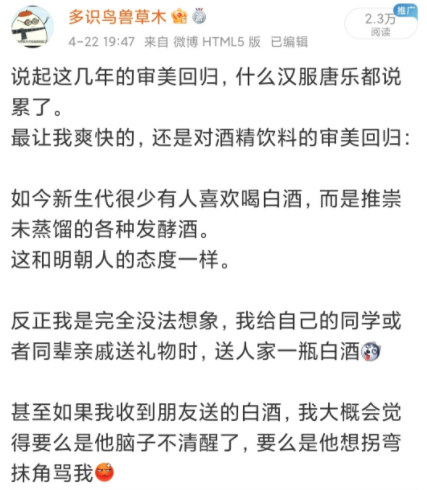

[Source](https://weibo.com/ttarticle/x/m/show/id/2309404628895520391271?_wb_client_=1)

>“我邀请一个中国人到小酒店喝酒。
中国人在喝酒之前，先把酒杯举向我和酒保以及仆人，说：请！
这是中国的礼节。
中国人不像我们一饮而尽，而是一小口一小口地喝，每喝一口之后吃点小菜。
喝完酒后为了向我表示感谢，赠送我几枚中国钱币，真是礼仪之邦。
中国人穿得很简朴，但很顺眼，吃饭有胃口，有礼貌。”——契诃夫

对，就是那个著名的俄国作家契诃夫，这是他1890年6月27日写给朋友的信件原文。

这段文字中透露出一个信息：中国人喝酒不碰杯，而是举起酒杯致意。这让身为俄国人的契诃夫觉得很新奇。

实际上，这个敬酒礼叫扬觯，非常古老，直到现在还能看到。

与之类似，晚明来华传教士利玛窦，也在自己的回忆录中详述了明代中餐：

——“中国酒和我们的啤酒一样，酒劲不很大，喝多了也可能会醉，但第二天的后劲并不很难受。一般说来，他们吃得很有节制”
——“虽然给大家斟酒的次数是一样的，但从不勉强哪个人喝过了量”
——“中国人在吃米饭之前绝不喝酒，宴会开始前，主人会郑重地走到庭院中，洒一杯酒到地上，表示祭祀天地”
——“宴会上都是分餐，中国的酒杯非常小，他们喝得也很慢。从不像我们一样大口喝酒，而是一口一口啜饮，喝茶时也如此。”

小时候我见祖父喝酒，用的都是非常小的酒杯，而且要分好几口才能喝完一杯。

利玛窦描述为“核桃壳大小的酒杯”，确实形象。

如今这种小酒杯，日常中已很少见。

这就是中国传统的宴会礼仪，很显然，和我们今天毫无文化的“酒桌文化”截然不同。

今天在群里聊到这个话题，@幻想狂劉先生 就说
“主陪副陪，座次，轮次举杯这些，还有祝酒致辞，都是苏联人的习惯”

对此我没有研究过，只觉得国初爱白酒的风气，确实很不中华，倒像是苏联习气。

又查阅了一下古籍，古人劝酒与今人完全不同，偶尔有类似今天这种风格的逼酒，基本都是军中饮酒。之前看过另一种说法，白酒的兴起或许还和国初全民皆兵有关。

如之前所述，白酒是蒙古西征后从西域传来的，汉人传统上是很排斥白酒的，明朝人认为白酒有毒、低劣。

想起我老家的传统宴会，确实不存在这些：

首先是没有祝酒致辞，最多是“督管先生”说几句吉祥话，大家边吃边听。（督管先生类似现代的司仪+总管）
然后大家宴会时绝不碰杯，酒单纯被视为饮料，谁爱喝就喝。

由此，我对碰杯这个问题产生了兴趣，特意去检索了文献。

发现最早出现“喝酒碰杯”这一动作描述的，是民国评书《童林传》

易言之，中国古代应该不存在喝酒碰杯，只存在扬觯。

毕竟分餐制也没法碰杯。

那么今天“酒桌文化”中碰杯时的各种规定和讲究，显然也都是伪传统了。

所以说，不存在什么五千年的酒桌文化，甚至五百年都不到，五十年还差不多。

而且仅仅过了两代人，这些建国后才出现的陋习，就再次被今天的人扬弃了。

以下为《利玛窦札记》中描述明朝宴会的段落

>客人就坐以后，宅中最有训练的仆人穿着一身拖到脚踝的袍子，摆好一张装饰华美的桌子，上面按出席人数放好杯碟。里面盛满我们已有机会提到过的叫作茶的那种饮料和一些小块的甜果。这算是一种点心，用一把银匙吃。                                                                仆人先给贵宾上茶，然后顺序给别人上茶，最后才是坐在末座的主人。如果作客为时很长，仆人要再次或甚至三、四次地这样上一圈茶，每次都上一道不同的点心。访问结束或客人走到门口要离去的时候，他们重新鞠躬行礼，主人随他们到门口，也鞠躬答礼。

>现在简单谈谈中国人的宴会，这种宴会十分频繁，而且很讲究礼仪。                            和希腊人的风尚一样，他们不说宴会而说酒会，这不是没有道理的，因为虽然他们的杯子并不比坚果壳盛的酒更多，但他们斟酒很频繁，足以弥补容量的不大。他们吃东西不用刀、叉或匙，而是用很光滑的筷子，长约一个半手掌，他们用它很容易把任何种类的食物放入口内，而不必借助于手指。食物在送到桌上时已切成小块，除非是很软的东西，例如煮鸡蛋或鱼等等，那些是用筷子很容易夹开的。他们的饮料可能是酒或水或叫作茶的饮料，都是热饮，盛暑也是如此。这个习惯背后的想法似乎是它对肚子有好处，一般说来中国人比欧洲人寿命长，直到七、八十岁仍然保持他们的体力。这种习惯可能说明他们为什么从来不得胆石病，那在喜欢冷饮的西方人中是十分常见的。

>到达之后先照常互相行礼致意，然后客人被请到前厅就座喝茶，以后再进入餐厅。这间房屋装饰得十分考究，但不用地毯，他们根本不用地毯，而是饰有字画、花瓶和古玩。每个人都有一张单独的桌子，有时在单独一个客人面前把两张桌子并在一起。这些桌子有好几英尺长，宽也差不多，铺着很贵重的桌布拖到地面，有如我们神坛的样子。椅子涂上厚厚一层沥青色，而且装饰着各种图画，有时是金色的。                                       在全体就座用餐之前，主人拿起一只金或银或大理石或别的贵重材料制成的碗，斟上酒，放在一个托盘上，用双手捧着，同时姿势优美地向主客深深鞠一个躬。然后，他从餐厅走到院子里，朝南把酒洒在地上，作为对天帝的祭品。                                           再次鞠躬后，他回到餐厅，在盘子上再放另一只碗，在习惯的位置上向主客致敬，然后两人一起走到房间中间的桌前，第一号客人将在这张桌子就座。中国人的上座是在桌子长边的中间或一列排开的几张桌子的中间一张；而不是象我们那样在桌子的一端。在这里主人把碗放在一个碟子里，双手捧着、并且从仆人那里取过一双筷子，把它们小心翼翼地为他的主客摆好。

>筷子是用乌木或象牙或其它耐久材料制成，不容易弄脏，接触食物的一头通常用金或银包头。主人为客人安排好在桌子前就座之后，就给他摆一把椅子，用袖子掸一掸土，走回到房间中间再次鞠躬行礼。他对每个客人都要重复一遍这个礼节，并把第二位安置在最重要的客人的右边，第三位在他左边。所有的椅子都放好之后，主客就从仆人的托盘里接受一个酒杯。这是给主人的；主客叫仆人斟满了洒，然后和所有的客人一起行通常的鞠躬礼，并把放着酒杯的托盘摆在主人的桌上。这张桌子放在房间的下首，因此主人背向房门和南方，面对着主客席位。这位荣誉的客人也替主人摆好椅子和筷子，和主人为客人安排时的方式一样。最后，所有的人都在左右就座，大家都摆好椅子和筷子之后，这位主客就站在主人旁边，很文雅地重复缩着手的动作，并推辞在首位入席的荣誉，同时在入席时还很文雅地表示感谢

>中国人不用手接触食物，所以饭前饭后都不洗手。在上述礼节做完之后，所有的客人一起向主人鞠躬，然后客人们相互鞠躬，大家入座。他们大家都同时饮酒，饮酒时，主人双手举起放酒杯的碟或盘，慢慢放下来并邀大家同饮。通常他们喝得很慢，一口一口啜饮，所以这一礼节要重复四五次才能把一杯酒喝完。啜饮是他们通常喝东西的习惯，甚至喝水时也如此。他们从来不象我们那样连续着大口喝。第一杯酒一喝完，菜肴就一道一道地端上来。

