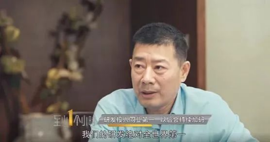
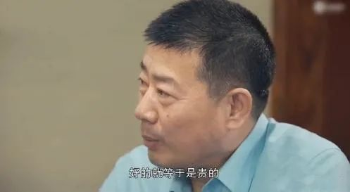

> 这篇文章算是对[边缘优势与企业的护城河](https://guanghuamao.netlify.app/2020/12/24/124/)一文的呼应，尽管最近几日腾讯股价大跌，但我仍然看好。至于什么，理想、蔚来、小鹏之类的一律看衰，至于连企业管理和企业诚信都有问题的，那就更不用说了，比如，比亚迪。看来看去，只能说，美国企业牛逼。

8月19日，中国飞鹤董事长冷友斌宣布增持2000万股，对外以示“信心”。对冷友斌来说，如此行为并不算新鲜，他一贯表现出对自己公司非同寻常的自信心。

曾经，冷友斌就敢放言，飞鹤的“研发投入世界第一”。

{width=80%}

但实际上，从2016年至2020年，飞鹤的研发成本依次仅有0.14亿元、0.15亿元和1.09亿、1.71亿、2.65亿元。以2020年数据为例，其研发投入占营收比例仍不到2%。

如果比较研发投入，国内伊利的最高，达到了5.42亿元；而从占比来看，澳优的研发投入为1.81亿元，占比达到2.26%，也明显排在飞鹤之前。

在这种情况下，冷友斌都敢说“世界第一”，更何况，他这次拿出了真金白银呢？

神奇的地方在于，凭着“更适合中国宝宝”的噱头，飞鹤的业绩表现却相当抢眼。2020年，飞鹤营收185.92亿元，同比增长35.5%。那么，原因何在呢？

对于这个问题，同样是冷友斌的一番豪言，从侧面暴露了其中的一二猫腻。2020年上半年，冷友斌在采访时坦言：“飞鹤奶粉折成公斤价，全世界最贵。”

{width=80%}

不止如此，同年飞鹤还邀请吴京加盟，叠加此前的章子怡，开启双代言模式。渐渐地，飞鹤被捧成“国货之光”。

但是，不断遭到独立机构做空，频频爆出质量问题，还被大股东减持，又要面对行业变迁，诸多不利影响交互作用，飞鹤还能继续让市值飞翔吗？

# 那些年吹过的“牛”

对飞鹤来说，冷友斌所谓“婴儿奶粉里，我们的研发费用投入绝对全世界第一”，无疑是打脸之举。飞鹤自己打脸的是，到了2021年上半年，相关数据直接在财报上“消失”。

此外，按照国标来说，符合标准的奶粉并不存在哪家更适合宝宝体质；因此，飞鹤标榜“更适合中国宝宝”也是迷雾重重，经不起严格追问。

即使不追问是否“更适合中国宝宝”，飞鹤宣称“一直专注于中国宝宝体质和母乳营养研究”，其“研究”也相当模糊。

不管是科研人数，还是代表性团队及其成果等，均没有得到公开。就此可以追问，飞鹤所谓“更适合中国宝宝体质的飞鹤奶粉”，难道是梦中修仙炼丹出来的吗？

滑稽的是，飞鹤的自我吹捧并没有止步于此，而是不断拉低底线。2018年，冷友斌领了一个蒙特奖，但这个奖项连其董事总经理都站出来喊话，“不是一个竞争性的评选”。

更要命的问题在于，飞鹤产品频频被曝出现质量与安全问题。依照《财经天下》数据，在黑猫投诉平台上相关投诉达267条，包括但不限于“宝宝吃了拉肚子脱水”“奶粉里面有虫子”等等。

面对追问，飞鹤客服还强调，“飞鹤奶粉生产环节完全可控，包括从奶牛挤奶到进入奶罐，都是管路输送，不会接触任何外部环境，建议详细了解奶粉生产工艺”。

那么，这样可控又严格的飞鹤奶粉，为什么出现问题呢？到底是有人在装聋作哑还是有人在自欺欺人呢？特别地，对于如何进行赔偿的问题，飞鹤客服根本不作正面回答。由此可见，在自我宣称和实际表现之间，飞鹤究竟挖了多深的壕沟！

---

# 逆势上涨背后的猫腻

借着吹起来的风，飞鹤的股值不断拉升，甚至被装扮成国货之光。但如果深挖的话，背后存在一种消费者心理基础，它被宣发诱变转化成飞鹤市值的助燃剂。关于这点，需要追溯到“三聚氰胺”事件。

当时，事件爆发后，中国家长的婴儿奶粉要求更加“焦虑化”。

依照千百年来形成的“一分钱一分货”“便宜没好货”等观念，进行扭曲转化，开始追求“贵的就是好的”。简单来说，价格高低成为判别奶粉质量高低的直接标准。

正是在这种心理转变的助长之下，“高端”奶粉趁势“崛起”。

也正是因为这个原因，冷友斌才敢回怼：“我们也有过100元以下的产品，消费者不买。”

这是一句相当现实的话，但却只站在了飞鹤谋利的立场上，它忽略了消费者为什么做这样的选择——被逼的。

飞鹤不止做“高端”奶粉，而且把价格做得越来越高。2019年，飞鹤赴港上市的招股书显示，其主打的“超高端星飞帆” 建议零售价分别为527元、440元、440元，但在两年前，其建议零售价还是473元、396元、396元；2018年时，价格飙升的高端婴幼儿配方奶粉的营收占比已经达到了64.1%。

也正是在上市当年，飞鹤被评为“好得不真实”，遭到香港投资机构GMT Research做空。按照其推断，从2010年开始，飞鹤的研发投入长期没有意义。2017年时，飞鹤的研发投入才1471万元人民币。GMT进一步质疑飞鹤的现金流和盈利能力。

而此前，飞鹤还有从美股“被迫”退市的一段经历。当时，飞鹤遭遇一系列审计师解雇和指控不当行为后，股价暴跌，业务崩溃。

这这也绝不是终点，著名的沽空机构“杀人鲸（Blue Orca Capital）”针对飞鹤新做出长达64页的报告。

杀人鲸指出，从2017年至2019年，飞鹤年均复合增长率高达54%。问题在于，相较于私有化退市前，飞鹤产品与市场相当，却表现抢眼因此，杀人鲸认为飞鹤像爆雷过的瑞幸咖啡。

---

# 回归价值评估的逻辑

飞鹤借助消费心理转变契机，依赖高端定位，流血营销，成为国内奶粉老大，同时享受“全世界最贵”的高盈利水平。

根据财报，2020年飞鹤高利率高达72.5%，直追五粮液的84.9%。在这方面，飞鹤的同行的表现就比较“差劲”，其中贝因美为60.48%，连蒙牛也才是37.7%。

归根到底，飞鹤在吃营销这一助燃剂的红利。根据今年半年报，飞鹤的销售及经销开支超过33.35亿元，同比增幅达到51.8%。

除前述双明星代言外，飞鹤还冠名开展各种节目，比如《快乐大本营》。这是飞鹤之所以能够起飞和飞起来的直接原因，甚至是最重要的原因。

不过，营销对其他乳业其实也并不困难，只要利润足够高足够动人心。根据东兴证券研究所数据，目前国内婴幼儿奶粉集中度仅为34.1%，较发达国家诸如美国的90.5%明显偏低。因此，中国未来市场占有率提升空间相当广阔，未来下场玩家一定不会少。

6月4日，有定增预案就披露伊利拟募资130亿元投入到6个项目中，包括婴儿配方奶粉智能制造项目。可见，很多乳品巨头实际都在旁边虎视眈眈。相比于这些巨头，至少从投研比来看，飞鹤可能是“落后者”。

不过，从行业变迁来看，当前的竞争被反推也会更加激烈。产能过剩，营销战，会让大洗牌加速到来。根据弗若斯特沙利文数据，中国婴幼儿配方奶粉市场的销售量自2019年就开始下降，未来五年复合年增长率将为负数。

面对这一趋势，研发投入和质量保障，将成为市场竞争力的关键。

毕竟，从企业史角度来看，依靠营销钻营而成的黑马都只是昙花一现。在这个方面，婴儿奶粉企业同样逃不开这个规律。

要成为全球性行业龙头，离开高昂资金投入，没有日积月累的研发，缺乏基于消费体验的改进，一定是虚幻的噱头。这是新的行业逻辑。

对飞鹤来说，被大股东减持可能仅是开始。5月14日，第二大股东摩根士丹利约40亿元的巨额套现，不仅让飞鹤股价大跌10.89%，市值蒸发逾130亿元，更为重要的是，这代表着当年帮助其从美股退市完成私有化的“贵人”，也不再看好飞鹤了。

正是在这个意义上，飞鹤的价值需要得到重估。

最后，也不要忘记，从实际成本来看，一罐一百块的奶粉和卖三百块的奶粉其实相差不大。对于标榜高端的奶粉，它们有些癫狂的业绩和市值，最后还要靠消费者间接买单。
