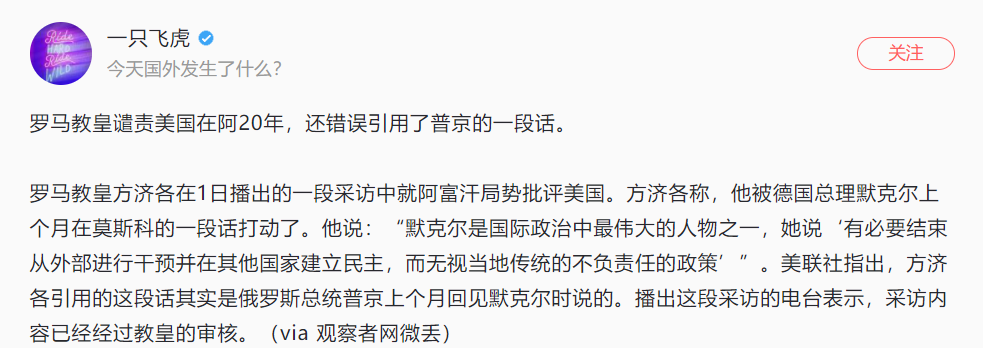

最近塔利班夺权事件在全球范围内闹的沸沸扬扬，有不少人认为赶跑了美帝国主义，独立自主的阿富汗就能够重建家园，在塔利班的带领下赶英超美。在前面的多篇文章中，我表达了对阿富汗这个国家命运的看衰，对阿富汗人民将来命运的同情。

二战结束之后，殖民主义退潮，接下来，我们看到的是一个个登上历史舞台、充满雄心壮志的国家领导人，他们认为独立自主的国家能够快速的迎来繁荣，只不过，天不遂人愿，几乎所有的独立国家都迎来了社会制度、经济发展、文化建设各方面的大倒退，各种人间惨剧也在轮番上演。

其实，殖民主义，或者说发达国家的制度输出，是治疗落后、贫困的一剂良药，当然，殖民毫无疑问也有副作用，但总体而言，制度输出是收益远远大于损失的，但美国不同意，它因为独立而获益，所以想当然的反对殖民主义、不愿军事干预、支持独立自主，这样的外交政策只会在遇到巨大外部武装威胁的时候稍稍改变，如军事管制日德、制度输出韩、台、以色列、乌克兰。阿富汗在美军入驻之后，其实社会的各个方面都有大幅改观，现在撤出，只会让阿富汗人民坠入无底的深渊。

今天，看到了西方各界领袖对制度输出的看法

看来接下来几十年，全球的制度状况只会不断恶化，勉强羞涩的美帝国主义在慢慢解体之中，除了冷战前线。