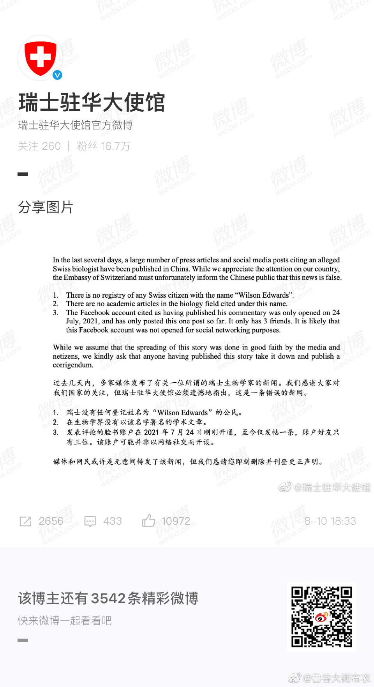

[Source](https://www.dw.com/zh/%E4%B8%AD%E5%9B%BD%E5%AE%98%E5%AA%92%E5%BC%95%E8%BF%B0%E5%AD%A6%E8%80%85%E7%A7%B0%E7%BE%8E%E5%9B%BD%E6%81%90%E5%90%93-%E7%91%9E%E5%A3%AB%E6%9F%A5%E6%97%A0%E6%AD%A4%E4%BA%BA/a-58826327)

>没有配图不好玩

{width=90%}

{width=90%}

中国官媒接连多日引述瑞士生物学家说法，指美国对主张新冠病毒与中国实验室无关的专家恐吓施压，但瑞士指出这是“错误新闻”，要求媒体及网民立即删除相关文章。

德国之声中文网）中国官媒近日报导称，有一名瑞士生物学家，因支持世卫与中国针对新冠病毒的朔源报告，遭美国施压与恐吓，并直指世卫的溯源工作恐沦为美国的政治工具。但瑞士驻中国大使馆10日发声明称这是“错误新闻”，要求官媒及网民撤掉相关文章。

包括中新网丶环球网丶人民日报等中国官媒，从7月底开始，接连引述名为威尔逊·爱德华兹(Wilson Edwards）的瑞士生物学家称，在过去的六个月里，特别是在第一阶段病毒溯源工作结束之后，世卫组织内部人士和一些科研同行抱怨说，“只要他们支持第一阶段溯源工作的研究结论，就会受到来自美方以及某些媒体的巨大压力，甚至是恐吓”。

报导引述爱德华兹说法称，美国在溯源问题上执意要攻击中国，甚至不愿意睁开眼睛去看看数据和研究成果。新冠溯源被政治化很有可能削弱科学界的士气，甚至阻碍全球公共卫生事业的发展。美国正试图诋毁那些参与第一阶段研究的科学家，并推翻世卫组织第一阶段溯源报告的结论。

但这些消息都被瑞士驻中国大使馆称为“错误新闻”。瑞士驻中国大使馆在官方微博及推特上公开声明，“这是一条错误的新闻”，推特上还称他们要找寻这位名叫艾德华兹（Wilson Edwards）的“生物学家，中国新闻机构和社群媒体过去几天曾引述他的话”。推文说：“如果有你这个人，我们想要跟你见面！”大使馆附上声明写道：“瑞士没有任何登记姓名为Wilson Edwards的公民”丶“生物学界没有任何以该名称署名的学术文章”，并称发表的脸书帐号2021年7月24日才开通，至今仅发帖一条，帐号好友只有3位，“该帐户可能并非以网络社交而开设”，并要求媒体和网民立即删除相关内容并刊登更正声明。

世卫专家小组今年1丶2月与中国研究人员在武汉及周围地区进行调查，2月9日发布的溯源小组调查报告得出的结论称，新冠病毒从蝙蝠经过动物中间宿主转跳至人的可能性最大，而来自实验室的可能性极其微小。

今年7月世卫生组织计划针对新冠病毒起源，进行第二阶段调查，并聚焦于病毒是否可能从武汉实验室传播出来。不过，中国7月22日拒绝第二阶段疫源调查，中国国家卫健委副主任曾益新强调，世卫专家组早于年初实地考察武汉病毒所后，就得出病毒极不可能起源于实验室的结论。

世界卫生组织总干事谭德赛则表示，溯源工作还未有定论，世卫将继续追踪所有理论。