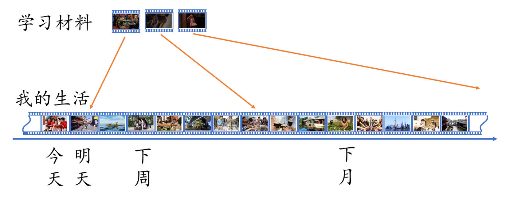
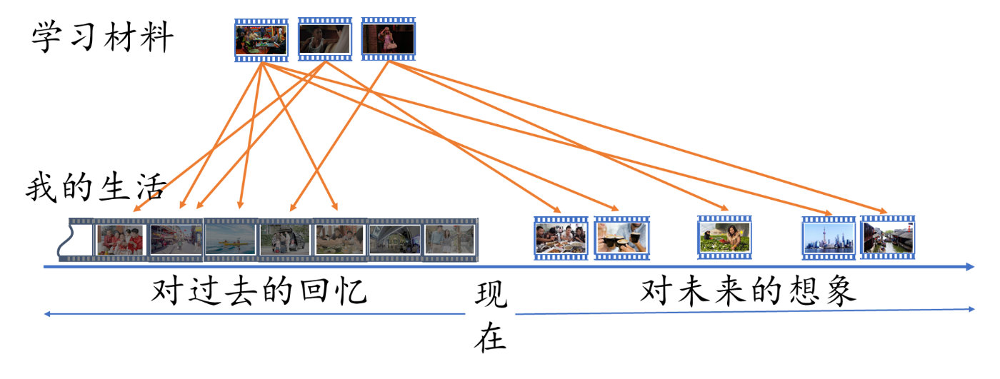

[Source](https://weibo.com/ttarticle/x/m/show/id/2309404630231351951523?_wb_client_=1)

>英语学习像是在迷雾森林中摸索，虽然走了很远，却发现是原地转圈，久而久之，令人心灰意冷

# 英语学习的迷雾森林

单词背了不少，但是边背边忘。明明背过这个单词，别人说的时候又反应不过来。花了很多时间磨耳朵，但听力提高还是很慢，美剧里说话一快就根本听不出。跟人用英语聊天特别慢，每次都要想半天才能说。听英语一听就困，比安眠药还管用。学英语很多年，流畅的话都说不出来。对于学习英语的人来说，不论是单词，语法，听力，口语，还是阅读和写作，哪一个看起来都不好对付。英语学习的过程就像是在迷雾森林中摸索，走了很长一段路，却发现就像是原地转圈，久而久之，令人心灰意冷。

# 小明的故事

小明，和大家一样，也是一位英语学习者，在学校里学了很多课本英语，但从来没有真正和外国人交流过。小明第一次出国购物的时候，一进商店，店员热情地上来打招呼，但小明只是想先逛一下，“我只想逛一下”咋说呢？小明一下子被难倒了，磕磕巴巴地开始解释：I could ... buy or not ...buy ,if I find ... I will buy something. 这句虽然捉急，也是能懂的英语，店员很快明白了，于是说：so you're just looking around？that's fine ,let me know if you need anything. 然后就走开了。小明恍然大悟，噢，look around就是逛一下的意思啊，居然这么简单！以后每次碰到店员热情打招呼，如果没有马上要买的，小明都会来一句 I'm just looking around. 久而久之，小明说起这句话来也越来越熟练，还能灵活运用到其他类似的场合。

在这个故事里，小明是在使用场景中学会这句话的，一旦学会，以后又有不断重复的机会，我们可以感受到，这样的学习路径，走起来轻松很多。做为对比，我们通过各种课程学习英语，首先面临着不会用的问题，因为我们没有像小明那样，在真实的使用场景中学习，其次还面临快速遗忘的问题，似乎学完很快就忘记了，不像小明能形成牢固的记忆。这两个问题，一个是“不会用”，另一个是“记不住”，我们往往以为，等到了需要的时候“不会用”，是因为我们学完之后“记不住”，是“记不住”导致“不会用”，小明的故事却告诉我们另一个道理，“不会用”才是“记不住”的真正原因，它们的关系如下图所示：

{width=90%}

从这个故事中，我们体会到了一个道理，只有通过在场景中使用英语，才能形成牢固的记忆。这个道理其实非常简单，因为小孩子就是这样学会母语的。

# 物品收纳的原理

为什么“在场景中使用”能帮助小明很快记住对应的表达呢？这是因为，每一句话都是在特定场景下产生的，都带有这个场景下的交流动机，场景本身就是语言表达不可分割的一部分。失去了场景的表达，就像失去土壤的植物，很快就会枯萎，死去，从记忆中消失。

家庭日常物品收纳可以帮助我们直观理解这个原理。

在我们家里，厕纸放在马桶边上，洗手液放在洗手台上，牙膏和牙刷在牙缸里，牙缸放在洗手台边，毛巾挂在旁边，客厅沙发前的茶几上摆着遥控器，卧室的床头柜边是开关，衣服挂在衣柜里。这些日常用品，都要按照一定的方式，放在合适的位置，你才用得顺手。要是有人把牙刷放在了厨房，牙膏收进了鞋柜，鞋子收进了橱柜，你是不是得气疯了？我们的语言表达，在大脑中应该收纳到什么位置呢？它们最应该被收纳的位置，恰恰就是它们被使用的位置，也就是需要说这句话的场景。

我们在学习英语的时候，输入的各种表达，就好像一件又一件被快递送上门的货物，你如果只是把它们堆在门口，它们很快就成为等待清理的垃圾，想要学会它们，就需要拆箱，取出，然后根据它们功能分门别类，收纳到合适的位置，只有这样，在需要用它们的时候，才能顺利地找到它们。

{width=90%}

了解了这个原理，我们就会知道，为什么学过那么多英语课文，听过那么多听力材料，看过那么多英剧美剧，最后留在脑子里的内容却少得可怜。很多英语老师推崇大量输入，但大量输入之后，你记住的有多少？那些输入之后然后被遗忘的内容，对你的英语学习有什么帮助？“你就每天大量输入，到了一定的时候就能开口说了”，这样的许诺，更像是在等待一个不知如何会发生的奇迹。从现在开始，不要再等待这种“奇迹”了，真正要做的，就是学一句，用一句，在真正的使用中才能牢牢记住所学的内容。

# 如何解决使用英语的问题？

小明因为这一句话的机缘巧合，领悟到了真正高效的英语学习方法，然而，当小明用这个方法进一步提高英语的时候，却碰到了一个又一个的障碍。

## 缺乏英语环境

小明并不是生活在英语国家，只是因旅游或商务短期居住，一旦回国，就很难找到运用场景了。为了解决这个问题，小明苦思冥想，最后灵机一动，即使在国内，周围人说的都是汉语，但并不是缺乏运用场景。在国内走进商店，店员热情地上来招呼的时候，你嘴上说“我先逛逛再说”，脑子里可以把这句英语“I'm just looking around.”调出来学习一下。那么，以后我碰上自己要跟别人说话的时候，嘴上说汉语，然后脑子里反应一下这个想法用英语该怎么说，这样持之以恒，不就等于把每天的生活，变成了可以练习的英语环境？即使没有人跟我说话，我还可以面对眼前的世界自言自语。不论练习时间，还是练习质量，都非常有保障。

## 很多场景都表达不出来

小明很快碰上了第二个障碍，场景虽然多，每天说的话不少，但大多数场景下的汉语表达，却很难翻译成自己满意的英语，也不会有人像国外碰到的店员那样，能把小明的描述用母语者的方式复述一遍。这时小明想到了翻译软件，碰到一个场景之后，先想想用汉语怎么说，然后借助翻译软件，把自己的说法翻译成英语，在翻译的时候，小明还会不断调整汉语表达，让翻译软件更容易翻译为可接受的英语，再有拿不准的地方，就去网上搜索类似的母语表达。小明对于这种学习方式还是比较满意的，虽然为了核实一个句子经常要花费很久，但这样学一句算一句，有了真正的积累，不再是学一句忘一句的感觉了。要说有什么不满意，那就是，这些表达经常是自己在工具帮助下造出来的句子，类似的情形下，母语者的惯用表达方式是什么，小明并不是很有把握。

## 专门学的场景表达，等到能用的场景时，都已经忘记了

为了积累母语者的惯用表达，小明又想到了一个方法，在平时看电影，看一些网上英语视频的时候，如果碰到了自己能用的表达方式，就记下来。这样记下来的表达，都是这个场景下地道的母语者表达。这时候，“不会用”导致“记不住”的老问题又出来了，即使记下了表达，但等到能够运用的时候，却已经过去了很久，这么久的时间内，没有实际运用的练习，记不住也是一个预料得到的结果。

这三个障碍，我们将其总结为 学习材料和真实生活之间的关系，见下面的图示：

{width=90%}

在这个图示中，下面是我们的实际生活，上面是我们的学习材料。这里的矛盾就在于，我们要能够说出符合母语者惯例的句子，就得有输入的学习材料做为模板，而我们当天学习到的内容，却不一定能在生活中马上用到，这也意味着容易遗忘。小明解决这个困难的办法是，一边积累学习材料，从中挑选出自己很有可能使用的表达，一边尝试在生活场景中使用英语表达，碰到自己拿不准的，就会在积累的表达中搜索，在词典中查阅，在搜索网站上搜索，虽然经常感到繁琐，但已经比之前的英语学习方式强了许多，对于具有一定英语基础的学习者，这个方法就更为好用。

我们再跟母语者儿童的语言学习比较一下：

{width=90%}

在儿童掌握母语的过程中，学习材料就是生活本身，在父母的引导下，儿童不断尝试着与父母交流，表达自己的想法。父母一方面提供了儿童用来模仿的学习材料，又不断主动创造重复运用的机会。每个表达都是来源于生活又很快运用于生活，不论是练习的数量和质量，都非常有保障。

虽然成年人并没有儿童这样从头开始的学习机会，但有些方式，也比较接近了。如果有一位英语母语者时时刻刻贴身陪护，引导学习者不断地学习和表达想法，也能达到类似的效果，当然，这需要大量的金钱投入。退而求其次，如果不是英语老师，而是同住在一起的室友，或者玩伴，恋人，也能在日常交往中迅速提高英语水平，出国留学生常常会选择一个寄宿家庭，在这样的家庭里，也能很快速地提高英语水平。

对于长期生活在国内，也请不起贴身英语老师的小明，虽然前面的方法已经可以接受，但有没有更进一步的方法呢？你也许会想到外教口语一对一聊天，但这样的聊天，一方面跟生活结合不够紧，不像小明是在真正的生活场景中寻找表达机会，另一方面，没法做到随时随地练习，在练习时间也完全达不到要求。

我们要寻找的，是一个能将学习材料和真实生活紧密联系在一起的学习方法。

## 心理预演

伟大的高尔夫运动员杰克.尼古拉斯（Jack Nicklaus）谈到如何在每一次挥杆之前应用心理预演时，这样解释说：“首先，我会‘看到’自己需要击打的高尔夫球，那个漂亮的白色精灵静静地躺在翠绿的草地上。接着，场景快速转换，我‘看到’了小球在空中飞行的样子：它的路线、轨迹、外形，甚至它落地时的姿态。接下来，头脑中的场景逐渐消失，现实重回眼前。”

这就是心理预演。

心理预演是通过对某个情境的深度想象，开启脑内的小剧场，在大脑中执行想象中的动作，当想象达到一定程度，能起到替代实际情境的作用，有时候效果甚至更好。我们在准备一些重大活动的时候，也常常会进行心理预演，比如要上台演讲之前，可能会做很多模拟的练习，不断想象台下观众的各种反应，以及自己的应对方式。有了这样的充足准备，真的碰到各种情况的时候才能够熟练地应对。

这就是人类这种智慧生物与生俱来的，强大的心灵力量。

这样的心灵力量，可以完美地解决缺乏英语运用场景的问题。我们虽然没有办法改变现实世界，让它服从于学习英语的需要，但我们可以进入想象世界并操纵想象世界，让它为英语学习服务。这个想象世界有两个来源，第一个来源，是我们每个人自带的海量记忆，这种记忆里包括了大量的经历过的场景。第二个来源，是我们所能预期的未来，我们可以用自己熟悉的元素主动构想出能够使用英语的可能场景。

自此，小明的疑问已经有了一个满意的答案，我们管这种方法叫做“场景预演式英语学习”。

# 场景预演式英语学习

当大家在前面阅读小明的故事时，已经部分体验到了这样的学习方法。只要代入到小明的角色，做为亲历者，以主观视角想象了自己去商店的场景，店员热情迎上来的画面，想象自己脱口而出“I'm just looking around”的时候，这个表达就在你脑子里扎根了。我相信，以后你不论是在哪里碰到类似的场景，都能想起来这句表达。这种学习方法，就是“场景预演式英语学习”。

我们可以提炼出这样两个步骤：

## 在输入材料中筛选出自己用得上的表达

不论是什么学习材料，我们都要以整句为单元，而且要了解这句表达的场景。有些句子，压根就不是自己能用的，比如“I'm a teacher.”，你如果不是老师，这一句你怎么也用不上，这时候你可以把teacher替换成符合自己职业的表达，比如医生可以说“I'm a doctor.”，警察可以说“I'm a cop."。这里所体现出来的原则是，你所要学习的句子，需要是你自己用得上的，用不上的句子完全可以放弃。如今输入的材料可以说非常丰富，几十句里挑选一句自己能用的也不为过。

##  通过回忆或想象，在自己的生活场景用上这样的表达

成人学习英语可以依赖的一个宝藏就是自己的海量记忆，不仅如此，你还可以合理想象出未来可能遇到的场景。我们前面说过，一句英语表达的最佳收纳位置，就是能运用这句英语的场景。有时候，这个场景就在你的记忆里。还是以“I'm just looking around“这句话为例，你仔细回忆一下以往进一些商店的经历，然后为这个经历增加一句英语表达，这个表达就和你的记忆联系起来了。即使没有这样的记忆，你还可以设想你去所在的城市某个商店时，可能碰到的场景，同样为这个场景增加对应的一句英语表达。

这个方法的图示如下：

{width=90%}

上图中的时间轴上，一边是对过去的回忆，另一边是对未来的想象。不论是回忆还是想象，都有海量的场景可用，我们只需将合适的表达，收纳到对应的场景中，就可以牢牢记住所学的内容。

这个方法具有一下几方面的特点，需特别指出：

## 练习以输出为重点，摆脱无效输入

按照这个练习方法，学一句，用一句，记一句，不再强调大量的无目的输入，而是从中选择可以输出的句子，逐句进行有效的积累。这样能够避免无效输入，让练习的每一句话，都能真正转化为自己的英语能力。

##  场景必须是主观视角，而自己是说话人

在实际运用的时候，有些同学可能会做为旁观者想象场景，说话人不是自己是其他人，这种想象虽然不是没有效果，但比起做为主观视角的想象，效果要差很多，对句子的体会也不如自己做为说话人那样深刻。我们对世界的认识来源于自我的角度，有了这样的基础，才能更好地理解别人。

## 学习以句子为单元

我们所要表达的想法，需要拆分为一个一个的句子。如果一个场景包括很多个句子，这些句子的难度可能会参差不齐，对于初学者来说，最好选取难度适合自己的目标句，吃透这一句即可，不必贪多。等水平到了一定程度，再做整段想象不迟。

## 只学自己用得上的表达

平日在学习英语的过程中，不论是阅读还是看视频，都会碰到各种表达，很多表达的内容，跟自己的生活并无联系，自己对所要表达的内容也没有兴趣，这种情况下，你不必句句都要吃透记牢，只需选取自己用得上的表达方式，并动用自己的回忆和想象，为表达安排合适的场景，只有这样，记忆才有效率。

## 句子需做发音练习，直到可以脱口而出

我们学到的句子，是随时准备说出口的句子，这就要求我们充分练习句子发音，一旦碰上合适的场景，便可脱口而出。在练习时，尤其要注重语调节奏，不可一个一个地蹦单词。很多句子在场景中，都带有特定的语气，不模仿好原句的语调节奏，说话就没有语气，句子表达的特定含义，也就无从传达了。

## 回忆或想象场景需认真，不可敷衍了事

这种练习方法的效果，取决于回忆或想象的质量。如果你认真地回忆或者想象，脑子里的场景细节丰富，栩栩如生，宛如亲历一般。这样的练习效果，甚至能超过实际的场景练习。场景中自己的发音，也需认真想象说话时的嘴部感觉，此点与听力和阅读都大有关系。

# 场景预演能解决听说读写吗？

这个方法，你以为只是在学习口语，那就太小看它了，正如民国时期的著名作家，翻译家，语言学家林语堂所说：

> 在听讲写读中，口讲尤为重要，尤其是在初级的时候。这并非说我们学习英文的目标，只在能讲几句英语，实在因为方法上应当如此。自然能看不能讲，只可说是半身不遂的英语，但即使目的不在口讲的人，在学习之程序上，为求基础之稳固习惯之养成，进步之神速，文理之清顺，都得如此。

英语能力是一个有机整体，不可生硬地分块切割，我们在读书认字之前，口语对话能力就已经相当成熟了，违背了这样的学习规律，不重视口语表达的基础，会让英语学习支离破碎，越走越困难。

* 口语：这一点毋庸置疑，从练习形式上看，这就是一种口语练习方法，能随时练习，逐句积累，真正帮助我们提高口语能力。 

* 听力：与大量输入磨耳朵的观念不同，我们强调通过发音提高听力，这是语音学中的“肌动说”所揭示出来的奥秘，在实践中得到了验证。 

* 阅读：通过练习发音和表达，然后将文字对应于发音，建立默读的能力，你会发现阅读就像听人说话那样顺畅自然。 

* 写作：有了组织句子表达自己想法的能力，继续发展出书面写作技能就会顺理成章，而不是只能按写作套路做假文章。 

* 语法：有了足够的句子积累，句型积累，才能通过归纳掌握构造句子的方法，而不是按照语法规则生搬硬套。 

* 单词：单词只有在句子和场景中才能牢固地记忆，灵活地使用，记忆的内容虽然多了，但记忆起来却更容易，更牢固了。 
应考：真正提高英语能力，才是以不变应万变的应考方法，而不是靠考前突击备考，考完全部忘光，下一次又要重新开始。

