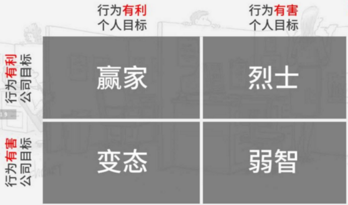
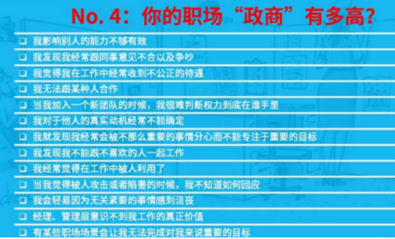

# 另类职场课不是什么

1. 不是励志成功学：媒体中生存的成功学主要是从老板的角度问题，并不是同一个公司的员工的角度来看问题。

2. 不是职场厚黑学：没什么用。搞政治有两种搞法有一种是负面的专注于怎么去害人还有一种是正面的搞法

3. 不是优秀人士的10个职场好习惯。

4. 这节课会讲一些职场真相不是老板想听到的。

5. 还有一些职场的理论和套路。包括一些标准答案，使得回答方式，这是我需要记住和学习了。

#另类职场课的四个板块

四个板块：职场政治制胜方法，员工不应该知道的职场真相(这些东西对公司不利，但是对员工有利），闲话职场，quote of the day。

# 职场政治制胜方法

政治不是一个脏字，政商很重要，不分中外

职场政治无所不在，学术圈也一样

搞政治就像耍流氓（存在得很普遍，但大家都不愿意提）

搞政治有什么好处，得到自己想得到的东西

希望与目标混为一谈。（多挣钱，提职，老板不傻逼，希望有猎头给我打电话，希望下属能积极配合工作，希望最大的错误就在于，我们将决策权交到别人手上。）目标需要有具体的时间点，决策权要在自己手里。比如我要怎么怎么样。

政商和情商不是一回事情，情商是天生的，政商可以后天学习。

换领导很常见，要学会应对。

消极对抗不得不做的事情是很愚蠢的

the power of 2x2

# 职场政治四种人物类型

{width=90%}

赢家类型：自己得到了自己想要的，同时也给公司创造了价值

烈士类型：太认真的，太一根筋；华为35岁被辞退的员工

变态类型：贪官，王雷雷事件

弱智类型：爱较劲，爱较真，爱嘴上逞强

作业：
将希望转化成目标（期望结果：我具体想要达到什么；障碍；我能做什么来克服障碍；目标声明：我要…；此时此刻我具体要做的第一件事是什么？）

我们自己到底是哪种人物类型：从诊断到行动。

你跟老板的关系怎么样：从傻逼到天造地设一样的难得。

基本功第二：政商与真相

农村总经理与富家董事长的故事

不能缺乏职场政商

高职场政商的表现：
(1. 清楚地定义实现目标的步骤。2. 识别任何群体中的权力关系。3. 抓住增加自己权力和影响力的机会。4. 找出他人的真实动机及隐藏阴谋。5. 专注关键目标，避免分散注意力。6.建立积极关系，即使对方是傻逼。7. 对正面即被面的攻击作出恰当反应。8. 把矛盾和争论转化成有效的讨论。9. 避免在无关紧要以及不可实现的东西上浪费精力。）

{width=90%}

职场真相：

公司不是民主

有些人的权力更大

所有的决策都是主观的

你的老板掌控了你的绝大多数命运

公平不可能实现

# quote

权力大的人永远会赢

你的职场政商有多高：

# 公司秘密：应该涨薪员工往往不会涨薪。

1. 你得开口要。2. 时机很重要：别人想要你的时候。3. 突出你的成功案例。4. 了解市场价格。5. 弄个正式点的报告。

小心：
1. 别当出头鸟。2. 不要瞎威胁。3. 不能 low 逼。4. 别不务实。5. 别当”工资害虫”

