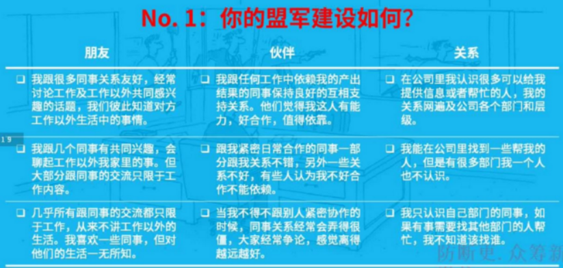

# 职场政治制胜方法

制造“盟军”，瓦解“敌人”。

一定要想清楚你到底想要得到什么？（在采取某种行动的时候）

能让对方做到你想让他做到的事情

闹是没有结果的，尤其是在流程走不通的前提下

任何一个挑战都是机会，越是偶然发生的事情就越是值得豁出去一回

小恩小惠打造一种被关照、被关注的感觉

It is not what you know, it is who you know. 但是实际上 what you know and who know you are more important.

识别盟军的三大类型：

朋友。朋友不是自然发生的，而是需要花时间去积累；朋友不一定是最有力的盟军（如果工作能力不行，在真正的任务面前，他不一定会支持你）

伙伴。工作中和我们一起做同一个项目，结果需要互相依赖，伙伴是不能挑的。伙伴并非是自动的盟军。伙伴有可能互抢功劳。把伙伴当敌人处理的人是政治弱智。

关系（熟人）。关系越多，覆盖的面越大，越有利。

# Quote

害羞的人被解雇

# 盟军养成攻略

## 三个不要

不要聚类。只跟自己的同类（同一个工种，老乡）交往

不要分层。只跟自己的同级交往

不要近视。只看到自己眼前的人，要和不同部门的人交往。

## 七个要

找到你需要认识的人

主动寻找交流的机会

做一个吸引别人的人，不做招人讨厌的人。（可靠，真诚）

可预测性

走出你的舒适圈

找链接

爱帮忙

# 敌人 VS 傻逼

## 识别“敌人”的三种类型：

目标驱动型敌人：不是针对你，而是讨厌在那个位置上的人

心情驱动型敌人：更年期，行为古怪，得到一种释放，不针对个人，而是针对所有人

复仇驱动型敌人：就是针对个人

## 敌人瓦解攻略

转化（目标驱动型敌人）

让对方相信他的目标和你的目标没有冲突

与你合作对实现他的目标有利

遏制：把损失最小化（心情驱动型敌人）

控制自己的反应

认清对方职场弱智的本质

利用结果、关系网和超脱杠杆

敬鬼神而远之

转化与遏制（复仇驱动型敌人）

化解误会（对方理性）

止损，但预防最重要

# 作业

{width=90%}

{width=90%}

# 员工不应该知道公司秘密

提职不要“提”

如何提职：先负其责，再谋其位。
