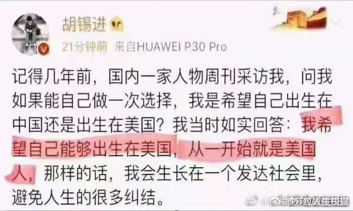
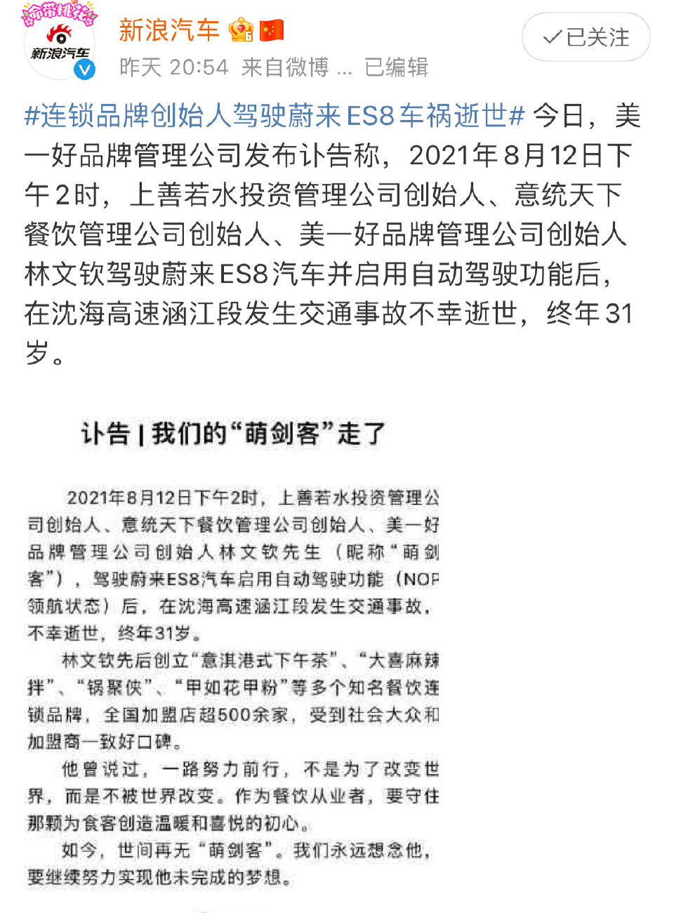
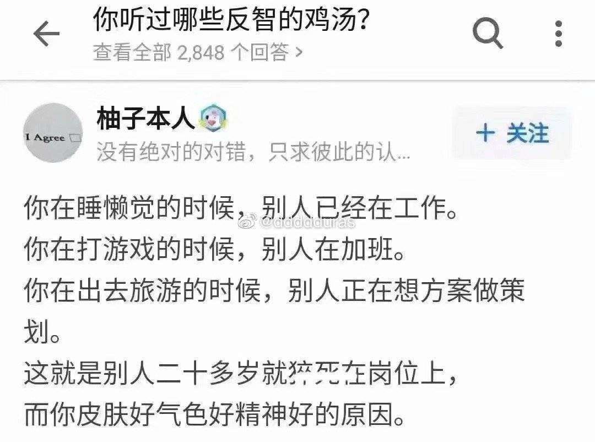
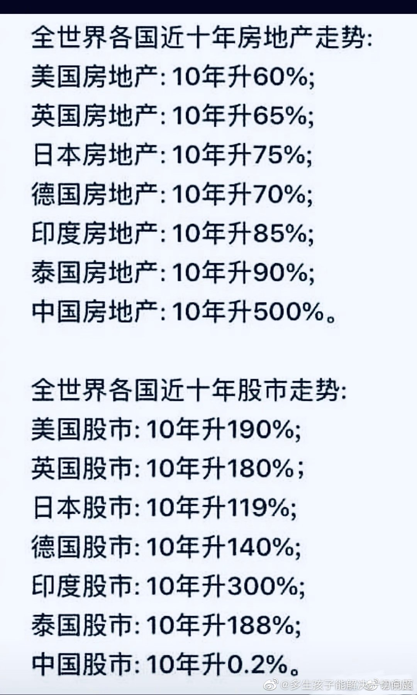

1. 国内媒体现在已经被禁止谈论财经话题了

{width=80%}

2. 苹果天下无敌，而且我来非洲之后还发现---苹果的市值相当于整个非洲的gdp，勉强羞涩的美利坚帝国在不断解体之中，看来美国、英国和其他国家的差距会不断拉大，韩国、乌克兰、越南会迎头赶上。

{width=80%}

3. 目前，加拿大的 gdp 相当于 整个非洲，那么 20 年后，韩国的 gdp 会超越整个非洲吗？哈哈，我很看好韩国。

4. 别当烈士，吃力不讨好，别人还不一定领情。

{width=80%}

5. 老胡不想当中国人

{width=80%}

{width=80%}
6. 对当下制度倒退的种种反思

{width=80%}

7. 烈士行为多则

{width=80%}

{width=80%}

8. 黑色幽默

{width=80%}

9. 近视眼手术明年必须做了

{width=80%}

10. 高额家庭负债席卷中国

{width=80%}

11. 美利坚是永远的光

{width=80%}

12. 蔚来的商业骗局

{width=80%}

{width=80%}

13. 衡水事件

{width=80%}

14. 汽车产业的未来

{width=80%}

15. 缺乏消费能力的中国人

{width=80%}

16. 最优子结构

{width=80%}

17. 房奴们太愿意自嗨，房奴们喜欢看得见的投资，就如同中国的政府喜欢投资基础设施建设一样，易得性偏差罢了，典型的愚者争虚名。

{width=80%}

