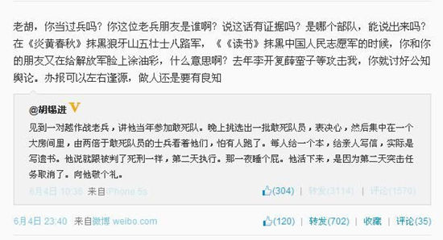

　@胡锡进：见到一对越作战老兵，讲他当年参加敢死队。晚上挑选出一批敢死队员，表决心，然后集中在一个大房间里，由两倍于敢死队员的士兵看着他们，怕有人跑了。每人给一个本，给亲人写信，实际是写遗书。他说就跟被判了死刑一样，第二天执行。那一夜睡个屁。他活下来，是因为第二天突击任务取消了。向他敬个礼。

　　@戴旭：老胡，你当过兵吗？你这位老兵朋友是谁啊？说这话有证据吗？是哪个部队，能说出来吗？在《炎黄春秋》抹黑狼牙山五壮士八路军，《《读书》抹黑中国人民志愿军的时候，你和你的朋友又在给解放军脸上涂油彩，什么意思啊？去年李开复薛蛮子等攻击我，你就讨好公知舆论。办报可以左右逢源，做人还是要有良知

{width=50%}

# 胡锡进为涉对越作战老兵言论致歉

中国一家知名报纸的主编为自己在微博发的帖子道歉，他的贴子暗示，中国在1979年与越南打仗时，一些士兵逃避参加执行危险的、具有自杀性质任务的“敢死队”。

人民日报集团旗下的《环球时报》主编胡锡进周三在新浪微博上写道，他曾与一些老兵交谈，他们说被派参加“敢死队”士兵的晚上驻地要有人把守，以防士兵逃跑。中国军队的官方报纸《解放军报》回应了这个说法，称之为“胡说八道”。

《环球时报》是一家民族主义色彩相对较重的出版物，经常用尖锐言辞回应国内外对中国政策的批评。胡锡进并不以经常表示遗憾而闻名，但这次却为自己暗示中国士兵在战场上也许不能视死如归而迅速道了歉。

他写道，他发士兵故事的贴子是为了展示“战争的残酷”，那些曾面对恐惧的士兵值得“特殊的崇敬”。他还说自己当过11年兵，一直是解放军的支持者。

他写道，“如果我的微博给某个现役或退伍军人带来了伤害感，我愿向他们表达歉意。”

