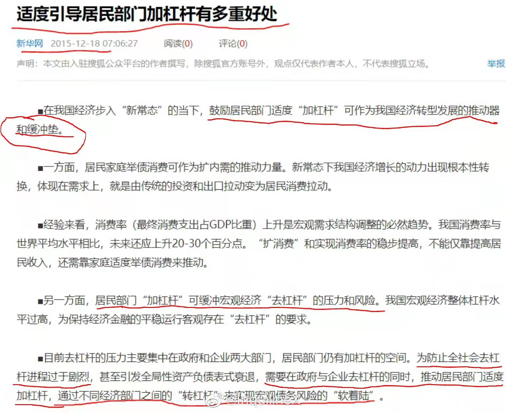
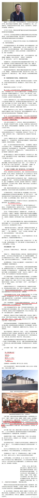
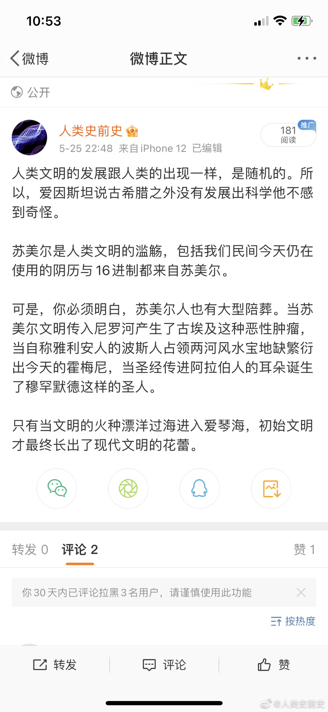
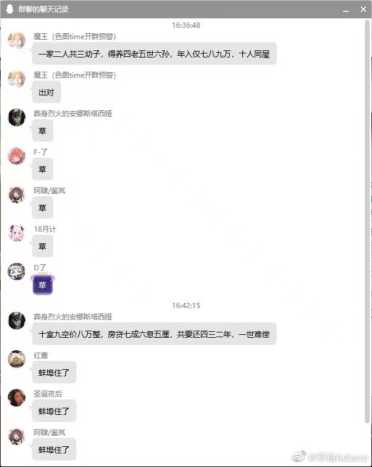

1. 如何警惕对于数据的裁剪，如何从统计全局去认识一个事物，要从全局全貌考虑，德克萨斯枪手谬误。

2. 胜间和代的作品。

3. 《思维破局》

4. How to perform market research. Scientific research on sales and stock management.

5. 代理人决策。

6. 失去了苏联的世界体系对所有人都是一种解脱，双11，元宇宙，我司目前的业务。其实已经注定失败了，但大家都不好意思提，只能硬撑着。

7. 时间、空间和数量上的边际成本与边际效用，还有关联效应和协同效应。

> 1. 淘宝新开一家店边际成本为0，优酷多播一部电视剧边际成本很高。
2. 时间上，因为版权，优酷需要不断购买同一部电视剧的版权，淘宝不用
3. 以上相当于时间和空间上的扩展性。
4. 关联效应，网络效应的一种，微信，Windows、王者荣耀都有这样的特征。微信支付和微信之间就有关联效应，但是特斯拉和老干妈就没有

8. wix ecommerce

9. 引导居民部门加杠杆。

>2015年12月：“引导居民部门加杠杆有多重好处”，一份载入史册的新闻，也是大扛鼎的起点。
这份引导中的红线和红圈部分是重点，一句话总结就是：引导居民部门加杠杆来避免全局去杠杆，再浓缩成两个字就是：“扛鼎”。
2015年12月时居民部门总债务26万亿，现在破70万亿了，5年多的时间升幅超过150%，这种加杠杆速度恐怕也远远超过了当时引导前的预估，但客观上也确实起到了扛鼎的作用，正是居民部门这40多万亿增量债务注入，为企业部门债务循环和地方土地财政循环起到了缓冲垫的作用，同时这也是人类历史上前所未有的一次杠杆转移实验，最终到底会造成什么后果，只有时间来证明了。

{width=50%}

10. 赢家与贪官

{width=50%}

11. 对社会现象的正确理解，有助于我们理解为何天不生大英，万古如长夜

{width=50%}

12. 讽刺房奴的文章

{width=50%}

