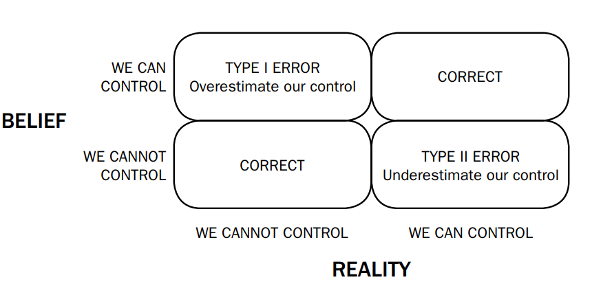
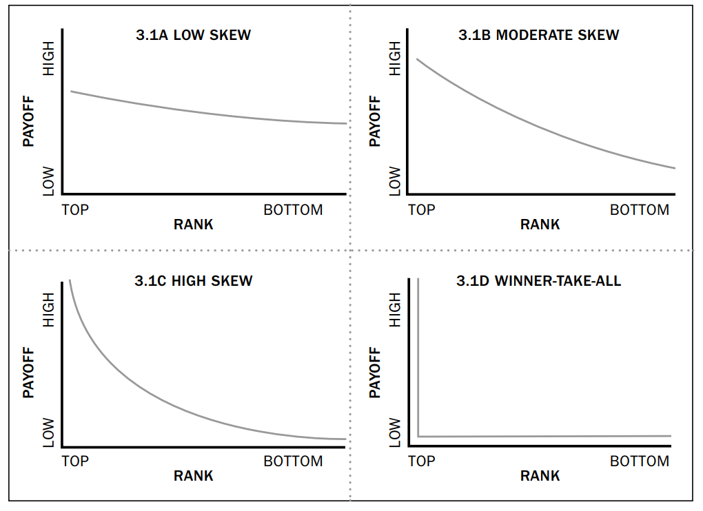
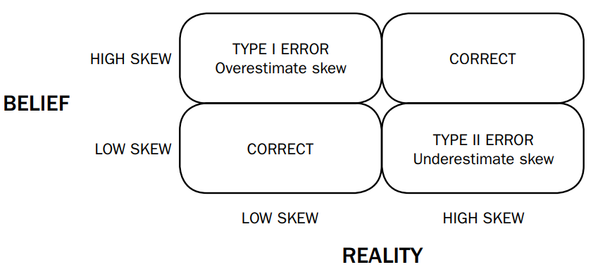
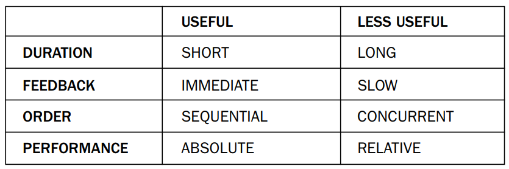

# 第一部分

作者首先讲述了一家建筑公司在竞标一个价值超 10 亿美元的商务活动的过程中所面临的困境：1. 自己的出价要低于对方的最高出价；2. 自己的价格要低于竞争对手的价格；3. 要保证有利润。最终这家建筑公司在经过详尽的分析之后给出了自己的价格。

我们普通人在生活中不会做一个价值 10 亿美元的决定，但这个案例其实非常典型（在商业、政治、体育、军事）：决定本身复杂、影响深远、充满不确定性。学会做出更加明智的选择拥有最高优先级。

近几十年来，认知科学的发展，让我们了解到了很多关于人类认知偏误的知识: 过度自信、确认偏误、幸存者偏差、控制偏差、寻找模式偏差、归因偏差等等，不一而足。

>The standard advice for making better decisions is to be aware of
our tendency for common biases and to find ways to avoid them.
That makes sense for many kinds of decisions. But as we’ll see, it’s
not sufficient for others, including many of great importance.

作者后来采访了建筑公司的高管，他发现在高管做决定的过程中，他们的确犯了很多认知偏误，但是又在情理之中，为何？

1. 确认偏误，高管的确找了很多支持自己做这个决定的证据，但不想做和做不到的证据不是更容易找吗？

2. 过度自信，高管的确认为自己的决定能够满足所有利益相关方的要求，只是在执行中需要更有效率。

3. 赢家的诅咒，如果不敢于突破自己、挑战极限，那就别想赢过竞争对手。

作者自此发现了在实验室中的认知科学研究与现实世界的决策有着多维度的不同：

1. 第一个区别，能否施加影响。实验室中的研究只是从几个选项中选出最优选项，现实世界中我们可以增加选项，甚至改变选项，或者有能力利用不同的选项。

2. 第二个区别，涉及自己还是团队。实验室的研究通常只涉及到个人的决策，现实世界中通常是我们作为公司的领导和高管做决策。

3. 第三个区别，需不需要和他人竞争。

4. 第四个区别，是不是需要马上做出决定且不能根据形势的发展而更改。

5. 第五个区别，决策的后果是否立马可见、可衡量。实验室中的研究是做出决定后马上就能知道结果的好坏，但是在现实世界中决策的后果通常要很长时间才能显性，而且很难有一套量化指标来衡量结果的好坏（比如殖民主义与反殖民主义）。

实验室中的研究假设所有人面临的状况和处理状况的能力都相同，而且没有外部因素可以干扰此项决定。他们不用关心我们是个人做出决定，还是作为团队成员做出决定，不用担心我们会如何被我们的同行和合作伙伴看待，不需要担心今天的决定和之前的决定是否一致。

>For social scientists, experiments are like microscopes or strobe lights, magnifying and illuminating the complex, multiple forces that simultaneously exert their
influences on us. They help us slow human behavior to a frame-byframe narration of events, isolate individual factors, and examine
them carefully and in more detail

毫无疑问，实验室中的研究对于我们理解消费者决策、商家的宣传和政治宣传有着重要意义。他们都包含了个人决策、在固有的选项中做出选择、无需考虑竞争，从个人的养老计划到买哪支股票，莫不如此。

回看一下建筑商面临的决策环境：1. 他们有能力影响选项（自己可以报价）；2. 需要比竞争对手报价更低；3. 需要很长时间才能知道结果（几年之后才知道能不能盈利）；4. 高管代表一个组织做决定。

>Much mischief can be wrought by
transplanting this hypothesis-testing logic, which flourishes in controlled lab settings, into the hurly-burly of real-world settings where
ceteris paribus never is, and never can be, satisfied.

我们对于消费者决策、公共政策、金融投资的决策研究已经很多，但对于真实世界中的复杂决策了解得很少。

这本书的核心是结合了认知科学的研究，加上现实复杂因素的考量来进行决策，简言之就是 left brain, right stuff.

1. Left brain (deliberate and analytical approach to problem solving):  

  1.1 knowing the difference between what we can control and what we cannot, between action and prediction
  
  1.2 knowing the difference between absolute and relative performance, between times when we need to do well and when we must do better than others
  
  1.3 sensing whether it’s better to err on the side of taking action and failing, or better not to act; that is, between what we call Type I and Type II errors
  
  1.4 determining whether we are acting as lone individuals or as leaders in an organizational setting and inspiring others to achieve high performance
  
  1.5 recognizing when models can help us make better decisions, but also being aware of their limits
  
但是，仅仅只有仔细的分析是不够的，伟大的决策需要面对危机，挑战极限、探索未知、成为先驱的意愿，这就是 right stuff。

>the right stuff wasn’t just a
willingness to risk one’s neck. Any fool could do that. Rather, it
meant “to have the ability to go up in a hurtling piece of machinery and put his hide on the line and have the moxie, the reflexes,
the experience, the coolness, to pull it back at the last yawning
moment.”15 The right stuff was about the intelligent management
of risk

2. right stuff:

  2.1 summoning high levels of confidence, even levels that might seem excessive, but that are useful to achieve high performance
  
  2.2 going beyond past performance and pushing the envelope to seek levels that are unprecedented
  
  2.3 instilling in others the willingness to take appropriate risks
  
这两样东西看上去貌似互相对立，但其实是互补的。伟大的决策既需要仔细和周全的考虑，同时也要有意愿去承担额外的风险。

接下来，第二章和第九章和 left brain 有关:

1. Chapter Two makes
the fundamental distinction between decisions for which we cannot
control outcomes and those for which we can. For the former, there
is little benefit to wishful thinking or optimism, but when we can
shape outcomes, positive thinking can be powerful. 

2. Chapter Three
introduces the dimension of relative performance, in which it’s not
enough to do well, but essential to do better than one’s rivals. Many
studies of judgment and choice omit any competitive dimension, but
when we have to do better than others, the need to think strategically is crucial.

3. Chapter Four combines these first two dimensions,
showing what happens when an ability to influence outcomes and
the need to outperform others are both present. Far from being a rare
or special case, such situations are very common. When it comes to
strategic management, they might even be considered the norm.

4.  Chapter Five examines perhaps the most widely
cited of all errors, overconfidence, and presents a radically different
interpretation. On closer inspection, what seems like a simple
idea—that people are prone to overconfidence—turns out to be
much more complex. In competitive situations, not only is a very
high level of confidence often useful, but it can be essential. 

5. Chapter Six looks at another well-known error, the base rate bias. The
basic finding—that people tend to overlook population base
rates—is correct, but the common advice—that we should heed
base rates—is incomplete. There are instances when not only can
we go beyond what has been done before, but competitive circumstances dictate that we must. Far from being reckless, however, we
can find ways of limiting risk, using the left brain in service of the
right stuff

6. Chapter Seven adds the temporal dimension and makes the
vital distinction between decisions for which feedback is rapid
and tangible, and those for which it is slow. For the former it may
be possible to learn through deliberate practice, but for the latter
it is more important to get the decision right the first time.

7. Chapter Eight moves beyond decisions made by individuals acting alone
to consider decisions by leaders in organizations. Now it may be
essential to inspire others to go beyond what might seem justified,
which forces us to take a fresh look at concepts like transparency,
authenticity, and sincerity. 

8. Chapter Nine focuses on decision models, a topic of current interest given the rise of Big Data. Models
can be very powerful and often provide remarkably accurate predictions. Yet in our embrace of decision models, we have sometimes
applied them incorrectly. Knowing when models are useful, but
respecting their limitations, is also vital

9. Chapter Ten
explores competitive bidding and takes a fresh look at another
well-known error, the winner’s curse. 

10. Chapter Eleven addresses
entrepreneurship and new venture creation, once again replacing
current ideas about decision biases with a more realistic and nuanced understanding of how people can and should make decisions
in the real world.

11. Chapter Twelve summarizes the key lessons for making
great decisions, not in routine settings of consumer choice or
investments—for which we neither can influence outcomes nor
need to outperform rivals—but in complex real-world settings.

---

# 第二部分 控制

作者发现很多顶尖的高尔夫运动员在挑战高难度动作的时候总是会极度自信，这种盲目地自信带给他们的不是灾难，而是更好的成绩。后来，有科学家也在实验室中检测了这一发现，视觉上认为高尔夫更大的那一组命中率高于视觉上更小的那一组。拥有更为积极的态度，哪怕有时候显得有些自负，对于结果的改善也是很有意义的。

传统的智慧告诫我们，不要过度乐观，不要自以为是，在我们不能改变的事情上，力求准确是十分必要的，但是，那些由我们来决定那些事情可能发生的情况下，传统的智慧依然可靠吗？

>Athletic performance is shaped by many factors, from proper technique to good
conditioning to smart nutrition, but a positive mind-set is also vital. 

在体育界的无数例子告诉我们，积极的心态、自信对于成功非常重要。

接下来的问题是，这种“错觉”在何种情况下才是健康的呢？

>Not far more capable, of course; we’re not suggesting that delusions of grandeur are healthy. But for many activities, in which we don’t just make predictions about things we cannot influence but
have a hand in shaping outcomes, positive thinking matters

在基础能力都不扎实的情况下，积极心态不一定健康。“普信男”

>Positive illusions lead people to
take the initiative rather than accept the status quo. They help us
cope with adversity and survive tough times. They make us more
resilient and less willing to concede defeat. Positive thinking stimulates people to be more creative, to look for new ways of doing
things, and to persevere in the face of competition

>people who display positive
illusions tend to have more friends and create stronger social
bonds, both of which are important ingredients of happiness. 

>enviable capacity to distort reality （现实扭曲场）

None of this should let us conclude that a positive attitude can overcome any obstacle, or surmount all odds, or any other such New Age motivational nonsense. For things that we cannot influence, there’s not much to be gained from positive thinking. As Dr. Thompson’s cycling experiment showed, improvements are demonstrable but hardly unlimited. Yet the general rule holds. When we can influence outcomes, positive thinking—even holding views that are somewhat exaggerated—can be beneficial.

尽管积极的心态由如此多的好处，但如何分辨什么是可以影响的，什么是不可以影响的，这是关键。对于可以影响的，人们能够准确评估自己影响的能力。

>When there’s no way to exert control, the best approach is usually sober and detached judgment. It’s smart to identify and ward off common biases. But when we can get things
done—when we can influence outcomes—positive thinking is
highly useful

大量的研究显示，人们通常会表现得能够去控制他们无法控制的事情。基于此，专家会建议：你们能控制的其实比你们想象得要少。它有一个专有的名词：控制偏误。但作者认为这不是故事的全部。

这些证明人类有控制偏误的例子都从随机的，不可控制的事情出发，只要人们稍加控制，于是就产生了控制偏误，如果对于人们有能力控制的事物（从强到弱），人们是会选择高估还是低估自己的控制能力呢？

多个实验证明：

>people do not consistently overestimate their level of control. A simpler explanation
is that people have an imperfect understanding of how much control they can exert. When control is low they tend to overestimate,
but when it’s high they tend to underestimate.

For the past decades we have favored a dramatic conclusion—that people suffer from an illusion of control—
rather than a less surprising but more accurate one: that people can
and do err in both directions.

在衡量自己的控制能力方面，人们同时存在高估或低估的倾向，那么哪一个倾向更常见，后果更严重呢？

Whereas decision research has warned us against the illusion of excessive control, for many activities the more important lesson is exactly the opposite: we should try not to underestimate our control.

>The availability heuristic, a mental shortcut whereby people place too much
importance on information that is readily available, causes doctors
to mistakenly diagnose diseases that come easily to mind while
overlooking diseases that are less common. 

>The confirmation bias, a
tendency to look for evidence that supports an initial hunch, prevents doctors from probing thoroughly for evidence that might
contradict that hunch.

>The anchoring effect is also important, as
initial data become an anchor that’s usually not modified sufficiently by subsequent information. 

A recent article in
the Annals of Behavioral Medicine summarized eighty-three studies
that examined illnesses ranging from cancer to cardiovascular disease, and found a strong relationship between patient optimism and
good health.

当然并不是说积极心态能解决所有问题。

The need to exhibit versatility, to think simultaneously in a
dispassionate and unbiased way while conveying optimism and
positive thinking when outcomes can be influenced, is one reason
health care is such a demanding profession

The essence of management is to exercise control and influence events. Of course managers don’t have complete control over outcomes,
any more than a doctor has total control over patient health. They
are buffeted by events outside their control: macroeconomic factors, changes in technology, actions of rivals, and so forth. Yet it’s a
mistake to conclude that managers suffer from a pervasive illusion
of control. The greater danger is the opposite: that they will underestimate the extent of control they truly have.

>[G]ambling contains elements of
uncertainty and positive or negative outcomes. Managerial decision
making is (hopefully) based on an educated guess of what is most
likely to happen and what can be done to remedy a negative outcome. That is, decision making is a continuous process in which
each decision is dependent on previous decisions. Gambling has
only two outcomes—win or lose, and each decision and outcome is
independent of others.

>Decision
theory puts all the emphasis on the analysis leading to the moment
of choice. While it is definitely important, my experience taught me
that my ability to influence whatever goes on after the moment of
choice is perhaps even more important.

Far from suffering from an illusion of control, managers are more likely to underestimate their ability
to influence outcomes. They often can achieve more, influence more,
and bring about more change than they imagine.

自此，我们已经知道了在商业决策和日常决策的众多场景中，通过施加影响，扩充自己的选项，增加自己的胜率或者在行动过程中调整自己的决策是很重要的，但是在生活中，我们很难分清楚那些可以控制，哪些不可以，如果人不得不在这件事情上犯错，那么我们是应该高估还是低估自己的控制能力呢？

>Of course we’d all like to have the wisdom to know the difference
between what we can change and what we can’t, but often we
don’t. That leads to more questions: When we don’t know for sure,
is it better to err on one side or the other? Is it better to imagine we
have more control than we really do, or better to be mistaken in
the other direction?

{width=80%}

Of course we would like to minimize the chance of error, and
often gather information to improve the accuracy of our beliefs. But
even so, some uncertainty remains. That’s why we still need to consider the consequences of error. Is it better to act as if we have
control (and run the risk of a Type I error), or is it better to assume
we don’t have control (and run the risk of Type II error)? By thinking about the consequences of each, we can try to avoid the more
serious of the two.

As a rule of thumb, it’s better to
err on the side of thinking we can get things done rather than assuming we cannot. The upside is greater and the downside less.

>当然这最终还是要看那一个后果更严重（损失 vs 收益，概率 vs 程度）。收益概率高，且收益大，则高估；反之，低估。

总结，大多数实验室中的实验以及古老的智慧总是告诫我们不要高估自己对事情的影响力，可这只是事情的一面，另一方面，人们其实常常低估了自己对事情的影响力。只是由于分析哪些事情可以施加影响，哪些事情不能施加影响很难分析，如果不得不犯错误，那么犯哪一种错误更好？

1. 首先区分哪些可以控制，哪些不可以？

2. 然后缜密分析，对于不可控制的谨慎选择，对于可控制的要保持积极心态，甚至有必要盲目乐观。

3. 对于无法确定的，在综合分析收益和成本的前提下，尤其是最坏的结果也能够承担，收益非常丰厚的前提下，要选择施加影响，但是在最坏结果无法承担的情况下，只依据事实做出判断，不要盲目自信。

>还是想起来官店酒店的事情，还是老妈手段毒辣，做几次生意都从成本最小化，损失最小化入手，没吃什么大亏。

> 这和方丈所说的，承认自己能力有限很矛盾啊，也许后面几章能解答我的困惑。

---

# 第三部分 相对表现还是绝对表现

要做出好决策的第二个关键在于我们是要做得更好，还是要比别人好。

>When it comes to managing your finances, decision research
offers many useful lessons. For starters, you should bear in mind
that stocks move in random patterns, and that several days of gains
neither mean the next day will bring another uptick, nor that a
correction is due. Don’t monitor your portfolio every day, because
people feel losses more acutely than gains, so the fluctuations of
the market will only add to your anxiety. And don’t try to time the
market, looking for the exact moment to jump in or cash out, because no one can time the market with accuracy. Rather, you should
periodically review the allocation of your assets and make adjustments. Invest for the long term and follow a strategy of buy-andhold, with index funds that track the market while charging low
expenses. Do all these things, and you’ll very likely generate solid
long-term gains.

 Managing your personal investment portfolio is
a matter of absolute performance. You keep what you earn, regardless
of what anyone else does. There’s no element of competition. The
National MBA Stock Market Competition is purely about relative
performance. It’s not enough to do well; all that matters is doing
better than the rest

那么我们要怎么做才能胜过我们的竞争对手呢？

目前大量的研究只教会了我们如何做出适合自己的判断，无需考虑其他人。在竞争的环境中，我们使用这些策略就要非常谨慎。

>the
art of outdoing an adversary, knowing that the adversary is trying
to do the same to you.

在确定了相对表现和绝对表现之后，接下来的问题是：回报的分布。

{width = 80%}

It becomes very important to do better than rivals.

As a rule, the greater the skew, the more important it is to outperform rivals—and the more extreme chances you’re likely to take.

>作者只考虑了收益吗？没有考虑损失吗？损失如果会非常严重，一定不要做。

目前绝大多数的竞争环境都是有一个明确的中止点和具体的回报，且是一个有限游戏，特别是在体育领域。

The combination of highly skewed payoffs and a clear end point makes for highly dramatic competitions.

但是在很多领域，竞争是相对的，但是回报却是不确定的。

>In many competitive settings performance is relative, but the nature of the payoffs isn’t clear. There are no clearly stated rules with
payoffs that are known to all, no standings posted in clear view so all
can see how they are doing, and no game show host to read the
questions and immediately judge the replies. There may not even be
a clear end point, making it difficult to know how much to bet.
Competition is complex and fraught with uncertainties. Or there may be multiple end points, with rivals aiming at somewhat different objectives. 

我们通常会认为总统选举是相对表现的一个例子---相对票数要多、回报丰厚、有一个明确的中止点，但是很多参加总统选举的人很多情况下是在各自玩不同的游戏。

那么商业表现呢？

>Game shows, sporting events, and elections are designed to produce
dramatic tension, with highly skewed payoffs and clear end points. In other kinds of competition, however, there’s neither a clear end
point nor an explicit payoff distribution.

商业世界中，相对表现当然很重要，但是每一个行业、每一家公司的回报却是不知道的，餐馆、互联网企业、电影公司的回报分布不同。

In other industries direct competition can be so intense that
there’s room for only a few successful companies. Any that are too
small to enjoy economies of scale or that fail to gain sufficient market share may fail. In some cases the lion’s share of profits may accrue to just a few companies.

商业世界没有一个明确的中止点，竞争不会停止。

As for end points, competition in business is typically ongoing and
open ended. Of course companies seek to outperform their rivals, and often
compete aggressively. But rarely is competition so intense that it’s
necessary to be the single best performer on a given date. Success is
often a matter of achieving high performance over the long term.
Here again, industries differ a great deal. For such highly dynamic industries, a new phrase has entered the lexicon: Red Queen competition.

In Red Queen competition, companies
are constantly under pressure to outdo one another—to introduce
new and improved products, to find new ways to bring value to customers, and to experiment with new business models—all to gain an advantage over rivals. Red Queen competition means that a
company can run faster but fall further behind at the same time.10
Recent empirical research suggests that in many industries competitive advantage is difficult to maintain, and that the speed of regression toward the mean is becoming faster.11 The reasons are clear.
Technology change accelerates. Customers can easily find alternatives. Rivals imitate leaders. Consulting firms spread best practices. Employees move from one firm to another, leveling advantages. All
of this means that companies cannot afford to stand pat, because
those that do face an inevitable erosion of performance。

> 有些产业受技术影响小，比如糖果、白酒，多年来都是老大哥主导，但是很多产业，技术的更新换代非常快，比如手机、互联网，暂时的领先很容易被颠覆。

For business executives, devising a successful strategy requires
more than knowing the end point, understanding the distribution
of payoffs, and deciding how much risk to take. The first task is to
assess the nature of performance. How intense is the rivalry? How
skewed are the payoffs, both at present and over time? There may
be moments when it’s important to be among the very few top players, because otherwise we stand a good chance of going out of business in a process known as shakeout, when many companies lose
out and only a few remain.

In the face of this uncertainty, managers often rely on a rule of
thumb that involves two points: the aspiration point and the survival
point. The aspiration point asks: What’s the best I can do? Can I
make a bold move that, if successful, will place me at the top of the
pack, at least for a while? Is it worth making a risky bet that could
bring great benefits? The survival point asks: What’s the least I need
to do in order to stay alive? What must I do to avoid being eliminated, so that at a minimum I can live to fight another day? Managers often make decisions with an eye to these two points, hoping
to reach the aspiration point but at least making sure they pass the
survival point.

能够区分相对表现与绝对表现的智慧

在无需竞争的情况下，分享自己绝对表现良好的经验无伤大雅，但是，在衡量相对表现时，闷声才能发大财。

>在商业中，帮助人们提高绝对表现的商业很难赚大钱，但是，能够帮助人们提高相对表现，而且赢家高回报，有一个明确的截止点的生意很好赚钱，比如学校培训和公务员培训。

 You wouldn’t mind if your doctor
shared information about your medical history to help other patients.
Your recovery is unrelated to theirs. If anything, you’d probably be
glad to help out. Business is entirely different. Firm performance—
whether measured in terms of market share, revenues, or profits—is
not only relative but often highly skewed, such that the success of
one company often comes at the expense of others. In these circumstances it’s not just irresponsible to share information, but dangerous.
What is sensible when performance is absolute may be suicidal when
performance is relative and payoffs are highly skewed

接下来的问题是我们并不是总有智慧去分辨相对表现还是绝对表现，如果非要犯错，犯那种错更好呢？

We can now pose a question like the one in Chapter Two: When it
comes to absolute and relative performance, on which side would
you rather err? Of course, you want to know when performance is
relative and payoffs highly skewed so that you can take appropriate
actions, much like the University of Alberta students. You’ll also
want to know when performance is absolute and payoffs have low
skew so you can act accordingly.

{width=80%}

If you believe
there’s an intense pressure to outperform rivals when that’s not the
case, you might prefer a Type I error. You might take action sooner
than necessary or act more aggressively when the better approach
would be to wait and observe. The risks can be considerable, but
perhaps not fatal. On the other hand, if performance is not only
relative but payoffs are highly skewed, and you don’t make every
effort to outperform rivals, you’ll make a Type II error. Here the
consequences can be much more severe. Fail now, and you may
never get another chance to succeed. By this logic, the greater error
is to underestimate the intensity of competition. It’s to be too passive in the face of what could be a mortal threat. When in doubt, the smart move is to err on the side of taking strong action.

当我们分不清回报的分布时，最好的选择是用尽全力。

最后我们再回想一下表现。

在只需要考虑绝对表现的时候，传统的决策理论是部分有效的。

In many fields, however, performance is best understood as relative. In business, politics, sports, and more, many of the most important decisions are made with an eye to rivalry. The aim isn’t to
just do well, but to do better than others. Sometimes the distribution of payoffs is clearly stated, but often the intensity of rivalry, the
nature of payoffs, and whether competition is open or closed ended,
is unknown. Very often we have to make crucial decisions without
all the information we need.

The most consequential managerial decisions are fundamentally different from those that have often been studied, and in two
crucial ways. Not only can managers often exert control over outcomes, but they also have to outperform rivals. And as the next
chapter will show, when these two factors are combined, some
conventional ideas about decision making are turned on their heads.

很多时候，我们难以分辨那些强调相对表现、那些强调绝对表现，回报的分布一开始也很难搞清楚，竞争到底有没有终点也不确定，各方参与竞争的目的也不甚明朗。如果非要犯错，那么还是看收益和损失，哪一方犯错的收益巨大，损失可接受，就选择哪一方。一般而言，选择用尽全力，相信竞争没有终点，认为大多数事物要衡量绝对表现是比较好的。

---

# 第四部分 赢的代价

>IN TIMES OF CHANGE, MANAGERS ALMOST ALWAYS KNOW WHICH
DIRECTION THEY SHOULD GO IN, BUT USUALLY ACT TOO LATE AND
DO TOO LITTLE. CORRECT FOR THIS TENDENCY: ADVANCE THE PACE
OF YOUR ACTIONS AND INCREASE THEIR MAGNITUDE. YOU’LL FIND
THAT YOU’RE MORE LIKELY TO BE CLOSE TO RIGHT.

Combine the ability to exert control with the need to outperform
rivals, and what happens? Now it’s not just possible to influence
outcomes, but often necessary.

在主动体育项目中，兴奋剂的使用大致可以提高运动员 5% 的赛场表现，这虽然不多，但对于一个高度竞争的体育赛事来说，这是赢得成功的关键。

>There would have been no way to win such a
competitive race without using all means at his disposal. The sad fact
is that Armstrong was probably correct, although by doping he exacerbated the problem, making it impossible for others to ride clean.

高度竞争的环境中可能任何人都不得不用一定的见不得人的手段。

> 依稀记得这位运动员还被当做励志典型呢，不了解实际情况的人所作出的归因简直不能信。

even a small improvement in absolute performance can make an
outsize difference in relative performance, in effect between winning and losing.

作者用蒙特卡洛实验方法最终发现，一点点提升，对于成为最后赢家的概率会大幅增高。

The lesson is clear: in a competitive setting, even a modest improvement in absolute performance can have a huge impact on
relative performance. And conversely, failing to use all possible
advantages to improve absolute performance has a crippling effect
on the likelihood of winning. Under these circumstances, finding a
way to do better isn’t just nice to have. For all intents and purposes,
it’s essential.

The distribution of payoffs in business is rarely stated explicitly,
with fixed prizes for first, second, and third place. Nor is there usually a precise end point when a company needs to be among the
leaders or face elimination.

Yet for all these differences, business nevertheless shares many of
the same competitive dynamics. Although there may not be a
clearly defined payoff structure, payoffs in business are often highly
skewed, with a great disparity between top and low performers.
There may be no precise end point, but that’s not necessarily a
source of comfort, because the threat of elimination can be constant. Furthermore, unlike sports, in which the rules are known to
all and the standings are clear for all to see, competition in business
has many sources of uncertainty. Technologies can change suddenly
and dramatically, new competitors can enter the fray at any time,
consumer preferences can shift from one week to the next, and rivals can merge or form alliances. If anything, competition in business is more dynamic and less forgiving than in sports. Not
surprisingly, there is incessant pressure to find ways of doing better,
whether through innovative technology, new products and services,
or simply better execution. Only by taking chances, by pushing the
envelope, can companies hope to stay ahead of rivals. Michael Raynor of Deloitte Consulting calls this “the strategy paradox”: that
strategies with the greatest possibility of success also run the greatest chance of failure. “Behaviorally, at least,” Raynor observes, “the
opposite of success isn’t failure, but mediocrity. . . . Who dares
wins . . . or loses.”6 A commitment to bold action may not be sufficient to guarantee success, but when performance is relative and
payoffs are highly skewed, one thing is assured: playing it safe will almost guarantee failure. You’re bound to be overtaken by rivals
who are willing to take big risks to come out ahead.

>李嘉诚所说的，稳健不忘发展，发展不忘稳健。忘我地投入，但不要让自己一旦失败就无法生活。

The importance of taking action in business—who dares wins—
isn’t a new idea.

In the highly competitive industries in which Branson operated, such as retail and airlines, the willingness to take bold action was a necessity. Standing
pat would inevitably lead to failure. Heike Bruch and Sumantra
Ghoshal, in A Bias for Action, took this thinking one step further: “While experimentation and flexibility are important for companies,
in our observation the most critical challenge for companies is exactly
the opposite: determined, persistent, and relentless action-taking to
achieve a purpose, against all odds.”9 Why “against all odds”? Because in a competitive game with skewed payoffs, only those who
are willing to defy the odds will be in a position to win.

In strategic management, a bias for action simply means a preference for action over inaction. Such a preference arises from the recognition that when performance is relative and payoffs are highly
skewed, only those who take outsize risks will be in a position to win.
The University of Alberta team displayed a bias for risk taking when
it pursued what it admitted was “aggressive and sometimes extremely
risky strategy.” They weren’t wrong. Their bias for taking risks reflected an astute understanding of the competitive context.

为什么说通常来讲在商业中积极采取行动是好的

>和方丈说的又有点不同，方丈是说多思考、少行动。也许内核一致，字面意思不一致。

Put them together, and not only can we improve outcomes by
taking action, but given the nature of competitive forces we’re
much better off erring on the side of action. That’s what Intel
chairman Andy Grove meant by the title of his book, Only the
Paranoid Survive. Grove didn’t say that all who are paranoid will be
sure to survive. He made no claim that paranoia leads predictably
to survival. His point was merely that in the highly competitive
industry he knew best—semiconductors—only companies that
push themselves to be among the very best and are willing to take
risks will have a chance of living to see another day. The choice of
words was deliberate. Grove knew from experience that paranoia
may not ensure success, but any companies that survive will have
exhibited something resembling paranoia.

> 这一章的很多理论还是要结合方丈的言论和市场失灵来看。腾讯、微软、谷歌和苹果不太需要这样做，但小米、比亚迪和特斯拉则不得不这样做。另外新产品邢台的出现会使得品牌、规模没有意义（诺基亚）。但是，一定要找到自己擅长和喜欢的事情，忘我地、长时间地投入。

谁才是哪个特俗案例？

Unfortunately, in our desire to conduct careful research that
conforms to the norms of social science, with its rigorous controls,
we have sometimes generalized findings to situations that are markedly different. 

Their desire, as the program title suggests, is to
achieve better strategic management of their companies. In recent
years two of my colleagues have added sessions about decision making. The finance professor showed how financial decisions are often
distorted by cognitive biases, and the marketing professor did the
same for consumer choices. That’s not a bad thing. Executives are
surely better off knowing about common errors, and no doubt they
enjoyed the sessions. But understanding decisions in finance and
marketing does not adequately capture what is distinctive about strategic decisions. For a program about strategic management, we should
consider situations in which executives can influence outcomes, and
in which performance is not only relative but highly skewed.

其实作者与方丈的很多想法不谋而合，商业战略相较于实验室做决定的区别：我们能施加影响、扩充选项；我要需要竞争、比对手更好；回报分布有些明朗、有些不明朗；没有具体的规则；没有一个明显的中止点。这都要求我们要有积极的心态、勇于采取行动、专注、用尽全力、找到自己擅长的事情、细节的改善往往会导致巨大的差别。大公司和伟大公司的区别在于：伟大公司知道专注和简洁、少即是多；大公司则是产品多、策略多、繁杂。这也是根目录思维和树型目录思维所带来的巨大差别。

---

# 第五部分 自信与过度自信

We need to ask: If overconfident means too confident, too confident compared to what? If overconfidence means greater confidence than
circumstances warrant, which circumstances are we talking about?
Very soon, what seems like a simple idea becomes much more
complicated.

To help make great decisions, we
need to take a new look at what we mean by confidence . . . and
what we mean by overconfidence.

那么在日常生活中，人们是如何使用 overconfident 的呢？大家是在用结果来倒退的吗？

Overconfidence is a common explanation any time something turns out badly, and not just in politics.

We know that athletes understand the importance of confidence.
Quite naturally, when they’re victorious they give credit to their
high confidence, and when they’re defeated are quick to blame
overconfidence. 

Perhaps nowhere is failure blamed on overconfidence as often as
in the business world.

人们以结果来评判是否过度自信：成功了---自信，意气风发；失败了---过度自信

In all of these examples, from politics to natural disasters to
sports to business, overconfidence offers a satisfying narrative device. Take any success, and we can find reasons to explain it as the result of healthy confidence. We nod approvingly: They were
confident—that’s why they did so well. Take any failure, and we shake
our heads: They were overconfident—that’s why they did poorly. If they
hadn’t been so sure of themselves, they might have done better.

First, not everything that turns out badly is due to an error. We live in a world of
uncertainty, in which there’s an imperfect link between actions and
outcomes. Even good decisions sometimes turn out badly, but that
doesn’t necessarily mean anyone made an error. Second, not every
error is the result of overconfidence. There are many kinds of error: errors of calculation, errors of memory, simple motor errors,
tactical errors, and so forth. 

Those first two flaws lead to the third. It might be convenient to
blame bad outcomes on overconfidence, but the logic doesn’t add
up. Even worse, the effect is to dilute overconfidence to the point
where it’s all but meaningless. When any failure can be attributed
to overconfidence, the term means nothing at all.

There’s another danger when we attribute failures to overconfidence, and it’s potentially the most serious of all. Accusations of
overconfidence carry a moral overtone. When we charge people
with overconfidence, we suggest that they contributed to their own
demise. We imply that they at least partially deserved their fate.
They committed one of the seven deadly sins, sometimes called
pride or vainglory. We think: They were too sure of themselves. They
should have known better. They got what they had coming.

It’s only after things turn out badly that
we hear the term. We’ll never learn from the errors of others if we
attribute them to overconfidence. We end up fooling ourselves.

如果说过度自信只是一种错误的事后解释的话，那么这些决策研究有意义吗？幸运的是，我们有办法用第三方的客观指标来衡量一个人是否过度自信。

the single word—overconfidence—has been used to mean
three very different things, which they call overprecision, overestimation, and overplacement

1. Overprecision is the tendency to be too certain that our judgment is correct.

2. Overestimation, the second kind of overconfidence, is a belief
that we can perform at a level beyond what is objectively warranted. When golfers believe they can sink 90 percent of their sixfoot putts, that’s overestimation. When we believe we can complete
a task in a shorter period of time than we can, that’s overestimation.
Overestimation is an absolute evaluation; it depends on an assessment of ourselves and no one else

>The evidence for overestimation isn’t nearly as strong as the
evidence for overprecision. For many ordinary tasks, there’s good
evidence that people believe they can do better than they really
can. 

most people also believe the future will be
better than the present. But there are limits. When it comes to difficult tasks, many people believe they won’t do very well and at times
even underestimate how well they can do. Overall, it’s a stretch to
claim that people have a general tendency to overestimate.

>高估与低估同时存在

3. Overplacement, the third kind of overconfidence, is a belief that
we can perform better than others. It’s not an absolute judgment,
but a relative one. When it comes to overplacement, much of what we have come
to believe isn’t just exaggerated but actually incorrect.

>Most people
think they’re below average. Little do they realize that almost everyone else has the same view.

That’s not what we’d expect if people really had a persistent tendency for overplacement. A simpler explanation is that
the way we place ourselves depends on the difficulty of the task and
the information we have.

>复杂系统中，考虑他人的情况是非常重要的。

Once we break down overconfidence into its different parts and
take a close look at each one, we shouldn’t conclude that people
see themselves as superior to others, period. We’re not overconfidence machines at all. Responses depend on the specific skill in
question and on the information we have.33 Rather than claim people are biased, it might be more accurate to say they’re myopic.
They see themselves clearly, but have less information about others, and generally make sensible inferences accordingly.

As for health-care reform, if the Obama administration had expressed high confidence about the chances of successful reform,
that would be overestimation. But studies of drivers and teachers
who overplace and computer executives who are overprecise hardly
let us conclude that health-care reform is tainted by overestimation.
In fact, if health-care reform is difficult—and by all indications it
may be very difficult to carry out successfully—the error may be in
the opposite direction. We may actually underestimate our ability to
bring about this sort of change. Far from undertaking too many
difficult projects, we may in fact initiate too few complicated and
ambitious projects.

那么为了更好地决策，自信的正确水平是多少呢？

So far we have seen that it’s not helpful merely to infer overconfidence after the fact, when things have gone wrong. Nor is it correct
to use one word for three very different things. There’s little reason
to suggest that overconfidence is as prevalent as is often claimed.

We saw previously that positive illusions often help improve
performance. Believing we can do something may help us do it
well. In that case, is a somewhat exaggerated level of confidence
really excessive?

The way forward is to remember the topics of the previous chapters. First, can we exert control and influence outcomes, and second, is performance absolute or relative?

For things we cannot influence—the roll of dice, the weather,
or the S&P 500—there’s nothing to be gained from overestimation.

1. When we can influence outcomes, it can be useful to hold
opinions that are somewhat inflated—that is, to overestimate.

2. When performance is relative, however, the desired level of confidence can only be understood in the context of competition.
What’s the best level of confidence? It’s what we need to do better
than our rivals.

That’s not to say that a very high level of confidence will guarantee success. It won’t. The performance of our rivals matters, too.
Still, when an ability to influence outcomes is combined with relative performance, only those who push themselves to go beyond
what seems reasonable will be in a position to succeed. What might
seem like an exaggerated level of confidence isn’t just useful, but in
the context of competitive rivalry, it is essential.

The problem is, identifying that level of confidence in advance
is difficult. There’s no formula we can use, which is why we so often resort to ex-post inferences. When things turn out well, we conclude that our level of confidence was appropriate. We were brimming with healthy confidence. When things turn out poorly, we
conclude it was inappropriate—either too much or too little. We
suffered from overconfidence—or maybe insufficient confidence. Of
course that’s really just an easy way out. Ex ante, things are never
so clear. Determining the right level of confidence demands more
than a simple comparison to past achievements. We need to consider whether we can exert control over outcomes and also the
nature of competition. When performance is relative and highly
skewed, a very high level of confidence is not excessive but
essential.

我们真的过度自信吗？

Once we tease them apart, however, we
find that overprecision is widespread, but overestimation and overplacement aren’t inevitable. In fact, when it comes to difficult
tasks, people are more likely to underplace than to overplace. The
common image of people as overconfident is justified for routine
tasks, but not for many of the greater challenges we face.

Far from people being “overconfidence machines,” I suspect a different interpretation is more accurate. As Henry David Thoreau observed, most people lead lives of quiet desperation. Glance at airport
bookshelves, and you’d never guess that people suffer from overconfidence. Much more common are books that encourage us to raise our
level of confidence. 

Why has it been reported so consistently that people are overconfident? One problem has to do with the design of experiments.
If we ask for ranges that require 90 percent confidence, we shouldn’t
be surprised to find that most errors are in the direction of too
much confidence, not too little. If we ask about routine tasks like
driving, we find people tend to overplace. When we run experiments with unbalanced designs, we shouldn’t be surprised that the
errors are mostly in one direction. The more serious bias isn’t with
the answers that are given, but with the questions that are asked.

There is another reason, too. Some of the most important research about decision making has been conducted by cognitive
psychologists, who have been interested in understanding basic
mental processes, but to whom questions about competition among
companies are not of central interest. We shouldn’t expect psychologists to ask when confidence might be excessive by one definition
but useful for competitive purposes.  Yet for those of us who are concerned with the world of management, questions of competition are central. We should be careful not to take findings that
make sense in one domain and apply them to another—at least not
without asking whether the circumstances are the same.

> 绝对的金句，任何事情都有其发挥作用的条件，罔顾条件而生搬硬套是绝对行不通的，在社会科学尤其如此，当然在医疗领域也是如此。不同的病人、不同的发病情况，应该适用于不同的治疗方法。

By now, claims of overconfidence
have been repeated so often that they are accepted as fact. Many
recent authors have simply repeated the same phrase without taking a critical look.

>批判性思维

I suggest we turn the phrase on its head:
No concept in judgment and decision making has led to as much erroneous
thinking as overconfidence. Sure, almost all failure can be blamed ex post
on overconfidence, but that’s not saying much. We know to be skeptical about retrospective attributions. They make good stories, but aren’t
valid explanations.

In much of our
lives, where we can exert control and influence outcomes, what
seems to be an exaggerated level of confidence may be useful; and
when we add the need to outperform rivals, such a level of confidence may even be essential.

---

# 第六部分 BASE RATES AND BREAKING BARRIERS

> 指的好像就是条件概率

when people make judgments under uncertainty, they tend to focus
on the case at hand and overlook the composition of the broader
population. 

> If a test to detect a disease whose prevalence is 1/1000 has a false
positive rate of 5 percent, what is the chance that a person found to
have a positive result actually has the disease, assuming you know
nothing about the person’s symptoms or signs?

哈佛医学院的一道概率题

Most people, whether ordinary folks or professionals, overlook the
population base rates. They don’t think in terms of the effect of
the probability of one event on the condition of another.

By now, the base rate bias is often mentioned as one of the common errors that plague our thinking.6 It’s listed along with overconfidence, the confirmation bias, and others. To avoid the base rate
bias, people are counseled to look at the broader population. They
shouldn’t just focus on the case at hand, but should stand back and
consider the larger context. They should develop a basic understanding of conditional probabilities.

That’s a step in the right direction, of course. But if the lesson
ends there, we have settled for too little. Like Richard Feynman
asking about the miracle of Lourdes, we need to probe further and
ask another set of questions.

BASE RATES, GIVEN OR FOUND?

In the experiments just described, it was easy to demonstrate the
base rate bias because all relevant information was provided. 

In the real world, however, base rates are rarely just given. They
have to be found.

If these seem like complications, that’s precisely the point. Recognizing the need to consider base rates is only a start. Using Bayes’s
theorem to make a calculation isn’t much good if we don’t know
which base rate to use.

>帕金森症在中国被逐步发现的案例很有启发意义

BASE RATES, FIXED OR CHANGING?

In each of these examples, recognizing that people have a tendency to overlook base rates is only a starting point. More important is to pose the next set of questions. Are base rates given, or must
they be found? Are they fixed, or do they change? And if the latter,
what can be done to change them? When it comes to making decisions in the real world, these questions are ultimately more important than identifying the presence of a cognitive bias.

>辉格关于论述统计学缺陷的那一篇文章与此章节有异曲同工之妙

我们能在多大程度上提升表现

When we have ability to shape events we confront a different challenge: making accurate estimates of future performance. The danger here is not one of overlooking the base rate of the broader
population at a point in time, but neglecting lessons of the past and
making a poor prediction of the future. Very often people place
great importance on their (exaggerated) level of skills and motivation. The result is to make forecasts on what Kahneman and Tversky call the inside view. Unfortunately these projections, which
ignore the experiences of others who have attempted similar tasks,
often turn out to be wildly optimistic.

A project may begin well—the first steps are often the
easiest—leading members to extrapolate what seems like a realistic estimate for the entire project, but which often turns out to
be wildly optimistic. They don’t see that future steps are likely to be more difficult than early ones, and almost never anticipate the
myriad obstacles and complications that arise, as committee members changes jobs, as new assignments take priority, and so forth.

> 想到了方丈所说的，把一件事情从 0 干到 60 是容易的，但是从 90 到 95 是很困难的。

The way to avoid the perils of an overly optimistic inside view is
to consider the past history of similar events, known as the outside
view. We should ask: What have others done in comparable settings?
What has been the record of a reference class population? How have
others responded to challenges, and what makes us think we will be
able to do any better? If we still maintain that we can do better than
our predecessors, we should have to justify why we think so.

What exactly is a “healthy” dose of optimism? How much is helpful, and at
what point might optimism become harmful? If we’re not careful, of
course, we might just make inferences based on outcomes. When
things turn out well, we will conclude that optimism was at a
healthy level; and when things turn out badly, we’ll infer it was
unhealthy, whether excessive or insufficient.

Rather than make ex-post inferences, we need to pose the question in advance. How optimistic should we be? If we commit to do
better than historical base rates, by how much can we—must we—
improve performance?

When there is no way to control outcomes, feelings of
optimism aren’t helpful. There is no point in optimism when we’re
dealing with a purely random event, like betting on the spin of a
roulette wheel. Far better is to have a clear understanding of probabilities and payoffs, and to have a good sense of our risk preference.
On the other hand, when we can control outcomes, optimism can
lead to higher performance. Setting goals that are demanding, but
that can inspire our team, may stimulate higher performance.
That’s the thinking behind “stretch targets.”

GOING BEYOND BASE RATES

Great outcomes surely involve
some risk, but there are often ways to manage risk and reduce it to
acceptable levels. It might be more helpful to observe that progress is due to men and women who engage both their capacity for
analysis—left brain—as well as moments of daring—right stuff.
Indeed, by carefully managing risk they can reduce the potential
dangers.

A number of good examples come from aviation. Over the course
of human history, few things have had a more prohibitive base rate
than human flight. From the tale of Icarus through the drawings of
da Vinci, the dream of heavier-than-air flight was persistent yet
unattainable. It wasn’t just a matter of low probability; the base rate
was zero.

The success of the Wright brothers was due in part to their
inside view—they weren’t short on ambition or self-confidence—
but also to the way they thought about the larger problem. They
redefined their task from facing a single challenge with a prohibitive base rate, to addressing three component challenges with more
feasible probabilities. Once they solved each of the components,
the impossible became possible.

>结构化思维

自然障碍与工程障碍

An extraordinary feat of skillful flying and courage? Definitely.
But Yeager’s achievement was hardly a matter of bravado. You don’t
take risks; you manage them. You move in small increments, make
adjustments and find ways to reduce risk along the way. What
seemed like an impossible barrier was broken into small chunks,
each one solved through clear-eyed analysis plus a willingness to
take a final step beyond what had been done before.

> 人们在制造超音速飞机的过程中，如何将一个大问题分解，一步步解决问题，认真分析、控制风险、采取行动。

Asked if he was chasing a pipe dream, Piccard explained: “My
goal isn’t to go beyond physical limits. It’s to go beyond the limits
we put on ourselves. Human beings prevent themselves from going
beyond what they know, from putting themselves in situations
where they risk losing control. Those are exactly the situations that
interest me, where we venture into the unknown.”

Bertrand Piccard, no less than his predecessors in aviation, embodies the right stuff—a willingness to go beyond what has been
achieved before—but always governed by careful planning and the
intelligent management of risk—elements of the left brain.

THINKING ABOUT BASE RATES

We know from experiments that most people suffer from the base
rate bias. They don’t naturally think in terms of conditional probabilities. They tend to focus on the event before them, but often
overlook important facts about the broader population.

Of course, it’s good to be aware of the base rate bias, whether
we’re trying to interpret the results of a medical test or to make some other judgment under uncertainty. Yet at least as important are a
series of second-order questions. Of all the possible base rates we
could consider, which is the most relevant for the purpose at hand?
Is the base rate fixed, or does it change? If the latter, what causes it to
change—and can we take action to change it?

Similarly, it’s useful to know the difference between the inside
view and the outside view, and to be aware that the view is often
inflated by overestimation. It’s smart to consider the outside view
in order to keep unrealistic the inside view in check. Yet it’s also
important to consider whether optimism can be useful. To answer
that question we not only have to know whether we can influence
outcomes, but also need to sense whether performance is absolute
or relative.

Finally, although it makes a good story to claim that progress is
due to the actions of unreasonable people, the truth is more complex. Going beyond what has been done before isn’t the province
of the wild and the reckless. It calls for a combination of careful.
analysis and management of risk—left brain—with the willingness
to take a step into the unknown—right stuff.

---

# 第七部分 BETTER DECISIONS OVER TIME 

We have seen that great decisions come from understanding
whether we can influence outcomes and whether performance is
absolute or relative. Another important element, epitomized by
Col. Boyd and his aviators, is learning and improving over time. It’s
about gaining expertise, which is not the same as simply amassing
experience.

>篮球训练程序---Noah，能够极大幅度的提升运动员的表现，这就是刻意训练。

The principle behind Noah is deliberate practice. Not just lots of
time spent practicing, but practice that conforms to a clear process
of action, feedback, adjustment, and action again. Not simply experience, but expertise.

Repeated practice led to a remarkable tenfold
improvement. Very consistently, subjects improved significantly when they received immediate and explicit feedback, then
made adjustments before trying again.

The best golfers don’t just practice a lot; they practice deliberately.

Previously we saw that when we can influence outcomes, positive
thinking can boost performance. The concept of deliberate practice lets us refine that notion. Positive thinking is effective when
it’s bracketed by objective feedback and adjustment.

The result is not simply optimism, but what the psychologist Martin Seligman calls learned optimism. The key is to replace a static view,
which assumes a single mind-set at all times, with a dynamic view,
which allows for the ability to shift between mind-sets. Before an
activity, it’s important to be objective about our abilities and about
the task at hand. After the activity, whether we have been successful
or not, it’s once again important to be objective about our performance and to learn from feedback.

A deliberative mind-set suggests a
detached and impartial attitude. We set aside emotions and focus
on the facts. A deliberative mind-set is appropriate when we assess
the feasibility of a project, plan a strategic initiative, or decide on
an appropriate course of action.* By contrast, an implemental mindset is about getting results. When we’re in an implemental mind-set,
we look for ways to be successful. We set aside doubts and focus on
achieving the desired performance. Here, positive thinking is essential. The deliberative mind-set is about open-mindedness and
deciding what should be done; the implemental mind-set is about
closed-mindedness and achieving our aims. Most crucial is the ability to shift between them.

An implemental mind-set,
focusing on what it takes to get the job done and banishing doubts,
improves the likelihood that you will succeed.

The question we often hear—how much optimism or confidence
is good, and how much is too much—turns out to be incomplete.
There’s no reason to imagine that optimism or confidence must
remain steady over time. It’s better to ramp it up and down, emphasizing a high level of confidence during moments of implementation, but setting it aside to learn from feedback and find ways to
do better.

It’s also a prime example of shifting from one mind-set to
another, gaining the benefits of deliberate thinking, but then shifting completely to implementation.

刻意训练很好，但是也有其局限性。

With so many examples of improved performance through deliberate practice, it’s tempting to conclude, as Ericsson puts it, that
“outstanding performance is the product of years of deliberate practice and coaching, not of any innate talent or skill.” Others have
made much the same argument. In recent years deliberate practice has been invoked as the key to high performance in books ranging
from *Talent Is Overrated*, by Geoffrey Colvin, to *Outliers*, by Malcolm Gladwell.

Set a specific goal, obtain rapid and accurate feedback,
make adjustments, and then try again. And again.

No question, the message of deliberate practice is very encouraging. It appeals to our can-do spirit. We like to think that genius isn’t
born. We like to believe that even Mozart had to practice long hours,
and that Einstein’s success was the result of good teachers and hard
work. It makes us feel good to imagine that Bobby Fischer wasn’t a
creature from a different world, but got an early start and persisted. It
makes us think there may be hope for us, too.

>Yet we should be careful. Deliberate practice is hardly the cureall that some would like to suggest

First, there’s a growing body of evidence that talent matters—
and a great deal. Researchers at Vanderbilt University found that
children who performed very well on intelligence tests at a young
age had a significant edge over others in later accomplishment.
Very high intellectual ability really does confer an enormous
real-world advantage for many demanding activities.23 Second, if
we’re not careful, we can always pick examples after the fact, then
look back and claim that extensive practice led to success. Among
Gladwell’s examples in Outliers were The Beatles and Bill Gates,
both chosen to illustrate the value of long hours of practice,
whether playing music late into the night at clubs in Hamburg and Liverpool, or programming computers for hours on end while growing up in Seattle. Missing, however, are the legions of people who
also practiced diligently but didn’t find the same success. (**Psychologist Steven Pinker found Malcolm Gladwell’s approach particularly maddening: “The reasoning in Outliers, which consists of
cherry-picked anecdotes, post-hoc sophistry and false dichotomies,
had me gnawing on my Kindle.”**)

More important, deliberate practice is very well suited to some
activities but much less to others. Look again at the examples we
have seen: shooting a basket, memorizing a deck of cards, hitting
a golf ball. Each action has a short duration, sometimes taking just
a few seconds or maybe a few minutes. Each one produces immediate
and tangible feedback. We can see right away whether the basketball went through the hoop, we got all fifty-two cards right, or the
shot landed on the green. We can make modifications and then try
again. Furthermore, each action was a matter of absolute performance. Even if a golf shot was made with an eye toward the competition, the shot itself—swinging a club to drive a ball onto the
green and then into the hole—was a matter of absolute performance. Executing the task didn’t depend on anyone else.

Duration is short, feedback is immediate and clear, the order
is sequential, and performance is absolute. When these conditions hold, deliberate practice can be hugely powerful. As we relax each
of them, the picture changes. Other tasks are long in duration, have
feedback that is slow or incomplete, must be undertaken concurrently, and involve performance that is relative. None of this is
meant to suggest their deliberate practice isn’t a valuable technique. But we have to know when it’s useful and when it’s not.

{width = 80%}

If nothing comes of your efforts, you may never know if it was because your sales presentation
was poor, a rival’s products and services were better, or another sales
rep was more effective. In this sort of setting, rapid and immediate
feedback that can be applied right away is simply not possible.

>目前我也在做销售工作，同感

在商业世界中的刻意训练

In the business world, some decisions lend themselves nicely to
deliberate practice, but others do not. Rapidly occurring and routine activities, including not only operations but many customerfacing encounters conform very well to the rigor of deliberate practice. That’s the essence of Kaizen, the system of continuous improvement at the heart of so many manufacturing techniques.
There’s a disciplined sequence—plan, do, act, check. The cycle
time is short and repeated over and over. Feedback is rapid and
specific and can be applied to a next effort. Performance, whether
gauged in quality or defects or some other operational measure, is
absolute. It depends on you and no one else.

Managerial decisions like
these rarely afford us the luxury of trying once, receiving feedback,
refining our technique, and trying again.

>获得反馈能够再来一次很重要，不要让自己没有机会再试一次

In Talent Is Overrated, Geoff Colvin offers an explanation of why
two young men, Steve Ballmer and Jeff Immelt, office mates at
Procter & Gamble in the late 1970s, became successful.25 Although
they had graduated from excellent business schools, Stanford and
Harvard, respectively, neither seemed much different from hundreds
of other new hires at P&G. Twenty-five years later, however, they
were hugely successful, Ballmer as the chief executive of Microsoft,
taking over from Bill Gates, and Immelt as the chief executive of
General Electric, where he succeeded Jack Welch. Colvin claims
that Ballmer and Immelt owe their success to deliberate practice,
and at first glance that seems plausible. If deliberate practice helps
people improve at everything from hitting golf balls to landing airplanes, perhaps it’s an important element for executive success, too.

Certainly the message is very encouraging. It’s comforting and
even inspiring to imagine that with diligence and deliberate practice, you too can become the chief executive of a major company.
But Colvin’s claim is doubtful. To conclude that Steve Ballmer and
Jeff Immelt were better at deliberate practice than their contemporaries, we would have to know who was in the next office and
whether those people engaged in deliberate practice.

Executive decisions aren’t like shooting baskets. In fact, as a
general rule the more important the decision, the less opportunity there is for deliberate practice. We may wish it were otherwise, but there’s little evidence that in business, deliberate
practice is “what really separates world-class performers from
everybody else.”

Most strategic decisions are very far removed from
the logic of deliberate practice, in which rapid and precise feedback can be used to improve subsequent decisions. When we fail
to make this distinction, we mislead our students and maybe
even fool ourselves.

But when feedback is slow and imprecise, and when performance
is relative rather than absolute, we’re in a different domain. Although deliberate practice is ideal for some activities, it is much
less appropriate for others.

THINKING ABOUT DECISIONS OVER TIME

Winning decisions call for more than identifying biases and finding
ways to avoid them. As we have seen, we first need to know
whether we’re making a decision about something we can or cannot directly control. We also need to understand whether performance is absolute or relative.

In this chapter we have added the temporal dimension. We need
to ask: Are we making one decision in a sequence, where the outcome of one can help us make adjustments and improve the next?
If so, the logic of deliberate practice works well. We can oscillate
between deliberative and implemental mind-sets. For many activities, especially those that offer rapid and concrete feedback, and for
which performance is absolute, the benefits of deliberate practice
can be immense.

Yet many decisions do not lend themselves to deliberate practice, and it’s crucial to know the difference.

> 对于战略性的决策来说，刻意练习没有用，要一开始就把决策做对，但是，应该如何做战略性决策，作者并没有讲。

Wise decision makers know that for sequential decisions that
provide clear feedback, we can err on the side of taking action,
monitoring results, and then make adjustments and try again. When circumstances are different—when decisions are large, complex, and difficult to reverse—a different logic applies. Now the
premium is on getting this decision right. Rather than err on the side
of taking action that may be wrong but that can be rapidly corrected, we may prefer to err on the side of caution and avoid a
mistake with potentially devastating long-term consequences.

---

# 第八部分 DECISIONS OF A LEADER

Up to this point, we have looked at decisions made by individuals. But other decisions are made by people who have responsibilities
in an organizational setting. 

At its core, leadership isn’t a very complicated idea. It’s about mobilizing people to achieve a purpose. 

>As a leader, your
job is to steer and inspire.

To steer
is to set a direction, and to inspire is to mobilize others to get there.

Of course, how to determine the best direction, and how to mobilize and inspire followers, is no small matter. Some have conceived of leadership as primarily transactional: the person in charge
uses rewards and punishments to appeal to the self-interest of followers. Another view, currently in vogue, sees leadership as transformational: the aim is to induce followers to transcend their narrow
self-interest and pursue a set of higher purposes—perhaps achieving
a mission or serving a cause. For transformational leadership, the
ability to communicate effectively and to persuade others is essential. If a leader isn’t perceived to be authentic, genuine, and trustworthy, others won’t follow.

You’re not acting on your own, but through other people. You need to inspire them to achieve great things, maybe even
to do something that’s risky or unprecedented. You may need to
instill in them a level of confidence that exceeds what can be justified by past experience or present capabilities. How should we
think about our responsibilities now? How do we reconcile the
need to inspire others with leadership traits we admire, such as
honesty, transparency, and authenticity?

These issues don’t arise when we study individual decisions, but
they are central when it comes to the decisions of leaders. They
raise some of the most excruciating questions of all. When we’re
leading others, where does transparency end and deception begin?
What is the boundary between authenticity and manipulation?
Questions like these don’t figure in most laboratory experiments,
but they’re the stuff of real-world decisions.

> 我司是欺上瞒下的情况非常严重

THE LEADER MUST NEVER WAVER

The story of Apollo 13 is dramatic and inspirational, but for students of decision making it offers something more. It’s a brilliant
example of leading others to be successful in a moment of extreme difficulty.

It was imperative that he project complete confidence in the face of long odds.

The leader
must set the expectations and no matter what the difficulty must
never waver.”

By
insisting that the men were coming home, by refusing to countenance the possibility of failure, Kranz clearly did communicate a
level of confidence that exceeded what was objectively warranted.
Because there was a chance of failure, and indeed a very great one.
Yet when a very high level of confidence is essential to inspire people to succeed, it’s really not excessive at all. It’s necessary. And
getting people to believe they can perform at that level is a supreme
act of leadership.

He displayed courage and strength, of
course. But he was also wise, recognizing that his team could exert
control and influence outcomes, and that his responsibility as a
leader was precisely to get them to do so. He knew there was nothing to be gained from dwelling on the possibility of a grim outcome.
There was nothing to be gained from an error of omission, or failing
to do everything possible to succeed. Of course the odds were long,
but by managing risk there was a way to improve the chances of
success—and by simultaneously holding a deliberate mind-set as
well as emphasizing implementation, Kranz led his team to a successful outcome.

AUTHENTICITY, RECONSIDERED

Leadership is about influencing outcomes, and
when only the very highest levels of performance are acceptable,
leaders need to convey high levels of confidence. Jack Welch used
words very similar to Kranz’s: “Business leaders gain nothing by
showing uncertainty and indecision. . . . [They] undermine success
by talking about the risk of failure. . . . Your team won’t give its all
if it senses you’re prepared to say, ‘Well I told you it might not work
out.’ They know you can’t win unless the leader believes you can.”

Leadership is about influencing outcomes, and
when only the very highest levels of performance are acceptable,
leaders need to convey high levels of confidence.

Inspiring people to accomplish the impossible is part of the role of the
leader—particularly in an industry where competition is intense
and constant innovation is required.

These examples force us to take a fresh look at the notion of
authenticity.  No question, authenticity is an attractive word. It’s also
wonderfully affirming to suggest that anyone can be an effective
leader if only he or she is authentic. It’s a bit like the promise of deliberate practice: As long as you’re authentic, you can achieve
anything.

If we look closer, however, things become more complicated.
First, we can always find evidence of authenticity when someone is
successful. Take any high performing organization, and we can
make a case that the leader is true to himself or herself. (It’s analagous to the way we commonly use overconfidence.) But it’s too easy
to make inferences based on outcomes. If we can find evidence of
authenticity for any successful leader, we have said nothing at all.
The term loses all validity.

Assuming we can define authenticity in an objective way and
not merely infer it from outcomes, we run into a different problem.
If a leader instills in others a level of confidence that exceeds what
is objectively warranted, is that authenticity or is that deception?
When does one give way to the other?

Although we love words like transparency and honesty and authenticity, let us recall that the ultimate responsibility of a leader is
to mobilize others to achieve a purpose. And when they must guide
others to reach high levels of performance, leaders may at times
need to communicate less than the full truth. They may withhold
information that could be disheartening or lead to defeatism. They
may need, a bit like the experiment of cycling we saw previously, to
deceive others into thinking they can achieve more than they have done in the past. Effective leadership calls for much more than remaining true to one’s inner beliefs, or being open and honest at all
times. It means being sincere to a higher purpose and may call for
something less than complete transparency. That’s not a view we
have come to associate with exemplary leadership, not in our age of
authenticity. Nor do such questions of communication and disclosure in organizational settings appear in most decision research,
which has tended to focus on the way individuals make judgments
and choices. But when we think of decisions by leaders, these sorts
of complications are always present.

THE LOOK OF A LEADER

The decision facing Gene Kranz was unusual in another important
way. Once the explosion occurred and the lunar landing was no longer possible, the mission changed to one of survival. The outcome
would be known in a few days at the most, and there were only two
possible outcomes: the astronauts would return safely or they would
perish.

In many leadership situations, neither of these conditions holds.
Decisions take longer to reach an outcome, and those outcomes are
more difficult to assess. That makes it harder to evaluate a leader,
which in turn changes the way leaders make decisions.

>商业世界很多时候是无心插柳柳成荫

decisions that simply took a longtime to bear fruit

商业上的成功很难归因到某一个单一因素，有可能是大环境好，也有可能是前人栽树后人乘凉。

It’s a paradox: as we go higher in an organization, decisions become more complex and take longer to produce results, making it
more difficult to evaluate the leader. For the very highest positions
of all, at which decisions often are the most consequential, evaluating those decisions can be the most difficult of all.

As for those people selected to be chief executives, they know
their decisions will take years to play out and will be confounded by
so many other factors that a definitive evaluation will be close to
impossible. As a consequence, they often act with an eye toward
how they will be perceived. They try to conform to what we associate with effective behavior, chief among which is to appear decisive. 

There’s that word again: bias. March and Shapira aren’t referring
to a cognitive bias, or an unconscious error of judgment, but to a
strong tendency or inclination. We saw that previously with bias for
action: a deliberate preference to act rather than to wait. Here it
means that leaders are expected to take decisive action. They’ll
be perceived as performing well as long as they seem to be inclined
toward taking action and acting with self-assurance.

As well, leaders want to be seen as persistent. They’re expected
to have a clear sense of direction and to be steadfast in the pursuit
of associated goals. 

As for the leader who changed policies and eventually succeeded? He was rated lower for clarity of vision and strength of
character. In fact, because he changed course, eventual success was
sometimes ascribed to chance. Far from praising his adaptability
and flexibility, he was questioned for a lack of consistency. The
implication for leaders is profound: being perceived as consistent
and steadfast was as important as the eventual outcome—and
sometimes more so.

> 人们渴望先知？渴望全知全能的神和救世主？

At least as important is to look strong and
constant, and avoid the appearance of being wishy-washy or indecisive. 

>Few actions are so visible, consequential, or accountable as those of leadership. . . . Most leaders try to avoid the appearance of vacillation so that their constituents can have faith in a
program or philosophy of management and can understand the direction that the organization is going. As we’ve seen, strong
leaders are perceived to be consistent.”

>众人瞩目的领导者犯了错误也不大愿意承认，因为他们不想被视作一个失败者，他们很愿意花费巨大的代价来证明或掩盖自己的错误。领导者必须是英明神武的，从他自己的内心和想要讨好他的人以及无脑崇拜的人都会促成这件事情的发生。[想起来了计划生育]

The desire to be seen as persistent helps explains why decision
makers are prone to escalate their commitment to a losing course of
action.

“Individuals may persist in a course of action
simply because they believe consistency in action is an appropriate
form of behavior, thereby modeling their own behavior on those
they see as successful within organizations or society in general.”

What seems to the leader like a reasonable decision—to take just
one more step, perhaps a small one, and to remain persistent, disciplined, and steadfast—can lead to a disastrous outcome.

>其实这也算是一种沉默成本谬误，不愿意接受现实，而要证明自己牛逼的人们终会受到惩罚。能老老实实承认自己失败的人反而很不错。

THINKING ABOUT LEADERSHIP DECISIONS

Much of what we know about decision making is based on laboratory experiments with individuals, acting on their own. That’s a
fine way to isolate cognitive mechanisms of judgment and choice. That’s also a good way to shed light on many real-world
decisions.

Generalizing the results of those studies to leadership decisions,
however, is problematic. Leaders mobilize others to achieve a purpose, which means that they do their work through the actions of
other people. Leadership means shaping outcomes, which involves
exercising control, of which we often have more—not less—than
we imagine. Furthermore, leaders often make decisions that are,
almost by definition, more complex and consequential than routine
decisions made by individuals. For these reasons, as well, they often
do not lend themselves to deliberate practice.

For leaders, there are several implications for making winning
decisions. First is to recognize that they may need to instill in others a level of confidence that might seem exaggerated, but is necessary for high performance. Terms that are currently in vogue, such
as transparency and authenticity, don’t do justice to the challenges
facing leaders. More appropriate may be the concept of sincerity.
Ultimately, the duty of a leader is to inspire others, and for that, the
ability to personify confidence is essential. As General Rousseau, a
character in Paths of Glory, asked rhetorically, If a commanding officer lacks confidence, what can he expect of his men?

Second is that unlike the decisions that offer rapid feedback, so
that we can make adjustments and improve for the next one, leaders often make decisions that take a long time to bear fruit. Deliberate practice is impossible; leaders often get only one chance to
make truly strategic decisions. For this reason it is especially important to deliberate wisely, considering the implications of Type I
and Type II errors.

Third, because it is difficult to evaluate complex and long-term
decisions with precision, leaders often act with an eye to how they are expected to behave. Put another way, they decide how to decide. When in doubt as to the best course of action, leaders will
tend to do what allows them to be seen as persistent, as courageous,
and as steadfast.

This final point introduces important questions of governance
and oversight. In The Powers to Lead, Joseph Nye writes: “History
tends to be kind to the lucky and unkind to the unlucky, but we can
still judge them in terms of the means they use and the causes of
their luck.”39 Certainly we should try to judge them in that way. In
practice, however, it’s difficult to separate luck and skill, especially for the most far-reaching and long-term decisions. It is not
always easy to evaluate outcomes, much less to appraise objectively
the means used to achieve them. It’s so much simpler and offers a
more satisfying story to make attributions based on results. When
they’re good, we naturally infer the process was sound and the actions authentic.

For individuals making routine decisions, we know a lot about
common biases and errors of judgment. At its core, however, leadership is not a series of discrete decisions, but calls for working
through other people over long stretches of time. It is not transactional but transformational. Making great decisions calls, above all,
for us to recognize that the most important and consequential decisions leaders face are fundamentally different from what has been
studied at length in laboratory settings. The controls that have
been so useful to isolate cognitive mechanisms, like a strobe light
capturing a single frame at a time, distract us from appreciating
what truly defines the decisions of a leader.

---

# 第九部分 WHERE MODELS FEAR TO TREA

We made the distinction between outcomes we can influence and those we cannot, between performance that is absolute and relative, between decisions that lend
themselves to rapid feedback and those that do not, and between
decisions made by individuals acting alone and those made
by leaders.

In coming chapters I’ll bring these elements together and look at
a few comprehensive examples. But first let’s take a closer look at a
topic of current interest: decision models.

Models are accurate in part because they avoid common errors
that plague humans. People suffer from the *recency bias*, placing too
much weight on recent information while downplaying earlier
data. They pay too much attention to information that is readily
available. They’re also unreliable: give someone the same information on two different occasions, and he or she may reach two rather
different decisions. Models have none of these problems. They can
also crunch copious amounts of data accurately and reliably.

>模型在招聘、放贷、入学等方面应用广泛，且比人类要好

Better risk management and improved crop yields
are the result.

Models have shown remarkable power in fields that are usually
considered the domain of experts. Models can even work well for seemingly subjective tasks. 

> 在鉴别葡萄酒品质的问题上，模型的预测准确度也远超人类。

Decision models, of course, don’t suffer from
such biases. They weigh all data objectively and evenly. No wonder
they do better than humans.

So are decision models really “the new way to be smart”? Absolutely. At least for some kinds of decisions.

But look back over our examples. In every case the goal was to
make a prediction about something that could not be directly influenced. A model can estimate whether a loan will be repaid, but can’t
change the likelihood that a given loan will be repaid on time. It
won’t give the borrower any greater capacity to pay or make sure he
doesn’t squander his money the week before payment is due. A model
can predict the rainfall and days of sunshine on a given farm in central Iowa, but can’t change the weather. It can estimate how long a
celebrity marriage might last, but won’t help one last longer or cause
another to end sooner. A model can estimate the quality of a wine
vintage, but won’t make the wine any better. It can’t reduce the acidity, improve the balance, or add a hint of vanilla or a note of cassis.

For these sorts of situations, in which our aim is to make an accurate estimate of something we cannot influence, models can be
enormously powerful. But when we can influence outcomes, the
story changes. 

MODELS AND MONEYBALL

> 读研究生的时候还讲述过 moneyball 的故事

The failure to distinguish between what we can control and what
we cannot has led to quite a bit of confusion, and nowhere more so
than in the application of statistics to baseball.

A very, very large percentage of
the things that the experts all knew to be true turned out, on examination, not to be true at all.

Quants had already revolutionized finance and were now making their mark in baseball.

>一个方法被证明有效之后会被各种人复制；数学和统计在入侵各个领域。

As for the Oakland Athletics? A baseball team’s performance is
relative, not absolute.* If Oakland was the only major league team
to rely on statistics to evaluate players, it would enjoy—all else
being equal—a clear advantage over the other twenty-nine teams.
What would happen if a second team took the same approach? Very
likely both teams might be able to find undervalued players, and
both would have an edge over the other twenty-eight. But now
suppose that six teams played “Moneyball,” or maybe twelve, or
eventually twenty. The market price for undervalued players
would go up, and what Michael Lewis described as an unfair game
would become a fair market. At some point, when almost all teams
played “Moneyball,” there would no longer be any relative advantage at all. True, any teams that still rejected the power of data
analysis would perform worse than the rest, but the use of statistics
wouldn’t be enough to ensure high performance. It would become
necessary, but insufficient to win.

> 上面这段话适用于所有商业领域，还包括读大学、考公务员、进大公司等事情。

And that pretty much describes what happened to the Oakland
Athletics, whose performance tapered off as they posted a losing record
for five straight years, before returning to their winnings in 2012 and
2013. In a 2009 interview—“No More Talk about Moneyball,
Please”—Billy Beane expressed mild irritation at the continued
attention paid to his earlier triumphs. He commented: “Listen, you
can’t get stagnant in this business and we certainly haven’t. There
are teams that are probably far beyond what we can imagine in this
office based on their intelligence and their resourcefulness. . . . You
can’t do the same things, in this case, seven years later. There are
too many changes in the game and it’s more and more
competitive.”

Statistical analysis is a powerful tool, and by now it’s indispensable for baseball teams. But in baseball, as in so many other competitive arenas, absolute improvements don’t ensure relative
success. **The bar keeps rising**.

WHY BILLY BEANE AND JOE MORGAN ARE BOTH RIGHT

But there was a deeper issue, one that touches on the difference
between making predictions and influencing outcomes.

When we stand back from the claims and counterclaims, Billy
Beane and Joe Morgan are both right, just about different things.
We come back to one of the central questions of great decision
making: Am I predicting something I cannot influence, or can I
exert control? The job of a general manager is to assemble a team
that will perform well on the field. When he evaluates players,
when he decides whom to sign and how much to pay, whom to
promote and whom to trade, he does best by relying on dispassionate analysis. There’s nothing to be gained from wishful thinking or
biased judgments.  Once the game begins, he’s powerless. The job of a player is entirely different. At that moment, an
implemental mind-set with high self-confidence is vital.

Between at bats, it’s important to shift to a deliberative mind. Then, when next standing in at the plate, deliberation
gives way to implementation. Now, thinking that you can succeed
is vital: believing that you can and will succeed now, against this
pitcher.

The
‘Moneyball’ kind of stuff has its place, but so does the human. Really, the combination is the answer.

Pitting baseball traditionalists against proponents of statistical
analysis makes for a spirited debate, but it’s a false dichotomy. It’s
not conducive to a better understanding. Both approaches have
merit, but for different things.

POLITICAL JUDGMENT . . . AND JUDGMENT ABOUT POLITICS

The need to distinguish between making predictions and influencing outcomes is seen in fields other than sports.

But predicting events is not the only kind of political judgment,
nor necessarily even the most important. Political judgment is not
the same thing as judgment about politics. The mark of a skilled politician isn’t the ability to forecast events but to shape them.

That calls for leadership, which means influencing people to bring
about desired results. Political leaders don’t just
predict what will happen.  They have to get things done. 

Good political judgment means using power and persuasion and levers of influence to shape the course of events.

INFLUENCE, DIRECT AND INDIRECT

Decision models can be very accurate at predicting things we cannot influence, like Supreme Court decisions and wine vintages. For
the person who actually has to get things done, models are far from
sufficient. There’s also a third category between direct influence
and no influence: indirect influence. If a model’s prediction is communicated in a way that changes someone’s behavior, we may still be
able to shape outcomes. Indirect influence can take two forms. If it
increases the chance of an event occurring, that’s a self-fulfilling
prediction. If it lowers the chance of an event occurring, that’s a
self-negating prediction.

The paradox, of course, is that
efforts at persuasion will be most effective when they are able to
disguise their true intentions—that is, when they appear to be
purely objective and impartial.

NOT JUST A ONE-TERM WONDER

Morris confirmed
one of the less savory principles of punditry: it’s better to be outrageously wrong and get lots of attention than to be correct but blend
into the crowd.
He underscored another truth as well: not all
predictions are created equal.

BAYESIAN MODELS, USED WISELY

Understanding the uses and limits of decision models brings us
back to the topic of base rates, discussed in Chapter Six. We saw
from the examples of the taxicabs and medical tests that people
don’t naturally think in terms of conditional probabilities. They
don’t often pay attention to the overall population when making
judgments about specific events.

In those examples, of course, all the relevant facts were provided to us, so that calculating conditional probabilities was just
a matter of applying the formula and crunching the numbers. But
as we know, very often data are not simply given but have to be
found, and are not fixed but can change. In such cases, we can
incorporate new information into our models through a process of
Bayesian updating.

Thinking of our models as works in progress, continually updated
to become more accurate over time, makes good sense.

But let’s be careful. What works so well for taking daily readings of the temperature, or predicting the performance of a basketball team, may not be especially useful for other kinds of
events. The time frame is different, and our efforts to update the
model may affect the event of interest

The process works when we get new data quickly and
accurately, and—crucially—when gathering that information
doesn’t alter the probabilities of a future occurrence. After all, the
weather doesn’t know what you predicted, nor do the Knicks know
what your model estimated. There’s no question of influencing outcomes, whether directly or indirectly

Things change, however, when it comes to finding mystery underwear. How exactly do you determine whether your partner is really
having an affair, and then adjust the model to make a more accurate
prediction, without altering the probability of a future event?

Bayesian updating can be very
powerful, but we should recognize its practical limits, as well.

>对于不相互独立的事件，贝叶斯定理的预测能力有限

THINKING ABOUT DECISION MODELS

Decision models can be immensely useful, often making very accurate predictions with relatively little data, and they can help us
avoid some of the common biases that undermine our judgments.
In the past decade their use has expanded enormously, thanks to
growing access to large databases. Models are becoming more important all the time.

In our embrace of decision models, however, we have sometimes
overlooked the need to use them well. Especially for things we cannot directly influence, there’s no benefit to anything other than
accurate judgment. When we have direct influence, the challenge
is different. Our task isn’t to predict what will happen, but to make
it happen. Here, positive thinking can make the difference between
success and failure.

Decision models are often a way to be smart, but even more important is to be wise, which means understanding what models can
and cannot do. To quote one blogger, the growing popularity of
“technically-sophisticated, computationally-intensive statistical
approaches” has an unfortunate side effect: to think less about what
the numbers actually mean. There’s a “shut up and calculate the
numbers” ethos, rather than one that promotes critical thinking.33
When we use models without a clear understanding of when they
are appropriate, we’re not going to make great decisions—no matter
how big the data set or how sophisticated the model appears to be.

We need also to acknowledge a third category: indirect influence. Even if we have no direct influence on a given outcome,
we may communicate our model’s predictions in such a way that
we can alter behaviors and ultimately shape events. Publicizing
the results of a political opinion poll is but one example. In baseball,
too, the results of statistical analysis can be used to encourage or
motivate, indirectly affecting what happens on the diamond, but
never in a way that replaces the need to swing the bat and throw
the ball. Statistics don’t play the game; ballplayers do.

---

# 第十部分 WHEN ARE WINNERS CURSED?

Experiments offer a powerful way to isolate a single phenomenon
while holding other things constant. Many real-world decisions,
however, don’t oblige our wish to deal with one element at a
time. They confront us with many elements, interlinked and interdependent. They often combine an ability to control outcomes with a need to outperform rivals, they often unfold over
months and years, and they involve leaders in an organizational
setting.

> 第一点是至关重要的

In these next two chapters I’ll look at two very different kinds of
leadership decisions: making a high-stakes competitive bid and
starting a new venture.  In both instances, we’ll see how a careful analysis and deliberation—left brain—is essential, but that winning
decisions also call for moments of calculated risk—right stuff.

>The winner's curse is a tendency for the winning bid in an auction to exceed the intrinsic value or true worth of an item.

The story of the winner’s curse goes back to the 1960s, when
managers at the Atlantic Refining Company noticed a worrying
trend. Some years earlier, Atlantic (later known as Atlantic Richfield and then ARCO) had won several auctions to drill for oil in
the Gulf of Mexico. Later, as the company reviewed the performance of those leases, it found that it was losing huge sums of
money. Oil had been discovered, yes, but revenues weren’t enough
to make the leases profitable. Winning bids had turned into losing
investments.

>共识很可怕，买的太贵了难以解套

He discovered an insidious dynamic: when a large
number of bidders place secret bids, it’s almost inevitable that the
winning bid will be too high. Capen called this the winner’s curse.

By the time everyone was through subtracting value, our bids were so low we didn’t buy anything.”3 Now
Atlantic had a different problem: it had found a way to avoid losses
from overbidding, but also precluded the possibility of any wins.

>竞标的价格太高不挣钱，出价低了又没有标的

Capen and his colleagues set out three rules: The larger the
number of bidders, the lower you should bid. The less information
you have relative to the information possessed by rival bidders, the
lower you should bid. And the less certain you are about your information, the lower you should bid.

people are often risk averse, and in this experiment there was
nothing to be gained by erring on the high side.

The larger the number of bidders, the
greater the chance that at least one bid would be wildly high, and
the less likely it was that an accurate bid could hope to win.

Of course it’s good to be aware of the winner’s curse. Anyone thinking of taking part in an auction should understand the basic paradox that the apparent winner often ends up a loser. You don’t want
to be drawn into a bidding war for some item on eBay when you
can find it somewhere else and perhaps more cheaply. The winner’s
curse is particularly important in the world of finance, where it
poses a serious danger for investors in publicly traded assets. Because market analysts and investors have access to roughly the same
information, anyone willing to pay more than the market price is
very likely paying too much. The implication is sobering. Imagine
you spot what seems like a bargain—a stock that you think can be
bought on the cheap, for example. Rather than believe you know
something that others don’t, it’s wiser to conclude that you’re
wrong.

Much more likely is that your generous valuation is in error. Seminars on behavioral finance teach investors to watch out
for the winner’s curse and to avoid its ill effects.

But let’s stand back for a moment. What do a nickel auction and
buying a stock have in common? By now, I hope you have spotted
the answer. In both cases, there’s no way to exert control over the
value of the asset.

In common value auctions, our bids reflect our estimates of the
asset’s value. If you think the jar contains more nickels than I think
it does, you’ll bid more than I will, simple as that. The same goes for
a share of stock. For these sorts of assets, there’s nothing to be
gained from anything other than careful and dispassionate
assessment.

There’s another reason you don’t want to overpay. If you need
nickels you can always go to a bank and buy a roll of 40 for $2.
There’s no reason to pay more. You wouldn’t worry about losing a
nickel auction—or making a Type II error. Rather, you should worry
about making a Type I error—winning the bid and realizing you
have overpaid. The same is true for a share of Apple or GE. There’s
a ready market with plenty of liquidity, and unless you’re planning
to mount a takeover bid and want to accumulate a large block of
shares, you can buy as many as you want without moving the market. Paying more than the market price makes no sense.

Other auctions are very different. They’re known as private value
auctions, in which the value for you and for me is not the same.
Differences might be due to entirely subjective reasons, as with a
collectible.

Is making a bid based on anticipated improvements an example of overconfidence? By one definition, yes. It smacks of overestimation. It exceeds our current level of ability. But by another
definition, betting on an annual improvement of 3 percent isn’t
excessive at all. It’s in line with the historical rate of improvement. The problem is, your rivals are also likely to improve at a
similar rate, meaning that betting on a 3 percent rate of improvement probably won’t be enough to win. It will only bring you to
the midpoint of expected improvements.

> 你在进步的同时你的对手也在进步

To have a good chance of winning, you might want to make a
bid that puts you in the top 10 percent, which means betting on an
improvement of 51.6 percent over fifteen years. To stand a better
chance, you might want to go still further—toward the high end of
what could be justified by historical rates. An improvement of 52.3
percent could be expected to occur one in twenty times. Such a bet
would seem to be an example of overestimation, but even then you
wouldn’t win the auction if a rival was willing to be even more
ambitious. To have a very good chance of winning the auction, you
might want to be in the top 1 percent, which means betting on an
improvement of 53.7 percent.

> 好是不够的，要好到前 1% 才行

Put another way, anyone not willing to go
out on a limb won’t stand much of a chance of winning.

it’s a
mistake to take a simple classroom experiment using a common
value auction and apply its findings to private value auctions,
where capabilities can improve over many years.

When we can
exert influence and improve outcomes, and in particular when we
have many years in which to do so, a very different logic applies.
Seeking to avoid losses and steer clear of dangers may seem prudent,
but it will not lead to success. In addition to a clear understanding
of base rates and a careful analysis of possible improvements, we
also need to take calculated risks.

>莽撞肯定不行，

it’s a short step to suggesting that excessive bids
stem from overconfidence. We point the finger at excessive
optimism, perhaps due to the runaway ego of chief executives.
That makes for a satisfying explanation, of course. We love to see
the mighty fall. We’re pleased to see the rich and arrogant get
their comeuppance. 

But as we know, it’s too easy to make these
sorts of judgments after the fact. As long as executives are successful, they’re likely to be described as bold and confident; it’s
only when things go badly that we talk of overconfidence or hubris or arrogance. What’s a better way to explain the poor track record of acquisitions? Very likely there’s a combination of forces at work. One is
overestimation. Even if it’s not as pervasive as often suggested,
some managers surely do overestimate their ability to drive revenue growth and cost savings. Chief executives who are the most optimistic about the benefits they expect to achieve will be willing
to pay much more than others. Second is the paradox that successful managers may be the worst offenders, having grown accustomed
to past success and therefore imagining they will succeed in the
future, even when attempting something much more difficult. They
focus on their own personal rate of success—the inside view—and
neglect the rate of success in the population—the outside view.
Third is the problem of asymmetrical incentives. Chief executives
may be willing to take a dubious chance if they know they will
benefit handsomely for getting good results but will suffer little if
things go poorly—or even walk away with a large severance payment if the deal goes badly. Heads I win, tails I win even more.

To blame the poor performance of so many acquisitions on overconfidence and the winner’s curse diverts us from making important distinctions. Acquisitions are typically matters of private value,
not common value. A company may be justified in paying more
than another if it can identify potential gains that are unique to it.
Furthermore, value isn’t captured at the point of acquisition, but is
created over time, sometimes several years. For that, companies can
influence outcomes.

>公司并购的目的如果是为了节省成本，成功的概率很高，如果是为了增加收入，成功的概率很低，节省成本自身有更多的控制权，增加收入除了自身，还需要考虑市场环境，影响因素太多。人也是一样，改变自己的成功概率很高。

By one definition, paying $15 per share for AT&T Wireless was
an excessive bid. It surpassed what could be justified based on
current calculations of costs and revenues. If the deal had failed
to deliver value, Whitacre would surely have been castigated for
hubris. Critics would have blamed the winner’s curse. But $15 per
share was not excessive given that AT&T Wireless offered benefits that were unique in the landscape of telecommunications, and
once lost might be gone forever. Ed Whitacre understood that in
a competitive arena, where managers can shape outcomes, the
only way to succeed is to take calculated risks—not just risks that
lend themselves to precise analysis, taken out to several decimal
points, but risks that are understood in broad brush strokes. Only
those willing to take large and even outsize risks will be in a position to win.

THINKING ABOUT COMPETITIVE BIDS

Many complex decisions involve competitive bids, whether tendering a low bid to win a contract or making a high bid to acquire a
property or a company. For anyone engaged in competitive bidding,
familiarity with the winner’s curse is vital. 

Yet once again, we sometimes generalize the lessons from one
situation without understanding important differences. Classroom
demonstrations about the winner’s curse are a good way to illustrate
the perils of common value auctions, but we need to be careful
when we apply them to private value auctions, let alone to situations in which we can influence value and performance is relative.
Very different circumstances call for a different mind-set.

When we can influence outcomes and drive gains, especially when the time horizon is long, we can and should bid beyond
what is currently justified. And where competitive dynamics are
crucial, it may be essential to do so. We must consider not only the
dangers of paying too much—a Type I error—but also to the consequences of failing to push aggressively—a Type II error.

The real curse is to apply lessons blindly, without understanding
how decisions differ. When we can exert control, when we must
outperform rivals, when there are vital strategic considerations, the
greater real danger is to fail to make a bold move. Acquisitions always involve uncertainty, and risks are often considerable. There’s
no formula to avoid the chance of losses. Wisdom calls for combining clear and detached thinking—properties of the left brain—with
the willingness to take bold action—the hallmark of the right stuff.

---

# 第十一部分 STARTING UP, STEPPING OUT

If most new ventures
fail, why do people keep starting them? Economic theory offers a
couple of explanations. Maybe enough new businesses succeed, and
a few succeed so spectacularly, that starting one is still a good bet.
In the language of economics, there’s a positive expected value. But
unfortunately most studies don’t claim that a few large successes
outweigh the many failures. The reason people keep starting new
businesses must lie elsewhere.

A second explanation looks to something called subjective expected utility. The idea is that people don’t make decisions based
on financial returns alone. Entrepreneurs enjoy the thrill of starting a new business. They take satisfaction from running their own
company and love to be their own boss. These non-financial benefits might be large enough to offset financial losses. In fact, according to this logic they must be, for otherwise rational
individuals wouldn’t keep founding businesses. But this argument
isn’t very persuasive, either. The thrill of starting a business won’t
last long as the red ink piles up. Being your own boss wears thin
when you’re losing money.

Decision research offers a different explanation. Why do people
continue to start new ventures despite a low chance of success?
Because of errors in judgment. Two biases stand out, and by now we
know them well: overconfidence and the base rate bias. People often
overestimate their abilities, thinking they’re better than they really are, and they also overplace, believing themselves to be superior to
others. They also disregard base rates and assume that the experience of others doesn’t apply to them. They emphasize the optimistic inside view and dismiss the more realistic outside view. Take
these two biases together, and it’s no wonder that entrepreneurs
launch new businesses despite the low chance of success.

Camerer and Lovallo concluded that people tend to be
overly optimistic about their chances of success, displaying reference group neglect. This bias, they suggest, explains why people
continue to start new businesses that so often fail.

If biases are to blame for so many failed businesses, presumably
aspiring entrepreneurs should be advised to guard against these errors and refrain from starting so many new businesses. No doubt
some aspiring entrepreneurs do suffer from delusions of success,
and some harebrained schemes that stand little chance of success
should be discouraged. But curiously, for all the fuss made about new business failure, it’s seldom suggested that the US economy
suffers from an excess of new ventures, or that entrepreneurial activity is somehow destroying economic value. Indeed, other countries strive to emulate our record for new business creation. Of all
the ills in American society—education, health care, crime, and so
forth—the high rate of new venture creation is rarely mentioned.
If anything, the vibrant climate for starting new companies is
thought to be an asset of the US economy.

How should we reconcile concerns about the high rate of entrepreneurial failure with a sense that overall it’s good to have lots of
start-ups? One way to square the circle is to suggest that even if
most new businesses go bust, there’s a spillover benefit for the economy at large. By this thinking, entrepreneurs are “optimistic martyrs” who sacrifice themselves for the greater good. Overconfidence
may be harmful at the individual level, but it serves as an engine of
capitalism and benefits the economy as a whole.

Note the words: entrepreneurship isn’t about taking smart risks,
but reckless ambition. Moreover, the resulting energy and ambition
are a beautiful thing. Lewis goes on to suggest that if Jeff Bezos hadn’t
been willing to take outsize risks against all odds, Amazon.com
wouldn’t exist. We need more of this kind of beauty, not less.

Similarly, Martha Lane Fox, cofounder of Internet start-up
lastminute.com, recalls that she had believed so passionately in the
success of her venture that she used the words of her doubters—
those who pointed out that success was highly unlikely—as a source
of motivation.

>When you start a business, you have to have a blind faith that you
can prove the critics wrong. If we had listened to the people who
said it was rubbish, bankrupt, we’d have failed to get out of bed in
the morning. So whether blindly, arrogantly, or whatever, we always thought we could make it work. . . . Anybody who starts their
own business, you are going to constantly be told no, by people all
along the whole journey, right from the word go. The first people we
showed the business plan to, our parents, both said no one’s going
to give you money for this idea, you’re crazy. You have to have that
passion to carry you through it.

Sure, many will fail, but that’s
part of a healthy process of innovation and value creation. We’re
all better off because of their willingness to push beyond what’s
reasonable; society at large benefits from their reckless ambition and
arrogance.

So what explains the high rate of new business failure? On closer
inspection, it’s not even clear that most new businesses fail. The
very premise is questionable to begin with. True, a majority shut
their doors in less than five years, but let’s be careful. If success
means selling shares through an initial public offering, then less
than 1 percent of all new ventures would be considered successful.
Surely that cannot be the only yardstick. If, however, success means
that a business closes with no debt, the rate of success after five
years is much higher, estimated by some studies to be as high as 92
percent! If that seems surprising, bear in mind that small businesses
cease operation for all sorts of reasons: family circumstances change,
better opportunities arise, and so forth. Many companies close
down but are able to pay their debts and even have something left
over—perhaps even enough to start another business. One study found that one in four companies that closes down actually made a
profit. The fact that many businesses don’t last very long shouldn’t
be taken as proof that most new businesses fail. Furthermore,
many companies that end up in the red have losses that are quite
modest, such that entrepreneurs state they would do it all again,
which is not something we normally associate with failure. That’s
not just a rationalization either. Losses are often modest and don’t
pose a barrier to trying again.

It makes a good story to begin with the premise that most businesses fail, observe the presence of cognitive biases, and then
claim that one is the result of the other. But this syllogism doesn’t
stand up to scrutiny. Even worse, by perpetuating the myth that
cognitive biases are a major cause of failure, we divert our attention from understanding how entrepreneurs successfully manage
risk, finding ways to take advantage of opportunities while limiting
their losses.

STEPPING INTO THE CLOUD

The
operative phrase during this early phase was fail fast. If the new product wasn’t going to work, they wanted to know quickly so they could
call a halt and not waste lots of time and money. Accordingly, they
stayed small, with just five employees, and kept costs to a minimum.
Their first offices were in a modest suite above a cheese shop at the
edge of a shopping plaza, hardly a hotbed of computer innovation.

> 用最小的成本，最快的速度去试错，积累经验

There’s no point doing something slightly different. You
need to be extremely disruptive, need to be extremely “outside
the box.” As we started VMware, we started with a clean sheet
of paper, a lot of confidence, not a lot of knowledge of the issues
ahead of us, but we knew where the mountain was and what
peaks were ahead of us.

Even in a small organization, you need to be able
to rally people and give people confidence that we know what
we’re doing, we have a path, even though the details are murky.”

The truth is simpler but no less impressive.
First, VMware’s founders were smart to identify a problem that was
difficult enough to discourage all but the best computer scientists, yet
was not impossible to solve. They also picked one that had the potential to be commercially successful, although the size of the market
was unclear. But they were hardly reckless or imbued with blind faith.
They kept an eye on what was within their control: solving a technological problem while risking as little as possible in terms of funds.
Had they been unable to solve the technical challenge—a very distinct possibility—they would have closed their doors. They would
have been listed among the many small businesses that fail, but really
would not have been a failure at all. They would have risked only
what was affordable. The gamble they made had a large upside, but
they made sure to keep the downside small. They were smart and
they were fortunate, but above all they were wise.

> 绝对的经典语录

MANAGING RISKS, SEEKING REWARDS

The approach taken by VMware is fairly typical of many new ventures. Starting a company isn’t a one-time decision. Entrepreneurs
don’t just make a bet and hope they can defy the odds. Their job is to manage risk, which means controlling what they can and finding
ways to grasp the gains while guarding against losses.

Brad Mattson explained that starting a new business demands
clear analysis with an ability to manage risk. “What I tell entrepreneurs is, ‘Your job is risk management. If you can reduce or
eliminate the key risk, you can succeed.’” New ventures face three
kinds of risk: market, technical, and financial. The one I try to avoid is market risk. You can’t control
markets. You can’t force customers to change. If your solution
depends on the customer changing what they’re doing, you’re just
adding risk. It makes little sense to pursue a speculative market
where demand doesn’t already exist. Also beyond an entrepreneur’s control are the actions of competitors and government
policy.

Technical risk is a different matter. Not only is technology
something we can influence, but improvements are very likely
crucial for the new venture’s success. Only with superior technology is there a chance to prevail. For this it was essential to take large risks.

>You can’t expect the market to
adopt your product if it’s 5 percent better; it needs to be 20 percent
better.

The key to success is to set aggressive technical goals, then pursue them with confidence. The greatest danger is not to worry
about an illusion of excessive control, but the reverse. It’s to set
sights too low. Mattson described one company that successfully
created the product it set out to build, but failed as a business because the product wasn’t ambitious enough. The company had
reached its (absolute) target but ultimately collapsed because it fell
short in relative terms. The moral: “*Don’t fail because you succeed.*”

Of course there is no point in attempting what is clearly impossible. “Don’t try to invent unobtanium,” was Brad Mattson’s advice.
“It can be demoralizing to find out something cannot be done.” Yet
he also said, “I’ve never yet been disappointed with a technical
team, to be creative and to come up with amazing things.”

Regarding the role of the leader in a start-up, with so many uncertainties it is essential to identify the critical success factors and
provide a road map for success, and then to communicate it with
confidence.

The third kind of risk is financial. Raising money is only part
of the challenge; spending it wisely is just as important. Just as crucial was spending money at the right time.

>Don’t spend lots of money in the first phase, because it doesn’t help you. You have to know the technology
linchpins. Those usually don’t need lots of money. You don’t
need 200 people or large facilities. When we develop a technology, what we need is a small number of people.

During the early
phase it is vital to focus on the technical challenge while keeping costs down, very much the approach at VMware. Yes, some
companies will be unable to develop the new technology and
will go out of business, but if they have kept costs low, any losses
will be small. Engineers will move on to other ventures, often
better for the experience.

If the technical challenges can be solved and there is a viable
product, the company enters a new phase. Now it is risky not to
spend money. Many companies miss the transition point, Mattson
said. Either they have too high a burn rate in the initial phase and
run out of the money they’ll need later, or else they’re too slow to
ramp up spending and fail to build a strong market presence.
Managing a new venture is nothing like deciding to enter a game,
with costs that are fixed and payoffs that are clearly stated. It’s all
about influencing outcomes to achieve success.

Even after a new venture is safely off the ground, success is not
assured. The challenges facing a new business—exerting control
over what we can, responding to what we cannot, while keeping an
eye on competition—often continue for years. Many companies
alter their products and adapt their business models in ways that
would have been unimaginable at the outset.

Managing a new venture often calls for a willingness to experiment,
to try and see what works. Perseverance was crucial. not
only because it takes a certain level of mental flexibility to understand what users want, but because the plan will probably change.
People think startups grow out of some brilliant initial idea like a
plant from a seed.”22 That view, so appealing to many, is wrong.

>好事无需规划在商业层面的解释

It’s not accurate to say that
their initial efforts failed; rather, those early efforts opened doors
that led in unexpected directions. Successful new ventures are less
often those that insist on following a set vision or executing a
precise business plan. They do well because they are able to adapt,
learning from feedback to find new opportunities.

ANOTHER LOOK AT LABORATORY EVIDENCE

Managing a new business, of course, is different on all counts.
There’s no fixed amount of profits to be distributed, nor is there a
precise end-point when profits will be handed out. In fact, profits
aren’t distributed but created—and the better we perform, the more
value we can create. Nor did this experiment allow players to influence one of the most basic factors of all—their costs. They had to
pay a fixed fee to enter, with no way to lower or delay those costs.
The result is an elegantly crafted experiment with statistically significant findings, but which does not provide a valid explanation of the
phenomenon of interest, namely an entrepreneur’s decision to start
a business.

And there’s more. In the aforementioned experiment, high performance came from doing well in a trivia contest about general
knowledge or sports. That’s significant because, as we saw in Chapter Five, people tend to overplace for easy tasks (like driving) but
underplace for hard tasks (like drawing). A trivia contest is likely to appear easy, leading many people to think they will outperform
rivals. No wonder they tended to enter in excess numbers.

>大家都觉得自己能干的生意，不能干。看起来热闹的生意不能碰。

What would happen if the contest was perceived to be very
difficult? Would we still observe excess entry? In “easy” industries there was evidence of excess entry, as people imagined they
would do very well and entered in large numbers. In “difficult” industries the reverse occurred. Now people imagined they would be unlikely to succeed, and fewer decided to play. Moore and his colleagues
commented: “Contrary to the conclusions of some entrepreneurship
researchers, our findings imply that entrepreneurs are not universally
overconfident. . . . Entry decisions result from an information search
that relies too heavily on the most easily accessible data: information
about one’s own and one’s firm’s capabilities. This tendency can lead
to excess entry in some markets and insufficient entry in others.”

When we think about new venture failure, the examples that
come to mind are in industries that are easy to enter, like restaurants, retail shops, and beauty salons. Capital costs are low, and
there’s little need for intellectual property. Many people think they
have the skills to succeed and don’t appreciate that other people
have just as much chance as they do. We should expect to find
excess entry in those industries, and we do.

In other industries success seems more difficult. Innovation is
unpredictable, capital costs are high, and customer preferences
change rapidly. Here, people may exaggerate the difficulties they
expect to face and be reluctant to try their hand at a new business.
Far from excess entry, the greater problem may be insufficient entry.

> 我估计在男女关系上也是一样

THINKING ABOUT NEW VENTURES

It is vital to understand how
people make decisions to start and grow companies. Unfortunately,
this process is often misunderstood. It’s easy to look at the (alleged)
high rate of start-up failure, connect that to (sometimes exaggerated) evidence of biases, and suggest that one is explained by the
other. We can even construct laboratory simulations to provide
supporting evidence. Managing a new venture is not a one-time decision to enter a
game costs and payoffs are known.

Far from suffering from an illusion of excessive control, we may fail to appreciate the control we have
and underestimate our ability to shape and transform.

Starting a new business involves many of the same elements we
have seen in other winning decisions: an ability to distinguish between what we can control and what we cannot; a sense of relative
performance and the need to do better than rivals; the temporal
dimension, in which decisions do not always produce immediate
feedback; and an awareness that decisions are made in a social context, in which leaders sometimes need to inspire others to go beyond what may seem possible. Together, these elements help new
ventures get off to a winning start.

---

# 第十二部分 THE STUFF OF WINNING DECISIONS

