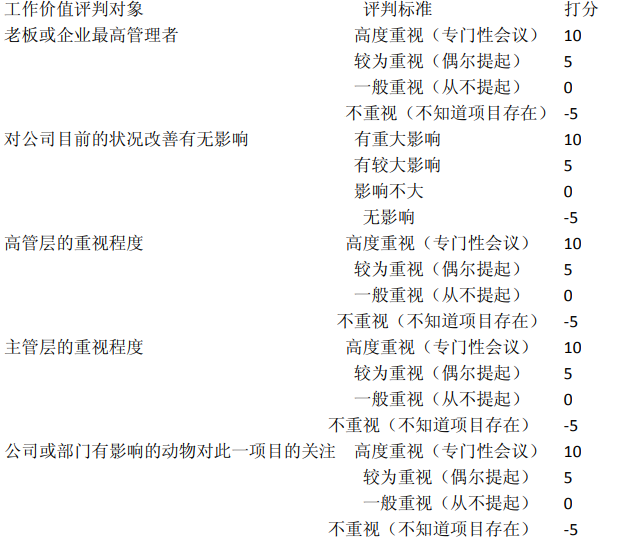

# 人物分类

狗：所有公司都需要、且在任何环境下都会脱颖而出的员工，但数量稀少。     

野牛：常见的一种员工，能力强，但运气糟透了，多半下场不妙。       

狐狸：狡黠奸诈，让所有狗都头痛的员工。    

笨猪：主管不是太欣赏，但地位相当稳固的员工。 

 蠢驴或绵羊：最吃苦耐劳的员工，通常运气比野牛还要糟糕。 
 
 刺猬或臭鼬：能力不足，牢骚满腹，职场最不受欢迎的员工。 
 
老鼠：最不引狗注目的员工。

# 招聘

实际上，肥猫早就打算招聘一名刚刚毕业的应届狗，他这是一家小公司，支付不起前边经理
狗和博士狗的薪资，他们的薪资要求都不可能少于五千，而肥猫最多只能出两千。肥猫之所
以请他们来到公司，就是想听他们聊一聊这个行业的新的发展态势。今天的面试，对肥猫来
说，可谓不无收获。

> 听说有很多公司都是通过招聘来挖掘行业的重要信息，作为找工作的人不要被利用。

职场是天然的猎场，所有进入职场的动物，都要主动或被动地卷入职场狩猎游戏之中。这种
情况的出现，是由于员工和公司（老板）的利益天然冲突性所决定的。  

在小公司里，老板和员工的道德冲突如下：   
   
老板的道德：从员工身上挣到钱，就是最道德的事情。   
员工的道德：从老板身上弄到钱，就是最道德的事情。   
所以老板会将员工视为一桩风险投资，采用短期经营或掠夺性开发的方法从员工身上弄钱。   
而员工则不承担老板所冒的经营风险，更愿意以在老板看来是无效或低效的——意即无市场
回报的劳动，从老板身上弄钱。  

小公司是这样一种情形，大公司同样也不例外。   
在大公司里，老板高高在上，主管掌握了对员工的生杀予夺之大权，这样就形成了员工与主
管的必然性冲突。   
主管的道德：能够巩固我的地位，对我有用的员工，就是好员工。   
员工的道德：不会挡我的路，阻碍我升迁或获取利益的主管，最低档次也不要找我的麻烦，
就是好主管。   
对主管来说，能够巩固其地位的，不一定要能力过强，能力过强反而威胁到了主管的地位。
此外，根据主管所处的环境不同及变化，其对员工的需要也不同，甚至连员工的愚笨、员工
的坏脾气都会成为主管巩固自己地位的手段。
没有任何一位主管会心甘情愿给部下“让路”，这就决定了大公司的职场斗争极为惨烈。 

与大家的想像不一致的是，政治斗争是维护大公司良性运转的有效手段。

这只猪罗，他不是一条狗倒也罢了，他居然敢对老板
瞒单，订单可是公司的生命，猪罗他这样做，无非是想等到肥猫想炒他鱿鱼的时候，他好拿
这个单跟肥猫讨价还价。另外还有一种可能，就是猪罗同时在替几家公司做事，哪家公司给
的提成高，他就把单交给哪一家公司。  

转眼间几个月功夫过去了，四名业务狗天天在一起，他们都是最辛苦的打工狗崽，肥猫不在
的时候大家就聚在一起聊天，越聊越近乎，很快形成了一个小团体，他们相互为对方遮掩隐
瞒，合起伙来与肥猫斗，想尽办法加大公司的营运成本。 

肥猫却早已发现了这个苗头，他在考虑打乱业务员的组织架构，解聘其中三狗，只留下一条
业务狗。   

目前四条业务狗的情形是这样的：   
业务狗甲，猪罗：老实听话，但稍一放松管理就偷懒，工作不指派到头上决不会动手，叫苦
的时间远比干活的时间更多。他来公司的时间最长，但业绩为零，始终没有搞定一家客户。   
   
业务狗乙，狐狸：聪明机灵，表面上对肥猫唯唯诺诺，其实自己心里另有鬼主意，特别会干
面子活，是得到肥猫夸奖最多的狗。目前狐狸已经搞定两个单，为公司创收八万元。
   
业务狗丙，绵羊：勤奋耐劳，善于死缠乱打，除了跑业务，还经常被指派其他工作，目前是
惟一任劳任怨的员工。虽然他来的时间不长，却也搞定一个单，为公司创收六万元。
   
业务狗丁，猴子：心思灵活，眼观六路，耳听八方，有狐狸的聪明，但不像猪那样懒，只是
工作时不像绵羊那样实在。目前猴子正在全力推动与一家大客户的商谈，这家客户希望将价
值六十万的订单交给肥猫公司来做。 

肥猫正考虑目前这四条业务狗中，只留下一条。留下哪一条，考验他智慧的时候到了，如果
留对了，就证明他有着一个典型的资本家的思维方式，公司就有可能会做大。反之，如果留
错了狗，就表明他还缺乏一个老板的意识，他的公司还要经过一段艰苦的停滞期，说不定捱
不过艰难的成长期倒闭也未可知。  

肥猫留下的，竟然是没有做成一单生意的猪。   
作为一个资本家，他是这样进行思考的：   
为公司拉来大宗业务的业务狗丁，猴子，是首先要解聘的，那怕只是解聘一条狗，那也就是
他了。   
   
为什么要解聘猴子呢？他的过错，就在于他为公司搞来了一宗大单，这样公司就需要支付他
一大笔提成，而目前的公司正处于资本积累的原始阶段，解聘了猴子，公司就能够节省下一
大笔开支。而从客户的角度上来说，他们是在与肥猫的公司做生意，并不是与猴子做生意，
无论猴子是否在职或已遭到解聘，都不影响双方的合作。   
   
这个情况，恐怕是为搞来了大宗订单而沾沾自喜的猴子所预料不到的吧？正当他自以为成了
公司的功臣的时候，肥猫老板却已经动了杀机。   
那么业务狗乙狐狸和业务狗绵羊，他们已经通过自己的业绩证明了自己的工作能力，而且他
们的提成也已经拿到，解聘他们也节省不了成本开支，为什么还要解聘他们呢？   
原因是，他们已经有了业绩，自认地位相当稳固，不会被解聘了，所以他们的工作积极性必
然会下降。此外——也是最为关键的，他们的资源已经用尽，至少几个月内不会再搞来订单
了，而且他们也会在心里计算：我已经为老板挣到了六万八万，那么我至少也要挣到这个数
目的薪资，才会再将新的订单提供给老板。  

> 看到这对目前互联网公司的裁员有了更加深刻的理解，老板永远会考虑削减成本，提高收益，着眼未来。积极性不高的员工，成本过高的员工，无法为公司的未来带来收益的员工都会被干掉。

这是员工的公平交换公式，但却不是老板的。所以，与其等待他们磨洋工，发牢骚，白白浪
费公司的资源，还不如将他们解聘的好。

最后，留下的是一单也没有成交过的猪罗。对于留下他的原因，肥猫是这样解释的：   
他已经在我这里白吃了几个月，市场也差不多培育成熟了，相信他很快就会有订单成交的。   
公司在不同的发展时期，选择员工狗的标准是不同的，对一家正处于原始积累时期的小公司
而言，成本的考量是惟一的标准。   
这就是肥猫的思维模式，这就是资本家的思维模式。   
这就是肥猫一直在做的事情。   
他做对了，肥猫公司通过不择手段地对员工的盘剥，迅速成长了起来。

# 职场十大谎言之一   

动物职场十大谎言之一：狗性化管理，或以狗为本。   

“管理”这个词语，本身就是违反动物本性的。   
   
管理的“管”，是指主管不许你做你想做的事情。   
管理的“理”，是指主管强迫你做他想让你做的事情。  

管理在其本质上来说，是限制你的快乐，强化你的痛苦

从狗性的角度上来说，付出的多而回报少，是决计不会快乐的，只有当得到的超出付出的时
候，动物才会快乐。所以，一家公司里的员工一旦是发自内心的快乐，那就意味着他从公司
里得到的回报超出了他的付出。   
也之所以，所有的公司都在告诉大家：付出是最快乐的事情。   
如果你不无偿地付出，公司和老板又如何能够得到？   
所以衡量一家公司是否有前景的最重要的指标，是看员工们是否快乐。   
如果部门的员工们快乐，那主管就要倒霉了。   
如果公司的主管们都快乐，那老板就要倒霉了。   
如果公司的主管和员工都处于如坐针毡的状态之中，那么，这家公司一定会在大家的切齿痛
恨之中发展壮大。   

> 对此段表述存疑，但一家公司如果员工（不包含管理层）太有议价权的确不是好事。

松下论断   
用狗就是用苦恼。   
提出者：日本松下电器公司创始狗松下幸之助   
点 评：老板无苦恼，主管就会有苦恼。
     主管无苦恼，员工就会有苦恼。   

# 职场用人模式

职场上充满了莫测的变数，决定一个员工的去留标准，并不是能力或业绩，而是利益。在很
多情形下，员工之所以遭到责难，仅仅是因为他与主管或老板发生了利益上的冲突，与他的
工作能力无关。   

而员工却很少有狗会意识到这一点，所以无论是解职还是解聘，他们总是要习惯性地大吃一
惊，并不负责任地将这种不公平视为主管的妒贤嫉能。只有当他们也会从利益的角度出发进
行思考的时候，才会认识到这一点。

肥猫的公司进入高成长期，公司不仅狗的数目增加了，员工
狗的质量也提高了，狗一多，就乱叫。部门多了，扯皮捣蛋的事情在所难免，肥猫每天疲于奔命，既要协调内部
员工之间的关系，又要和客户进行沟通，忙得不可开交。此时有一个业务助理则显得十分必要。在人才济济的公司，能力一般的猪罗走马上任了。他的无能为公司内部的管理带来
了数不清的麻烦，可是令皮皮目瞪口呆的是，肥猫的公司却避过了一个又一个经营上的陷阱，
在那些管理上无懈可击的公司纷纷倒闭之时，肥猫公司迅速占领了市场，成了一家规模性的
大公司。   
像这样的选择，肥猫在日后几乎天天都要遇到，幸运的是，每一次他都做对了，肥猫公司很
快在业界声名鹊起。   
那么，肥猫为什么会选择能力最差的猪罗出任副总呢？他到底是怎么考虑的？这件事对肥猫
的公司来说意味着什么？请大家来回答这个问题，如果你答对了的话，那就证明你拥有着一
个老板的思维模式，恭喜你了，不管你现在正做什么，但迟早，这种思维习惯会让你获得成
功。   
如果你答错了的话……没有关系，老板毕竟是极少数，让我们大家快快乐乐地摇着尾巴继续
看下去吧。

大荣原则   
企业生存的最大课题就是培养狗才。   
提出者：日本大荣公司   
点 评：只有对企业的发展来说至关重要的狗，才称得上狗才！   
      
韦尔奇原则    
我的全部工作便是选择适当的狗。    
提出者：美国通用电器公司总裁杰克·韦尔奇   
点    评：最合适狗选，即是最佳狗选。   

# 肥猫独白：职场政治   

有狗就有是非，有利益就有争夺，利益的争夺就是政治。而在这方面，我们从学校接受到的
却是相反的信息，一切教育的目的都是为了告诉我们做一个诚实的狗，正直的狗，勤劳的狗，
与狗为善的狗，善于与狗合作的狗。   

一切教育的目的都是为了让我们远离政治这个是非圈。   

当教育成功的时候，也就是我们失败的日子。   

许多狗一听到“职场政治”，就会产生强烈的抵触心理，他们更多倾向于狗性的光明一面，
对职场的尔虞我诈缺乏清醒的认识。站在道德的高度上看，这些狗无疑是正确的，只不过，
他们忽略了一个至关紧要的问题：   

职场的利益博弈，决定了“职场政治”的无所不在。那些对职场政治有着强烈抵触心理的狗，
没有意识到自己跟其他狗正处在同一条船上，船上的成员，都要定期举行一些有趣的益智游
戏。这些游戏包括：   
豁免者选拔（升职）：   
优胜者竞猜（站队）：   
找呀找朋友（结党）：   
倒霉蛋出局（裁员）：   
代罪小羔羊（诿过）：  

无论你是如何的洁身自好，如何的明哲保身，但你都必然会被裹入这种残酷的游戏之中，只
有两种情况下你能够置身事外：一种情况是你升迁了，在一个更为广泛的圈子里继续新一轮
的游戏；另一种情况则有点不妙，你被淘汰出局了，因为你不善结党，缺乏盟友，形成了以
一对多的劣势，失败是必然的。

许多初入职场的年轻狗，天真善良，与狗为善，但最终，莫名其妙地丢了工作，却搞不清楚
为什么。其实原因很简单，只要你身在江湖，就无可避免地卷入是非圈中。那些所谓洁身自
好的一厢情愿，只能证明你思想的极度不成熟，没有认识到有狗的地方就有是非，有利益的
地方就有政治这个基本的事实。 

职场政治由来已久，无所不在，对其采取不承认或视而不见的鸵鸟态度的狗，是处境最为危
险的。

# 职场斗争的起因  

职场斗争的起因，多半缘自于员工对产出的计算失误。   

如果员工没有大工业生产的概念，一味地将全部产出归结于自己，就会引发
跳槽、窃取技术专利、泄密等事件。而在小公司里，突出的表现则是员工撬走老板的订单，
或者是拉走老板花费心血培养的客户。  

如前所述，这样的员工小老板只要遇到一个，就会血本无归。大公司出现这种事情，多半也
会消耗庞大的成本，伤透了脑筋。这就决定了公司或老板必然会想尽办法来保护自己的利益，
而这种保护措施或手段，则进一步激化了员工的对抗情绪。   

所以，那种理想中的以合作的观念对待员工的老板，是不可能存在的，因为他们都已在遭遇
到不良员工的时候覆舟折戟，惨遭淘汰了。剩下来的，只有那些竞争意识特别强烈，对狗性
中恶的一面看得更透的老板或公司。他们非常清楚市场的竞争不会挤跨公司，不良员工的不
良行为才是公司生死存亡的最大威胁。  

所以，公司的管理，从本质上来说，都是为了防范内部威胁的。而对公司威胁最大的，则来
自于那些最有能力的员工。   
   
这就是公司管理上为什么会存在那么多的问题，而老板却置若罔闻的原因。
   
这就是为什么无能者更容易得到升迁机会的原因。  

# 尖耳朵初入职场   

经过三年的苦读，尖耳朵拿到了最有名气的狩猎大学的硕士狗文凭，毕业了。他聪明，能干，
年轻又勤奋，满怀信心地摇着尾巴进入了肥猫公司。尖耳朵沉浸在幸福之中，关于职场，他有很多美丽的想
像，那是一个充满了温暖与温情的地方：高耸入云的写字楼，光线明亮的办公室，美丽的笑
脸，愉快的心情，快乐的工作，密切的合作，以及令狗振奋的成功……这些场面无所不在，
无时无刻地感染着尖耳朵，让尖耳朵无由产生一种感恩的心态。  

此时，尖耳朵在职场中遇到了其他 2 个新同事：一条是博士狗憨憨，一条是硕士狗斑斑，这两条狗也都是肥
猫亲自相中的。博士狗憨憨悄悄地告诉他们，他们三条狗是肥猫精选出来的管理层梯队狗选，
如果不出什么差错的话，或许用不了一年的时间，他们三条狗都会升任为部门经理。

> 好像公司对每一个员工都是这样说的

尖耳朵在自己的部门见到了以下人物：哈叭狗经理、蠢驴、野牛、狐狸、笨猪、刺猬、老鼠

氨基酸组合效应   

 组成动物生命体蛋白的八种氨基酸，只要有一种含量不足，其他七种就无法合成蛋白
质。   
点 评：组织是一种社会生态系统，各种要素必须一应俱全、完全“纯净”的组织，
也是最缺乏生命力与竞争力的组织

# 新员工的牢骚  

蠢驴、野牛、狐狸、笨猪、刺猬和老鼠，这就是尖耳朵办公室里的所有动物。   
这六只动物再加上尖耳朵，一共算是七条狗，由哈叭狗经理管理。但是尖耳朵很是怀疑，这
个号称七条狗的团队，里边到底有没有真的狗？  

三位同一时间入职的新同事相聚。

憨憨说：“你们猜不到我现在都在做什么，说出来你们肯定不信，我的工作主要是收传真，
发邮件，复印文件资料，再就是接接电话，替老板们安排一下办公室里的车。我可是个博士
啊，你们想像不到吧？”

尖耳朵皱起眉头，好半晌才迟疑不决地回答道：“我感觉，我的哈叭狗经理并不想要一条狗，
他可能更需要我做一头蠢驴。”   
憨憨皱起眉头道：“做蠢驴也没什么不好，毕竟公司还是需要蠢驴的。”   
“可是，”尖耳朵回答道：“肥猫老总之所以招我们进来，看中的正是我们身上狗的气质，他
更希望得到的是狗，而不是蠢驴。”   
憨憨犹豫不决地看着尖耳朵：“要不要我跟肥猫老总说一下这事？”   
尖耳朵冷笑道：“憨憨，你觉得说了有用吗？”   
憨憨想了想，失笑了起来：“是没用。”   
斑斑也在一边笑道：“说了不仅没用，而且只怕肥猫老总对你憨憨也会有了看法。”   
憨憨很是歉意地对尖耳朵说道：“没办法，那就只能靠你自己了，也许你可以先做蠢驴，然
后再慢慢进化成一条狗。”   
“嗯，”尖耳朵点头：“这是个好办法。”他举起杯子，心里却在想，或许憨憨真的不知道，
蠢驴，是绝无可能进化成一条狗的

>重点：蠢驴，是绝无可能进化成一条狗的

# 难以接受的现实  

正像尖耳朵所担心的那样，在哈叭狗经理下面工作了一段时间之后，他的耳朵越来越长，脸
孔也在迅速拉长，正迅速地向一头蠢驴的方向进化，可这个结果决不是他想要的。   
他开始被迫学着磨洋工，明明二十分钟能够做完的工作，他一定要拖一个小时，即使是这个
工作速度也远远超出了哈叭狗经理的预期，于是哈叭狗经理继续将工作单派发向他的办公桌。
更不妙的是，现在部门里的其他动物也在将自己的工作推到他的头上，就像当初推到蠢驴头
上一样。   

尽管尖耳朵的工作量在增长，但是蠢驴的工作量并不见减少。蠢驴就是蠢驴，如果他的工作
量少了，那他就不是蠢驴了。   
如何才能够成为一条狗，这成了让尖耳朵忧心不已的事情。为了实现这个目标，他不得不注
意观察办公室里其他动物的生活习性。   
   
他注意到，这间动物办公室，就是一个完整的生态圈，存在着一个清楚的食物链。   
麻雀虽小，五脏俱全，职场生态圈里的动物，自享有豁免权的哈叭狗经理而下，共有七种动
物分成四个阶层：   

第一层，狐狸和笨猪。他们共同的特点是本事不足以服狗，但仰承哈叭狗经理的鼻息，狐狸
在这方面还有所保留，最明显不过的是笨猪了。只要是哈叭狗经理的决定，无论什么情况下
笨猪都是无条件的拥护。  

第二层，桀骜不驯的野牛。野牛的工作能力很强，但是自行其是，蔑视哈叭狗经理的权威。
哈叭狗经理却拿他无可奈何。   

第三层，蠢驴和目前的尖耳朵，他们承担了部门几乎所有的工作，目前工作量仍然在增加之
中，每天要从早做到晚，得不到片刻的喘息。   

第四层：刺猬和老鼠，他们的工作不积极，很多事情他们不插手还好，一插手局面反而更加
混乱，所以乐得袖手旁观。  

这是一间明显的苦乐不均的动物办公室，让尖耳朵想不通的是，不仅他这里是这样，在总裁
办任职的博士狗憨憨和业务部门任职的硕士狗斑斑告诉他，他们那里也是一样的。   
不仅大名鼎鼎的肥猫公司里是这个样子，比肥猫的公司规模更大，知名度更高的公司里，也
是这样一个情形。就连许多刚刚成立的小公司，也不例外。

太不公平了，大家都在一起工作，拿着相差无几的薪水，但在职场中的地位却是天壤之别。
怎么会有这种事情发生？如果这种状态一直保持下去的话，又怎么能够留住那些优秀的狗？
这就怪不得公司里动物满为患，偏偏就是缺少公司最需要的狗。  

可是，大家都是作为狗被招进来的，那些蠢驴、野牛、狐狸和刺猬，当初他们被公司招进来
的时候也和自己一样，满怀信心地准备成为优秀的狗，但进化的途径却是如此不尽狗意，问
题到底出在什么地方呢？

尖耳朵再仔细观察，终于发现了这个阶层分布的奥秘。   
秘密就在于动物们是否服从上。   

>服从
   
很明显，哈叭狗经理是根据两个原则，对属下的动物区别对待的。   
第一是动物是否服从他的指令，第二才是实际的工作能力。   
狐狸和笨猪都是服从哈叭狗经理的，所以他们成为了部门的上层。而刺猬和老鼠是最不肯服
从的，所以被挤压到了部门的最下层。   

这个现象令尖耳朵惊讶不已，他一直这样认为，忠诚又有工作能力的，理应进化为猎狗，事
实上不仅是他这样认为，所有的狗都是这样认为。他小时候狗爹爹狗妈妈就是这样告诉他的，
进了学校之后老师也是这样教导他的。   
尖耳朵沿着理论上猎狗的进化途径出发，结果却进化成了一头蠢驴，这个结果太出狗意料了，
简直让他有些不知所措。   
做蠢驴似乎并没有什么不好，大家都这样说，实际情况却并非如此。   
蠢驴前几天因为连续加班，累病了，进了医院输液。可是他正在输液的时候，肥猫老总交待
下来一项工作，指明让蠢驴完成。于是哈叭狗经理立即向办公室要求派出一辆车，到医院把
蠢驴拉了回来，让他一边输着液，一边工作。  

野牛同样是不肯服从的，但因为他工作能力强，所以就比刺猬老鼠高了一层。而蠢驴除了同
样有工作能力之外，还肯听话，所以就排到了野牛的下面，但却在刺猬和老鼠的上面。 
尖耳朵看了看蠢驴，每条狗都清楚，在部门里做出贡献最多的就是他，奖金分配如此的有失
公道，蠢驴能够咽得下这口气吗？尤其又是在刺猬无理取闹获得成功的情形下。   
蠢驴果然受到了刺激，他站了起来，犹豫了好长时间，终于下定决心，走进了哈叭狗的办公
室，哈叭狗一见进来，立即说道：“蠢驴，你进来的正好，昨天我交给你的工作怎么样了？
刚才肥猫老总还打电话问起来，你拖得时间太久了，要赶快，赶快，听见没有？”   
蠢驴刚要说话，哈叭狗已经递过来厚厚一叠工作单：“蠢驴，你最近有些不在状态，这怎么
可以？做为一名老狗，你要严格的要求自己才对，你看看新来的尖耳朵，他来的时间虽然短，
可是工作却做得不亚于你，你要努力啊，不努力就会跟不上公司发展的步伐，这个结果，可
不是我们希望看到的。”   

哈叭狗的话，虽然语气轻柔，却带有强烈的杀机，分明是在说如果蠢驴不好好干的话，就会
立即将他辞退。辞退了他的话，自有新来的尖耳朵接手所有工作。所以蠢驴嗫嗫半晌，终于
未敢说出对哈叭狗奖金分配的意见，最后拿着那厚厚一叠工作单，回到了自己的办公桌前。

# 职场丛林法则之一  

职场丛林法则之一：所有的动物，进入职场时的身份都是狗，但你究竟能够进化成什么动物，
取决于两个条件：   

第一、你是否服从主管的权威   

第二、你是否有足够的工作能力   

服从又有能力的动物，会进化成为蠢驴和猎犬，大多数时候都是进化成为了蠢驴，只有很少
动物能够进化成为公司最需要的猎犬。  

服从但没有能力的动物，会进化成为狐狸和笨猪。但谁会进化成为狐狸，谁又会进化成为笨
猪，这取决于动物自身的条件。  

不服从但有着工作能力的动物，会进化成为野牛或狼。他们共同的特点是挑战主管权威，桀
骜不驯。   
   
不服从但也没有工作能力的动物，会进化成为刺猬和老鼠。同样是不服从和没有工作能力，
但刺猬和老鼠的待遇是不同的。刺猬明显高于老鼠。  

尖耳朵自怨自艾、自暴自弃地想着：我的梦想破灭了，我进入了一家管理无序的公司，
在这里，充斥着任狗唯亲，溜须拍马，打小报告，传播流言蜚语，拉帮结派，勾心斗角的习
风，同事与同事之间表面上笑脸相迎，背地里却相互排挤，推诿责任，对同事的过失幸灾乐
祸。整个公司的经营状况弊病丛生，内耗不断，效率低下，沟通不畅，肥猫老板高高在上，
为一些阿谀奉承的中层管理者所包围着，对公司内部深层的隐患一无所知，听不进逆耳的忠
言，所有的狗都只是报喜不报忧，我只是一个低级的下层蠢驴，又何必多事呢？   

好吧，好吧，蠢驴尖耳朵埋首于数不清的工作单中，一边苦干一边闷闷不乐地想着：既然我
没有什么背景，没有什么靠山，那我就不要有什么野心。只要能够安贫乐道，只求温饱，小
富即安，不与任何同事发生争执或矛盾，不挑战哈叭狗经理的权威。让他们自己去相互倾轧
去吧，我装聋作哑，只是做好分配给我的工作，工作总是要有蠢驴来完成的。只要我尽到了
一头蠢驴的职责本分，不介入动物职场的任何私党斗争之中，我就对得起自己的良知和老板
的工资了。  

# 职场丛林法则之二  

职场丛林法则之二：在动物职场，每一只动物的自由裁量权不一样。同样的事情，别的动物
做了无所谓，但对你来说就可能意味着灭顶之灾。

不明白职场丛林法则的动物，往往会犯认不清自己的角色定位的错误。有时候他们以为自己
是一条忠诚的猎犬，实际上只不过是一头蠢驴。有时候他明明是一头笨猪，却想获得和狐狸
一样的特权。像这种动物永远也学不会改善自己的处境，很容易误入雷区，理所当然地遭到
主管或老板的责罚。

那些不明白主管为什么突然对他大发其火的狗，那些接到辞退通知目瞪口呆的狗，他们往往
只不过是突破了自己的职场定位，受到了责罚却仍然懵懂不知。   
   
所以，认清你在职场中的定位，搞清楚你被主管所默许的“特权”和“义务”，避免犯逾矩
的愚蠢错误，对稳定你的职场生涯，不无裨益。   

所以，认清你在职场中的定位，搞清楚你被主管所默许的“特权”和“义务”，避免犯逾矩
的愚蠢错误，对稳定你的职场生涯，不无裨益。

如狐狸和笨猪这一类的听话但缺乏能力的员工，主管对他们的要求就是服从，无条件的维护
主管的权威，而不指望着他们在工作中做出什么成绩来。他们的特权与义务分别如下：   
特权：享有高难度工作的豁免权   
义务：必须要耳听六路，眼观八方，随时将办公室中的工作进程及事态发展向主管汇报，同
时，还要注意不得迟到早退，时刻维护主管权威。   

如野牛这样的“刺头”员工，要想保持自己目前的超然地位，也必须认识到自己的特权与义
务：   
特权：被默许可以冒犯主管   
义务：做为对主管权威冒犯的“回报”，必须要承担难度最高的工作。

如蠢驴这样的“劳苦大众”，是最没有希望的一族，因为他们存在的惟一价值就是工作，而
且他们所做的都是别狗也能够胜任的差使，如果你不幸已经沦落到劳苦大众阶层，相信我好
了，现在你们的处境还不是最糟糕的时候：   
特权：可以因为繁重的工作而“累病”   
义务：继续保持现有的高强度工作量，不得中途撂挑子   

如刺猬和老鼠这一类垃圾员工，他们既没有特权，也没有什么义务，除非他们认识到自己的
处境，爬到上一层，否则，他们就毫无价值。   

尖耳朵在此郑重提醒阁下：请把这张图表剪下来，贴在你的笔记本上，认清楚你在办公室里
的角色定位，清楚你的自由度能够有多大，避免莽撞失误。  

# 不服从的问题员工
就在尖耳朵为他竟然进化成了一头蠢驴而百思不得其解的时候，进入业务部的硕士狗斑斑，
却出狗意料地进化成了一头野牛。   
也就是说，他成了一名调皮捣蛋、不服主管管训的问题员工。  
因为斑斑发现他的主管窃取了他的劳动成果，而且向上级举报了他。

斑斑与鬣狗主管之间的关系一下子就变得水火不相容，他再也不肯服从鬣狗
的指令，鬣狗更是处处找机会刁难他。斑斑进化为狗的可能性彻底不存在了。但因为他有着
很强的工作能力，最终并没有像鬣狗主管所期望的那样进化成一只臭鼬，而是进化成为一头
蛮横的野牛

# 主管是你的第一障碍  

在进化的途径上，主管是你的第一障碍。   
如果你有能力，他就会强迫你进化为蠢驴，一头拼命苦干却绝无可能得到回报的蠢驴。如果
你拒绝进化为蠢驴选择对抗的话，你就会进化为一头野牛。   
蠢驴：服从又肯苦干的员工   
野牛：有能力但拒绝服从的员工   

# 蠢驴为什么被炒鱿鱼 

博士狗憨憨突然接到了狗力资源部的通知，他被解聘了。  

这个消息如一个可怕的惊雷，震得尖耳朵一下子歪倒在座位上。   

尖耳朵一直都认为，蠢驴的地位应该是很稳固的，没有哪一家公司不欢迎那些埋头苦干兢兢
业业的狗。这个道理，从小狗爹爹狗妈妈就这样告诉他，进了狩猎大学之后老师们也是这样
说。散布在街头那些数不清的职场指导手册上，也都是这样一笔一划地写着的。

所有的狗都在这样对他说：做一头蠢驴吧，埋头苦干，拼命工作，世间自有公道，付出总有
回报。一分汗水，一分收获。群狗的眼睛是雪亮的，狗心里都有一杆秤。   
正是基于这样一个想法，所以尖耳朵和憨憨义不容辞地选择了蠢驴的进化道路。这些日子以
来，尖耳朵一直替野牛斑斑悬着一颗心，担心鬣狗主管会对斑斑下手。可是没有想到的是，
斑斑安然无事。

憨憨是真的不知道，这几乎是所有的蠢驴遭到灭顶之灾的时候的共同表现。他们切齿痛恨动
物职场的溜须拍马之风，不停地抱怨老板无能，任狗唯亲，专爱听小报告，却无视蠢驴们的
辛苦与贡献。如果找不到这些理由的话，他们就会将自己所遭遇的不公视为主管的心术不正，
抱怨自己成为阴谋诡计的牺牲品。总之，责任都在别狗身上，蠢驴一点错也没有。   

“既然如此，那他为什么不重视我们这些狗才？”憨憨愤怒了：“尖耳朵，斑斑，你看看我
们三个，论能力，诺大的肥猫公司，有几个动物能赶得上我们？我们是真正的狗才，比那些
肥猪老鼠们对公司的贡献大得多，肥猫老板却这样对待我们，还想让我们怎么说？”   
“也许，问题正出在这里。”尖耳朵思索着：“肥猫老板肯定比我们还要明白这个道理，如果
不是我们自己出了差错，怎么会有今天这种事？至少，没有如期的进化成为一条狗，就是我
们的错误。”   

> 上述抱怨在任何公司都听到得太多

没有哪个动物会喜欢一个总是说“不”的员工，带来坏消息的狗比坏消息本身还不受欢迎。
憨憨并没有错。   
想明白了这一切之后，憨憨不由得摇头叹息：“想不到，想不到，真的想不到，我一心只想
老老实实地做一头蠢驴，毫无怨言地工作。却没想到，我做的竟然全都是垃圾工作，全是毫
无意义的工作。”  

# 职场工作价值评判指标

有一种非常流行的错误观点，认为蠢驴是主管和老板最喜欢的动物，他们没有明显的攻击性，
不会对主管和老板的地位形成威胁，却吃苦耐劳，逆来顺受，埋头苦干，兢兢业业，因此在
职场上大受欢迎。   

几乎所有的职场教导手册，都是这样告诉我们的，然而，事实并不是这样。  

真正的现实是，蠢驴在职场中的生存空间已经被挤压到了形同于无的地步，他们往往会在第
一时间被清除出局。这种情况是下面的原因所决定的：   
动物职场上秘而不宣的真相是，同样劳动量的工作价值并不等同。  

动物职场上的工作分为四种：   

第一种：面子活，也可以称之为形象工程。   
只需付出极少的劳动和最小的代价，就能够让老板主管都感到满意的工作，这包括：老板或
主管最关心的事情，在老板或主管眼皮子底下的工作，以及花费不多却能带来轰轰烈烈的效
应的工作。这种工作一般都是主管亲历亲为，或是交给听话的笨猪来做，狐狸凭借自己的狡
猾也能沾上一点边，但蠢驴却决计碰不到一点，因为他们太忙了。 

第二种：日常工作。   
这些活可作可不作，拖下去也没关系，干好了也没用处，但是工作量大，琐碎繁重，没完没
了，所以蠢驴们主要是用来做这些工作。这种无意义的工作做得再多，也不会为蠢驴自己带
来丝毫益处，这就导致了蠢驴实用价值最低，甚至还比不上什么工作都不做的老鼠和臭鼬—
—他们至少还可以不做不错，而蠢驴却是做得越多，错误越多。   

第三种：垃圾工作。   
这种工作处处存在，如对付难缠的客户，把坏消息报告给老板，提出老板根本无法解决的问
题等等。通常情形下大家都回避这些垃圾工作，但如果事情迫到头上来了，一定要有狗做的
话，那就只能是蠢驴来做。因为蠢驴没有头脑，分辨不出垃圾工作，而且蠢驴也养成了工作
的习惯，会习惯性地把垃圾工作接下来，最终导致自己也成了垃圾员工。  

第四种：陷阱工作。   
这种工作的坏处比垃圾工作还要可怕，无论你有多么大的本事，一旦让这种工作缠上，铁定
会死得很难看。这些工作包括：前任留下的烂摊子，专横的老板下达给部门的无法完成的任
务。再次警告，这种工作要在你脑子里亮八百盏红灯，绝计碰不得。

动物职场安全区域：   
绿灯区：形象工程，平步青云之路   
黄灯区：日常工作，无升职之喜，但也无解职之虞   
红灯区：垃圾工作，危险，从事这种工作，就会沦落为垃圾员工   
死亡区：陷阱工作，极度危险，一旦遭遇，逃无可逃  

说明，基于信息不对称的原则，在职场中地位越高，拥有信息量就越充分，对组织所面临的
关键性问题也就看得越准确，而基层职员由于掌握信息相对不足，判别一项工作或项目的价
值标准，只能从高层对这项工作的重视程度来判断。

项目性质系数计算方法如下：   
属于独立性活动，即可由一只动物凭自己的能力单独完成，而不需要职场中其他动物插手的
项目，系数为 10   
则此项工作的价值分数为：加权分乘以 10   
属于互动性活动，即与其他动物共同完成的项目，属于项目开始的部分按加权分乘以 10 来
计算，属于项目的中间环节，按加权分是正分的话乘以‐10，加权分是负分的话乘以 10 来计
算。   
例如，一项工作的加权分为‐25 分，又是互动性活动的中间环节，则乘以 10 得分‐250。   
同样一项工作的另一部分，加权分为 25 分，则乘以‐10 得分‐250 分。   
对工作或项目的性质影响最重要的，是老板或主管的期望值系数。一项工作即使是形象工作，
但如果老板期望值过高，你也未必能够做到让老板满意。反之，很可能一项老板或主管根本
不抱希望的垃圾工作，你却做得极为优秀，反而更有助于你脱颖而出。   

老板或主管的期望值 系数   
期望值极高 1/10   
期望值较高 1/5   
期望值一般 1   
期望值较低 5   
期望值最低 10  

这样我们就可以计算出一项工作的实际价值，计算方法为：   
[老板关注度+工作重要度+高管关注度+主管关注度+对公司有影响的动物关注度]*独立活动
或互动活动系数*期望值系数   
例如：有一项工作，老板关注分埴为 10，对公司重要程度为 10，高管关注度为 10，主管关
注度为 10，对公司内部有影响的动物关注度为 10，属于独立性活动，同时老板对此项工作
预期极高，那么，该项工作的价值为：   
（10+10+10+10+10）* 10 * 1/10=50 分。   
而另一项工作，老板关注值为 5，对公司重要程度为 5，高管关注度为 5，主管关注度为 10，
对公司内部有影响的动物关注度为 0，属于独立活动，同时老板对此项工作不抱任何期望，
那么，该项工作的价值为：   
（5+5+5+10+0） * 10 *10=250 分   
总之，经过计算后，得出的数值越高，则工作价值越高，反之越低。   
得分为 5000……4000 分者，是公司的“形象工程”，建议所有动物不惜一切代价也要参加。   
得分在 4000……0 分之间者，为日常工作。   
得分在 0……‐4000 之间的，为垃圾工作，此种工作对企业和自己都没有任何意义，做了不
如不做。   
得分在‐4000……‐5000 之间的，为陷阱工作，属于无可救赎的死亡区域。

# 尖耳朵逆进化为野牛  

的确，尖耳朵突然犯了犟，从一头听话的蠢驴突然逆进化成了一头不听话的野牛，这让哈叭
狗经理措手不及。哈叭狗经理却不知道，尖耳朵正是因为受到了蠢驴憨憨事件的刺激，才突
然逆进化成野牛的。既然蠢驴总是用来做垃圾工作，如果他再这样傻乎乎做下去的话，迟早
会沦落成垃圾员工，跟憨憨一样被清理出去。   

关键词：   
食物链：生活在同一环境下的生物，彼此之间不是以其他生物为食，便是为其他生物所食，
这种藉食性关系而直接串联起来的一组生物，称为食物链。   

职场生物链：共事于同一工作场所或环境的同事，彼此之间既合作又竞争，依据他们在职场
生物链上的不同层次，分享他们的能量配合——工资与奖金收入。 

职场中的所有动物，都牵系在这一条食物链上，他们所处的位置及生存状态如下：   
食物链顶端，狐狸、笨猪：处在食物链顶端，非常稳定。   
食物链第二层，野牛：处在笨猪和狐狸之下，不稳定。   
食物链第三层，蠢驴：他们的地位高于刺猬和老鼠，但极不稳定。   
食物链低层，老鼠和刺猬：不稳定。

蠢驴之所以没有价值，是因为他们做的工作大多数是毫无价值的工作。这是因为公司为了满
足蠢驴工作的欲望，不得不提供大量毫无意义的工作让蠢驴来做。如果没有这些垃圾工作，
蠢驴就没有任何必要留在公司里了。   
工作不过是蠢驴的奖赏，蠢驴求仁得仁，理应无怨无悔。 

同样的道理，当工作出现了失误的时候，就需要有动物为之承担责任。但是，逃避责任是动
物的天性，而且更多时候动物在组织中的作用很大，不能够过重惩罚，这就需要推选替罪羔
羊，以维护组织系统内部的秩序和规则。   

需要替罪羔羊的时候，在组织中的作用与地位最无足轻重的成员就会被推选出来。理论上来
说老鼠被推选出来的可能性最大，但因为老鼠刺猬工作量少，所以责任就很难推诿到他们身
上。更多的时候，都是由在组织内部作用最小的蠢驴来承担。  

食物链中沦为替罪羔羊情形分析   
   
动物名称           特点             食物链位置        替罪豁免权限   
狐狸和笨猪         服从无能力             顶端              免责   
野牛             有能力不服从             第二层          责任者   
刺猬和老鼠         无能力不服从             第三层          免责   
蠢驴             有能力又服从             底层              责任者  

尖耳朵打算去找肥猪老板聊一聊，但老板很忙，回应道
“猪总，去找你们主管副总，别什么事都找我。”   
尖耳朵急忙点了点头，转身出去，走到副总猪罗的门前，抬手一敲，门敞开一条缝，正好看
着猪罗正靠在大班椅上，仰头呼噜呼噜，睡得正香。门声一响，猪罗立即醒了过来，这是猪
罗早年跟着肥猫时养成的习惯，他这猪干活最爱偷懒，要叫肥猫老板逮住一定没好，所以他
虽然入睡得快，却稍有一点动静就会立即醒过来。   
他睁开眼睛，看到探头探脑的尖耳朵，满脸不高兴地将他的长嘴撅了一下：“是你啊，尖耳
朵，你来，进来，我正要找你聊聊。”   
尖耳朵走进去，依言坐在沙发上：“猪总，什么事？”   
猪罗不说话，先拿过一只饲料缸子，咕嘟咕嘟地猛灌了一气，然后放下猪食缸，问道：“来
了这么长时间了，感觉怎么样啊？”   
尖耳朵趁机道：“猪总，我这不正要找你说说这事吗。”   
“嗯嗯，”猪罗精神振奋起来：“说说，说。”   
“咱们公司啊，不能这么下去了，效率太低了，”尖耳朵开了口，正要接着抱怨下去，猪罗
却突然不高兴起来，把猪食缸重重地往桌子上一 H，气呼呼地说道：   
“尖耳朵，不是我说你们，你们这些硕士狗博士狗啊，真是眼高手低，具体工作干不来，只
知道挑三捡四挑肥捡瘦。我可告诉你，尖耳朵，你要是再这样下去的话，你就是下一个憨憨。”   
尖耳朵眨了眨眼，知道说错了话，正不知应该如何辩解，只听猪罗继续说道：“像你们这种
样子的狗，公司以前招进来也不知多少，就拿十年前公司刚刚开张的时候来说，你知道那时
候肥总爪子下有多少个能力强的员工？我告诉你，有猴子，有绵羊，有狐狸，猴子他都提了
部门经理了，可最后还是被肥总开掉了，只留下了我一个。知道为什么吗？”   
“为什么？”尖耳朵确实对这个问题比较好奇。   
“因为我从来不抱怨，不发牢骚，干工作更不挑挑捡捡！”猪罗猛一拍桌子，连自己都信以
为真地说。   
猪罗正在信口胡吹，突然野牛斑斑敲了敲门，走了进来：“呵呵，尖耳朵你也在？正好，猪
总，关于公司营销员的管理，那天猪总你说了之后，我回去想了想，有了个新的想法，想和
你聊一聊。”   
啧啧，尖耳朵心花怒放，原来做一头野牛还有这种好处，不需要做实际工作，只要天天和老
总泡在一起信口吹牛，云山雾罩就行了，这招自己怎么以前没想到呢？  

# 职场政治斗争规则  

职场政治中最令狗不快的一点是，能力与水平恰恰是最不重要的，许多失败者并不是因为自
己缺乏工作能力而被摒弃出局。相反，那些平庸者却能够位置稳定，一帆风顺，这其中的奥
妙，就藏在职场的政治斗争规则中。   

笨猪和狐狸这种狗几乎随处可见，他们没有实际的工作才干，业绩平庸，却处于职场食物链
的最上端。所以，在一个职场圈中，地位最稳定的，最不易受到冲击的就是那些最贴近主管
或老板的狗。   

相对而言，像野牛这一层次的动物，地位最不稳定，如果遇到能力较强的主管，会用种种办
法分化他们，瓦解他们，压制他们。如果遇到才能平庸的主管，那既是他们的机会，也有可
能成为他们的滑铁卢，关键要看他们是否具有清醒的政治头脑，是否有勇气与不称职的主管
进行拼争。   

考察这一层次的狗，必须要从整个公司的大局出发，而不能囿于一个部门，也许压制他们的
无能主管却是更高一层的老板用来牵扯或防范能力出众的主管的棋子，如果遇到这种情况，
那么，无论野牛如何争取，都是无济于事的。   

吃苦耐劳的蠢驴，是最无可奈何的、最悲惨的动物。在职场没有什么公平可言，只有刀刀见
血的利益。如果蠢驴试图改变他的处境，后果有可能出乎他的意料。 

处于食物链最底层的刺猬和老鼠，他们的自保之策是需要做最大的努力，尽快改变主管对自
己的印象，否则，谁也救不了他们。  

# 野牛处于危机之中   

垃圾工作十大特点：   
任何一家公司，都存在着大量的垃圾工作，这些工作混杂在紧迫性的工作之中，做了对企业
毫无益处，有时候甚至会影响到企业的发展。尽管如此，我们仍然很难将垃圾工作与真正意
义上的工作区分出来，就连经验最丰富的管理学家都无法评估这些垃圾工作对于企业的实际
意义。   
垃圾工作有时候是基于企业最高管理者的某一个不实际的念头，较为常见的则是基于高管的
一个不实际的念头，但更多的时候，这些垃圾工作是基于主管的某些不实际的念头，才产生
出来的。   
一般来说，这些垃圾工作的产生状况如下：   
基于最高管理者的念头而产生的垃圾工作量为 10%左右。   
基于高管的念头而产生的垃圾工作量为 20%左右。   
基于主管的念头而产生的垃圾工作量为 60%左右。   
基于员工的念头而产生的垃圾工作量为 10%左右。   
基层主管所产生的垃圾工作量大，是因为基层主管与高管相比，所占据的资源最少，所得到
的信息也最少。为了防范高管对他们的工作状况出现不满，他们尽可能做得全面一些。实际
情况是，高管对主管在部门中所作的工作，只了解其中的 30%，另外 70%的工作对企业的发
展来说可有可无，意义微乎其微。但主管仍然不敢掉以轻心，照样是付出百分之百的努力把
垃圾工作做好。   
员工出于对自己地位或被炒鱿鱼的担忧，也会主动加入进来，生产一定量的垃圾工作证明自
己的存在价值。  

在部门中承担垃圾工作的，主要是蠢驴。蠢驴垃圾工作做得多了，自然而然也就成了垃圾员
工。   
甚至有一种普遍的现象，因为工作狂蠢驴的存在，主管不得不“创造”出一些垃圾工作满足
蠢驴工作的欲望。   
分析你手中的工作是否是垃圾，有以下十个标准：   
   
垃圾工作十大标准特征   
序号 特征   
1 没有具体交待时间   
2 没有具体进程安排   
3 没有明确完成时间   
4 没有明确工作量大小   
5 没有具体质量评估指标   
6 没有奖励或惩罚措施  
7 封闭式、单独完成   
8 负责高管不详   
9 负责高管过多   
10 可随时为其他工作让路   
   
只要具备上述十大特征中三个以上者，就已经接近垃圾工作这一范围了。具备上述十大特征
五个以上者，就可以确定其为垃圾工作。对主管来说，这些工作完成与否不涉大局，对员工
来说，不做这些工作也不会招致过重的惩罚。   
员工真正的能力或智慧，不在于做了多少具体工作，而在于避开这些垃圾工作，将精力投入
到真正有意义的工作中去。

# 尖耳朵的困惑   

公司就是这么一个样子：   
最高层的肥猫，天天养尊处优到处乱跑。   
次一层的副总：猪罗副总和河马副总，明争暗斗争权夺利。   
第三层次的是以哈叭狗经理和鬣狗为代表的主管：他们也分几种类型，有秉性抗上却得到部
门员工拥护的老母鸡型主管，有媚上欺下的秃鹰型主管，有上下关系都梳理得一团和气的孔
雀型主管，但是却没有上下关系都搞不好的主管，这种主管一旦出现就会立即遭到淘汰。   
第四层也就是普通的员工了，如前所述，这些普通员工在主管的眼里也分成几个层次。

动物职场食物链图谱：     
肥猫   
河马、笨猪   
孔雀型主管   
秃鹰型主管（包括哈叭狗经理、鬣狗主管）   
老母鸡型主管   
狗、狐狸   
笨猪   
野牛、刺猬   
蠢驴、老鼠   

尖耳朵不明白，肥猫为什么如此偏袒猪罗这个蠢货？他曾经在心里做过评估，如果将猪罗这
个家伙清除出公司的话，公司至少会多获利几千万元。   
虽然尖耳朵已经逆进化成了一头野牛，但蠢驴的思维模式仍然影响着他。他怀疑，这个猪罗
说不定和动物政府的某位实权动物有关系，所以肥猫不敢得罪他。   
但听猪罗眉飞色舞地夸夸其谈，说到他自己家族里的猪，也都是在乡下烂泥塘里打滚的动物，
他算是家族中社会地位最高的猪了。经常有些落魄不堪的野猪打着亲戚的旗号来找他谋职。
每当遇到这种情况，猪罗就一躲了之。   
这就是说，猪罗既没背景也无靠山，那么肥猫把他这头猪捧得这么高，这其中究竟有什么奥
秘呢？  

# 职场十大谎言之二  

动物职场十大谎言之二：能力是衡量员工最重要的指标。   
或者：我们只要最优秀的员工。   
又或者：有能力的员工都可以在我们这里找到位子。   
再或者：……   
事实上，从管理学的角度上出发，企业不过是老总或董事长个狗理念的延伸和实现工具，部
门则不过是主管个狗理念的延伸和实现工具。   
员工能力一旦突破主管能力的天花板，就会使部门的发展方向失去控制。 

所以在企业内部，主管在鞭策落后员工促使其发奋努力的同时，更重要的工作则是控制那些
能力过强的员工，使其行进速度不可随心所欲地过快，以免将整个部门丢在后面。   
鞭策落后的员工，是一件简单的体力工作，就连工地上的工头都可以胜任。   
真正考量一个管理者的管理能力的，在于如何控制那些能力过强的主管或员工，这是真正体
现管理精髓的地方。

尖耳朵告诉斑斑：“你错就错在，狗在职场，却不明白职场的铁律，竟然接手了一个陷阱工
作，这个工作，谁接手谁倒霉，你为什么不推出去呢？”   
斑斑苦笑：“尖耳朵，你想，我已经拒绝了上一次的市场调查了，这一次又是猪罗亲自出马
下令，我躲不过去啊。”   
是啊，尖耳朵黯然神伤，这就是野牛的命运了，你可以躲过第一次，运气好的话也许会躲过
第二次，但你迟早会有躲不过去的那一天。 

# 陷阱工作逃生法则

陷阱工作逃生法则：   
在企业内部，陷阱工作一般并非是刻意而为之，而是分布在被大家都忽略的重要工作流程中
最不起眼的细节上，这部分枝节表面上看起来无足轻重，实际上却有可能占据了整个项目百
分之八十以上的工作量。   
陷阱工作不仅工作量极大，而且几乎全部是互动性活动，属于那种必须与其他动物合作才能完成的工作。有动物，就免不了有矛盾，在此环节之前的诸多矛盾将会集中在这一层突然爆
发，从而导致庞大项目的运作整体性失败。   

陷阱工作的十大特点：   
   
序号 特点   
1 整体性项目的枝节部分，不引狗注目   
2 负责者无自由裁量权，不得随意变更   
3 工作的前、后两个环节极为重要   
4 社会互动活动，与其他动物共同合作才能够完成   
5 工作时间跨度较长   
6 负责这项工作的动物未介入前期工作，对整个事态缺乏了解   
7 工作具有突然性，不是顺理成章接受的   
8 对上没有明确的主管过问   
9 工作过程得不到上下环节的对接   
10 没有其他动物帮助理清的烂摊子   

一般来说，从陷阱工作中逃脱，多数是采用如下几个办法——但能否奏效，取决于当时的局
势，不可一概而论。   
第一：大声呐喊呼吁援救   
所谓大声呐喊，就是要在第一时间里向相关高管报告，保持信息畅通，高管一但得闻，就已
经替你承担了一部分责任，对你的责罚最多不过是责你无能而已，不会出现灾难性的后果。   
第二：中途逃走以免后患   
发现事情不对头，立即撒谎说家里有动物重病，最好的理由是另有其他更重要的工作，中途
脱手，为时未晚。虽然这样做有失一个纯朴员工的本色，但你必须想到，有能力的你才是公
司最宝贵的资源，保护好你自己，就是对公司最大的贡献。   
第三：制造矛盾与虎谋皮   
抢先发难，制造事端，可以是向客户发难，也可以是向同事发难，但前提是要搜集好证据，
把全部责任推到合作者或同事的头上，以便当公司追究的时候能有一个交待。   
此外，还可以采用推狗落井踏尸逃生的伎俩，但这种办法得不到道义的支持，即使是一时成
功，也毁掉了自己的清誉，弊大于利，心地纯良的动物是不屑于使用的。  

责任推卸定律   
 动物们一旦预测到在不久的将来自己会与某件事毫无瓜葛，就会从这一分钟开始推掉与
此事有关的一切责任   
 提出者：日本心理学家多湖惠   
 点 评：推御责任是动物与生俱来的本能，但是总得要有动物为此承担责任，承担责任
的往往是那些对这种情况一无所知的动物。   

# 职场自我保护意识   

转眼功夫，野牛斑斑已经被辞退两个月了，尖耳朵的性格变得阴沉起来。   
他们三条狗同一天进入肥猫公司，才不过一年多一点的功夫，就已经被淘汰了两个，这件事
对尖耳朵的刺激太大了，他不能不小心翼翼，提防着对他怀恨在心的哈叭狗经理也像鬣狗对
待斑斑那样对他设置圈套，强烈的危机意识促使他重新审视自己的过失。   
从一开始，他和憨憨一样闷头工作，不计较得失，但是这种只顾低头拉车不抬头看路的后果
很快就显现了出来，堂堂的博士狗憨憨做了太多的垃圾工作，最终沦为垃圾员工误入雷区，
而野牛斑斑牺牲得更是惨烈，鬣狗主管通过精心设置的陷阱轻而易举就除掉了他。   
在职场，无论是蠢驴还是野牛，都免不了一个被清除出局的下场。   
那么尖耳朵到底应该怎么办？   
把憨憨和斑斑的失误重新思考，看起来蠢驴和野牛是两种不同的动物，工作风格也迥异，但
他们有一个共同的特点，那就是不懂谋略。   
他们甚至连起码的防狗之心都没有，似乎职场中的同事都是他们的狗爹爹狗妈妈，疼他们爱
他们还会天天给他们熬肉骨头吃。这种事怎么可能，即使大家再善良，遇到棘手的工作或需
要替罪羔羊的时候，动物们自我保护的本能总是有的。别的动物都在考虑自我保护，而憨憨
和斑斑却没有这种意识，理所当然会遭到竞争的淘汰了。   
这种在竞争中不断强化的自我保护意识，就是谋略了。   
对了，就是谋略！   
尖耳朵重新考虑自己的定位，再像以前那样昏昏噩噩肯定是不行的了，他是肥猫作为部门经
理的梯队狗选招进来的，比不得普通员工狗，即使是他表现得比普通员工狗要好，但如果达
不到肥猫的要求的话，同样也会惨遭淘汰。   
可是肥猫的标准，究竟是什么呢？  

卡尔岑定理   
 所有行业都是表演行业。    提出者：美国社会学家简.卡尔岑   
点 评：你在职场中所看到的，决不会是真相

# 员工不负老板的责  

员工不负老板的责。   
在组织系统内部，不承担系统稳定性责任的成员具有着天然的扩张欲望，扩张程度越大
越好，至于系统的扩张导致了系统自身的崩溃，则跟这些成员毫无关系。甚至在很多时候，
组织成员的自毁倾向极为明显，一旦让这种非理性的力量失去控制，组织系统就会在高速扩
张的同时迅速崩溃。   
而在企业内部，除掌握着绝对权力的企业领导者之外，在其他员工层级中，表现出最为
强烈的资源争夺，即子系统扩张。而实现子系统扩张的途径，必然会压迫其他子系统的正常
运转。另一种形式则是企业领导者力图使系统保持稳定地发展状态，而在员工，则力促系统
扩张的欲望更为强烈，系统的高速扩张或扩张可能，都会打破系统的均衡，带来变数。   
任何形式的扩张都是以企业的高额成本消耗为条件的，所以非理性的扩张必将给企业带
来灾难性的后果，而这，正是系统稳定者力图避免的事情。   
促使企业非理性扩张的欲望是如此强烈，以至于管理者首先要考虑的问题就是设置一个
系统安全程控阀。   
这道系统安全程控阀，其功能，就如重水相对于核聚变反应堆，就如刹车装置相对于高
速疾行的汽车。   
这道安全程控阀也是一道强效的过滤层，可以将那些为公司带来致命危机的项目过滤出
去。   
 杠杆效应   
 杠杆是一个能绕着固定点转动的杆，喻指起平衡或调控作用的事物或力量。   
 点 评：最有效的杠杆，总是放在最恰当的支点上。最完美的管理，取决于微妙的
各方利益团体的平衡。  

# 职场中的野狼谋略  

霎时间，以前无数想不通的问题，如电光石火一般掠过尖耳朵的大脑，他终于明白了，
肥猫为什么对愚笨无能的猪罗青眼有加，即使在猪罗害得研发部河马精心设计的市场调查方
案失败的情况下，还不肯追究猪罗的责任，原因并不是肥猫昏聩，更不是猪罗有什么背景，
仅仅是因为，那个项目根本就没有什么市场前景可言。  

愚笨的猪罗，正是肥猫公司这个系统内部的安全程控阀。   
现在尖耳朵终于明白了，他再也不能把想像的理想当做现实，再也不能依据那些对企业
一无所知的专家学者的著作来指导他在企业中的行为了。   
企业是一个复杂的系统，其内部充满了非理性的扩张因素。为了避免这些因素失去控制
将企业引向灾难，管理者必须强化对这些非理性因素的控制，这个控制才是管理的真谛。但
其所引发的问题，却一直被理论界视为“弊病”。   
既然猪罗是不可或缺的，那么，因猪罗而引发的一系列管理上的混乱，也就成为企业内
部必不可少的一个组成成分。   
他必须要在混沌中成长，必须容纳或接受这种现实，而不是用自己的想像抗拒现实。这
才是肥猫对他寄予的希望。   
对现实的理性分析与接纳，使得尖耳朵在进化的途径上又迅速前进了一大步。   
他的尾巴迅速加粗变长，乱蓬蓬地拖在地上。   
他进化成了一只领悟到职场政治智慧的野狼。 

布克定理   
 一切制度都是生长出来的，不是制造出来的。   
 提出者：英国政治学家布克   
 点 评：文化是制度生长的土壤，有什么样的文化，就有什么样的制度。
 
 
野牛永远也不会弄清楚，拉帮结伙，决不是帮伙中的同盟者动物数目越多越好，只要蠢
驴和野牛这两只承担了大部分工作的关键性动物在，尖耳朵就已经占到了绝对优势。   
选择野牛、蠢驴和老鼠，正是尖耳朵开始萌生的职场政治意识在指导着他。   

# 职场政治意识

在职场，一只动物是否真正有能力，是否聪明，不是取决于他多么听话，更不是取决于
他多么勤奋，而是取决于这只动物的职场政治意识。换句话说，你是否知道哪些工作对公司
来说真正有价值，即使你的能力不足，也强过那些虽然有能力却缺乏对工作实效的评估意识
的动物。   

只有有这种明确的职场政治意识的动物，才会把注意力放在对公司形态的观察上来，能
够知道哪些工作是公司真正需要的，能够把工作恰好做到点子上，少做无用功。同时也能够
精明地避开垃圾工作，绕开那无所不在的职场陷阱。 

在职场，有些动物很聪明，有些动物则表现得很笨，而有些动物是看起来聪明，另外一
些动物却是看似愚笨实则非常聪明。   

这种所谓的“聪明”，就是对职场政治意识的把握。   
“政治”这个词，会引起一些冥顽不灵以自己的想像替代现实的动物们的反感，事实上，
他们误读了政治的内涵。   

政则正也，所谓政治，就是公正地做事，正确地做事，做正确的事。 

政治意识的有无决定了动物们在职场中的地位，其顺序如下：   
排在第一位的是狗，他既服从主管，又有工作能力，政治意识最强，但这种动物可遇而
不可求，很难见得到。但一旦出现，就会迅速走红上升，任何类型的主管都无力压制住他们。 

排在第二位的是野狼，与狗有同样的工作能力，同样明确的政治意识，是尚未进化成狗
的最高级动物，惟一的缺点是不服从主管。尽管他不肯服从主管，但主管却不敢轻启战端，
而是小心翼翼地将其放在仅次于狗的位置上。   

排在第三位的是狐狸，他有明确的政治意识，又肯服从主管，惟一的缺陷就是缺乏实际
工作能力，但是他的聪明仍然使他成为主管最倚赖的助手，主管对他的态度是恨狐不成狗。 

排在第四位的是刺猬，这只动物除了明确的政治意识之外，既不服从也无实际工作能力，
几乎可以说是一无是处了，但主管仍然不敢小看他们，因为他们聪明，决不会染指垃圾工作，
更不会踏入陷阱工作，遇到真正有价值的工作他都会想办法挤进去占个位置。 

排在第五位的是笨猪，这种动物惟一的好处就是服从，但对它来说有这一点就足够了。
笨猪的悲惨在于，换了主管，笨猪的末日也就到头了。   

排在第六位的是野牛，最缺乏政治意识，最不肯服从，但偏偏工作能力极强。   
老鼠排在第七位，他没有任何优点，不服从，无工作能力，也没有政治意识，昏昏噩噩
听天由命，但因为蠢驴的愚蠢衬托出了他的无为，有时候运气反倒会出狗意料。   

悲剧动物蠢驴被排在了最后一位，究其原因，是因为他们垃圾工作做得过多，那些毫无
意义毫无价值的工作做得多了，同样是多做多错，这种愚蠢的勤奋不仅无功，反而有过。 

这张单格可以看作是动物职场的薪资发放标准，所有的主管，无论能力高低，都是按这
个顺序分发奖金与薪资的。从表中我们可以看出，那些具有政治意识，知道什么工作必须要
做什么工作一定不能做，做正确的工作并正确地做工作的动物，都排在前面。

反过来，那些缺乏政治意识，也就是缺乏对工作价值评估能力的动物，只能排在后面。
而毫无意义与毫无价值的工作做得越多，排序就越靠后。   

那些拼命苦干却最终遭到责罚的悲剧动物，如蠢驴，正是因为缺少了这种以职场政治意
识命名的工作价值评估能力。   

这就是说，职场上的动物实际上只有两种类别，一种是公司非常需要的，除非他们犯了
不可饶恕的错误，否则他们的地位是非常安全的。不仅安全，而且还随时都可能获得升职机
会。  

而另外一种类型的动物，却是对公司来说价值不大，随时都可以剔除的。正因为他们对
公司的价值不高，所以剔除出公司的技术手段也没必要过于精细。   

如博士狗憨憨，剔除他表面上的原因是他给老板不停地送去“坏消息”，实际原因却是
他缺乏评判工作价值的能力，像这种毫无意义的垃圾工作他都要抢着做，如果把他提拔到高
管的位置上来，面对比公司内部复杂千万倍的市场，肥猫有什么理由相信他会给公司带来赢
利的项目？除非老天爷开眼，否则的话，受这种低水平的价值判断能力所限，憨憨多半会搞
出一大堆没有任何市场前景的项目来。   

如硕士狗野牛斑斑，他甚至连保护自己的能力都没有，失蹄踏入陷阱。规避风险的意识
之差，让狗咋舌，如果把公司交给他的话，又有什么理由相信他不会把公司拖进经营陷阱里
去呢？   

如果你不能给公司以机会，公司又怎么可能给你以机会呢？   
任何事物都有它的两面性，公司最需要的动物虽然具有对工作价值的评判能力，但却成
了主管的眼中钉，主管会不惜一切代价将这种苗头扼杀在萌芽状态之中。那种以为主管会心
甘情愿让出位置的想法，是异想天开的幻想，没有任何事实依据。   
体现在职场食物链上，职场内部的动物稳定程度也有所不同：   
职场动物稳定状态分析表：   
   
动物名称职场地位 稳定程度   
狗 1 恒态稳定   
野狼2 挑战无论是成功还是失败，都会获得升职机会   
狐狸3 不会轻启战端，稳定   
刺猬4 行动莽撞，一旦失败后果堪虞   
笨猪5 固定环境下稳定，动荡时期会遭淘汰   
野牛6 极不稳定   
老鼠7 极不稳定   
蠢驴8 极不稳定  

“不要说你的部门经理不对。”猪罗生气地说：“尖耳朵，你就是这个毛病，以后要注意。”   
“是，猪总你说的对，以后我一定注意。实际上，我们哈叭狗经理是很大度的，都怪我
们这次沟通不足，不是他的错。”   
尖耳朵假惺惺地说道，心里却在窃喜，可怜的小哈叭狗经理正一步步踏入他这匹野狼设
下的圈套之中，他越是替哈叭狗经理说好话，就越是衬托出哈叭狗经理告自己部属的无能与
蠢笨。   
他越是显示出自己的大度与宽容，就越是衬托出哈叭狗经理的愚蠢与不成熟。 

# 职场动物升职进化条件

职场上的动物只有两种，公司需要的和公司不需要的。

公司需要的动物：狗，野狼，狐狸，刺猬，需要他们的理由是因为他们有工作价值评判
意识，也就是说他们有职场政治意识。   

公司不需要的动物：笨猪，野牛，老鼠，蠢驴。不需要他们的理由是因为他们不具有工
作价值评判意识，也就是说他们没有职场政治意识。

公司需要的动物，一旦条件成熟或许可，都会有升职的可能。而不需要的动物，随时都会遭遇到陷阱并被清除出局。而公司需要的动物即使跌入陷阱之中，高管甚至老板都会亲自
营救，因为他们仍然有价值。  

只要一只动物具备了对工作价值的评判能力，那么就必然会有升职的可能，但不同动物
升职的条件是不同的，有没有实际工作能力，肯不肯服从主管指令，这都是升职的限制条件。
但最重要的，还是你有没有这种升职的意识。   

对于狗来说，任何恶劣的环境都不足以影响到狗的作用，甚至环境越恶劣，越有助于狗
的升职，但是因为千猪易得，一狗难求，这种情况是所有老板都期待着的，但却很少发生。 

对于狼来说，他必须取得盟友的协助，向主管的权威发起挑战，并最终如愿以偿地架空
主管，击倒主管，升职之后进化为狗。但如果狼遭遇到主管的强力阻击，这时候高管甚至老
板就会出面，将狼升职后调到另一个部门，避免狗咬狗一嘴毛。   

对于狐狸来说，因为他缺乏实际工作能力，如果取得无工作价值评判却有工作能力的同
盟者相助，就会迅速走红窜升。但这种情况所见不多，所以狐狸一旦按捺不住，失去耐性，
就会与主管拼个两败俱伤。   

刺猬升职的情况只有一种，那就是公司的初升时期和动荡时期，主管数量不足，才有可
能拿他充数。但刺猬一旦得到提升，就会迅速进化为狐狸，坐稳之后再撼之不易。

# 职场动物生态圈  

缺乏政治意识或对政治争斗厌恶的动物，并不会因此而如愿地置身职场的争权夺利斗争
之外。他们是最可怜的牺牲品，斗争的各方会以种种方式强迫他们表态支持自己，如果他们
拒绝表态的话，就会被双方视为不合作者，最终会落个清除出局的下场。  

要想在组织内部避开无益的风险，即使无意参加权利斗争，但也要认清形势，否则的话，
就会被胜利者视为失败方的盟友而遭到可怕的清洗。   

即使一时没有遭到清洗的动物，也会被胜利者打入另册，因为缺乏对工作价值的评估能
力而废黜，只能生活在动物职场的最底层而成为一只卑微的老鼠。  

分析职场的政治斗争，并不困难，通常来说，在职场之中狗和狼恒胜，狡猾的狐狸最不
可靠，刺猬即使混水摸鱼一时侥幸成功，最终也会黯然离场。 

任何一只有政治意识的动物在向主管发起挑战的前期，都会精心地研究职场内的各种动
物，并采取拉拢、打击、疏远或分化的方式建立自己的阴谋集团，一般来说，挑战者对无政
治头脑的职场动物利用总是基于这样一个原则：   
有能力的加以拉拢，不服从的加以分化。   
挑战者基层动物利用分析表：   
   
挑战者基层动物利用分析表   
动物名称挑战者态度 原因   
笨猪打击 没有利用价值，且是主管的亲信   
野牛第一盟友 有能力，且与主管做对   
老鼠利用 因为无能而成为用来打击对手的棋子   
蠢驴拉拢 拉拢住蠢驴，就等于拆了主管的半壁江山  

# 职场十大谎言之三   

动物职场十大谎言之三：企业内部要团结   

从组织学的角度上来说，组织内部的信息相互矛盾，相互抵消，恰好是组织蓬勃生长的
时期。在这个时期组织内部各子系统活化程度极高，彼此碰撞相互冲击，最大程度地激发了
组织内部的竞争机制。当组织内部的信息保持高度一致的时候，组织内部的子系统就发生了
高度的同化现象，其功能简化到了不值一提的地步。

老板对高管发出的“团结一致”的呼声，意思是说：请注意，我才是头。   
高管对主管所发出的“团结一致”的呼声，意思是说：请注意，要听我的。   
主管对员工所发出的“团结一致”的呼声，意思是说：请注意，请跟我来。   
但是，当所有的高管真正服膺最高管理者的时候，企业的高层就会丧失对外界刺激的反
应，新的经营思想就再也不会出现。当所有的主管真正服膺高管的时候，在高管的管理跨距
之内，再也不会出现真正有挑战意义的管理思想。当所有的员工都服膺主管的时候，部门内
部最后一息创新能力就被扼杀了，一切以主管的思想为思想，再也不会有实质意义上的突破
可言。   

因此，企业管理者一定要保持企业内部的竞争状态，默许新的思想挑战老主管，而老主
管的功能就在于将那些不成熟的思想过滤掉，让真正有价值的思想体现出来。   
在这个意义上，企业内部的管理，实质是对于挑战者的思想管理。那些自甘平庸、庸庸
碌碌混日子的员工，一定要接受各种淘汰机制的洗礼，迫使自己的活力与创造力被激发，通
过挑战证明自己的价值，在实现自我价值的同时也实现企业的内部价值。 

卡那定理   
 一个组织不是一台静止的机器，而是一个演变着的社会系统。   
 提出者：法国组织学家 N&#8226;D&#8226;卡那   
 点 评：系统是一种矛盾的存在，当矛盾消失，系统也就寂灭了。  
 
 其实任何一个项目操作起来，总是免不了磕磕绊绊漏洞百出的，越是有价值的工作，就
越是问题成堆。但老板不乐意听到关于成堆问题的牢骚性汇报，老板最喜欢听员工在问题面
前是如何拿出解决方案的。野狼尖耳朵太明白这个道理了，立即口如悬河地把问题无限放大
之后，再轻描淡写他们是如何提出解决方案的，听得肥猫眉头皱起，满脸不悦，不敢露出开
心的样子，怕一高兴起来让这只野狼又脱了缰绳胡闹起来。

# 职场十大谎言之四  

做为系统的组织体系内部，即使是清晰的、明确可识别的讯息也会在传递的
过程中严重失真。   

而在职场，这种情况更为多见，任何一道讯息都会经过传递者加工之后以扭曲的方式重
新发出，讯息传递到最后，因为承载了过多的附加信息，已经彻底丧失了其明确性，变得含
混模糊，仅凭分析已经无法找到其核心要义。 

在这种情况下，沟通做为一个清理讯号的手段提出来，在高层，是希望借此将附加在原
始讯息上的不良信号过滤掉。而在这个过滤的过程中，却往往是更多的附加讯息被添加上来，
导致了部门之间的沟通成为了一场分赃谈判。  

当老板在说“沟通”的时候，意思是指：你们要弄明白我在说什么。  
当其他狗在说“沟通”的时候，意思是指：我在这里，请你们要考虑到我的利益。 
当主管责怪部属“你沟通有问题”的时候，意思是说：想一想你又把谁的功劳给忘了？  

职场动物做为成熟的个体，无论是语气、动作，还是更为隐晦的暗示，都没有任何误读
的理由。但所有的这一切，都只不过是一个表象，真实的内在是每一个作为个体动物的实际
利益。忽略了这一点，职场就会演变成狩猎场，利益遭到忽视或伤害的动物就会愤怒地反击，
职场的争斗，也就不可避免。

因此，企业利益最大化的做法就是，促使部门之间相互“沟通”，使其相互之间形成利
益对立，这样，主管们就不会联合起来，一致对外地损害企业的利益。 

波特定理   
 当遭受许多批评时，下级往往只记住开头的一些，其余就不听了，因为他们忙于
思索论据来反驳开头的批评。   
 提出者：英国行为科学家 波特   
 点 评：批评意见永远不会被接受，尤其在批评本身具有价值的情况下更是如此。 
 
 
通常来说，组织维护其功能的做法，就是严厉地惩罚每一个嫌疑者，宁肯错误的
冤枉品质好的成员，也不会容忍这种可怕的现象将整个组织全部污染。 

“老板恒坏”定律：每一个成功的老板都是坏蛋。（无商不奸） 

老板是一种“互动活动者”，每天要同无计其数的狗打交道，以员工而言，只要狗数一
多，总会良莠不齐，有一些素质不高狗品极差的员工混杂在其中。如果老板真诚对待员工，
将每一个员工都视为伙伴的话，就会被坏员工利用老板的善良做出损害公司的事情来，而且
这种事情往往很严重，许多小公司正是因为订单被坏员工拉走，客户被坏员工带走，或专利
技术被坏员工窃走等事件，从此一蹶不振。   

因此，成功的老板都是将员工视为“坏员工”来进行管理的，尽管大多数好员工的积极
性受到了压抑，但坏员工搞跨公司的可能性也就不存在了

组织与竞争：   

组织功能的强化，是在大工业时代的竞争加剧背景下产生的，技术推动社会变革，个体
在社会的强势力量面前显得渺小而卑微，只有组织起来对抗竞争越来越激烈的社会，并依附
于组织而存在，结果组织的特色越来越鲜明，而个体越来越被忽略。 

组织的力量强于个体，但组织与组织之间，也有强弱之分，强势组织追逐并吞并弱势组
织，所有的弱势组织必须推选出最优秀的领袖与强势组织相抗衡。  

但是，构成组织的个体之中，哪一个才是最优秀的？如果错误地选择了能力不足的领袖，
就会为整个组织带来隐患。因此，组织内部优秀领导的筛选工作，就成为组织中重中之重的
工作。   

领袖的推选，在企业内部就是狗才的选拔。 

企业外部所面临的是险恶的市场竞争环境，远比企业内部的权力斗争复杂得多，需要一
个对这一切都能洞察把握的领袖才能引导企业渡过危机。   

一个企业领导者，如果连来自于企业内部的挑战都应付不了的话，又如何能够应对更为
复杂更为险恶的外界环境？所以许多企业都建立了内部主管竞争机制，试图通过这种方式磨
练出领导者的威信与素质，但是，唯有在混沌之中搏杀出来的领导者，才是无可争议最为优
秀的。  

管理层十大压力表   
   
序号施压者 施压内容   
1 员工 较高的工资，更多的福利，就业的保障   
2 主管 更高的位置，更多的自由裁量   
3 消费者 价格合理、安全可靠的产品   
4 供应商 更多的订货   
5 股东 较高的投资收益，投资的安全保证   
6 政府 更多的纳税   
7 社会 更少的污染，更多的就业，更多的义务   
8 财政 更透明，更利于监督   
9 竞争者 “让渡市场份额”的“公平竞争”   
10 银行 更好的信用，更有利的融资  

需要说明的是，企业高层所面临的诸多要求，是彼此矛盾不相协调的，管理者的工作就
是将这些彼此之间互不相容的要求融合起来，必须要有足够的心理承受力才能应对多方面的
指责与不满。   
由此可见，一个甚至连在企业内部的弱竞争中都无法立足的员工，更无法想像他能够引
导企业参与更为激烈的外部竞争。   
这就是企业高管有时候刻意地打压优秀狗才，磨练他们的意志力与韧性的原因。  

哈叭狗经理在培训部呆的时间越来越长，战略推进部这边几乎顾不上了，这时候，猪罗
找尖耳朵谈了一次话，让他先把部门里的工作挑头干起来，他用胖嘟嘟的猪蹄子指着尖耳朵：
“要干好，要干得跟你们经理在的时候一个样，你有没有这个信心，给我一句话。”   
只是吩咐尖耳朵把工作干好，却没有任何形式意义上的任命。   
尖耳朵没精打采地走出猪罗的办公室，摇了摇尾巴，他发现自己不知道什么时候已经进
化成为了一条狗。   
这是他一直在努力的目标，但是，当这个目标终于抵达的时候，结局却是如此不尽狗意，
让尖耳朵心有戚戚焉。

蓝斯登原则   
 在你往上爬的时候，一定要保持梯子的整洁，否则你下来时可能会滑倒。   
 提出者：美国管理学家蓝斯登   
 点 评：不择手段或许会达到目的，但也会很惨地跌落下来
 
 
# 主管角色定位     

从朋友、同事到上下级之间的关系转换，是主管所要经过的最难的关坎，难就难在已经
发生了角色转换的双方，都无法适应这种新的角色定位。 

在升职之前，同事之间而朋友，是因为性情投合，或相互赏识，或利害相关。同事之间
而对手，是因为喜恶不同，如有的狗讨厌某种香水的气味，有的狗性情严谨，不习惯那些大
大咧咧的自来熟。这种喜恶有时候还会受到微妙的心理因素的影响，如有的狗见了某种相貌
特征的狗就不喜欢，有的狗讨厌穿花格子衬衫的雄性动物等等。  

总之，动物的喜恶是一种非理性的情绪，可以有一千一万个理由喜欢或厌恶某种东西，
也可以毫无理由地喜欢或厌恶，总之是随心所欲，无迹可寻。   
但当你升职为主管的时候，再受这种非理性的情绪所影响，那就显得极为幼稚而被动了。 

主管的一大禁忌是炒下属。   

如果主管动了这种念头，就会一发而不可收，最终失去控制，炒来炒去，炒到最后连同
自己一块炒掉。 

这就是说，当一条狗升职为主管，在面对突然变成下属的同事而不知所措的情况下，就
一定要调整自己的心态，巧妙地化解对方的懒惰和挑衅，万不可轻率动了炒鱿鱼之念。   
既然一定要在同一个钢筋水泥格子间里共事，就一定要重新调整自己的心态。   
主管升职前后的心态调节：   
主管角度   
升职前看待同事的标准  升职后看待同事的标准   
喜欢或厌恶  是否服从指令   
情谊为重   是否有工作能力   
不论是非只论友情      是否有对工作的价值评判能力   
   
老朋友升职后的员工心态调节：   
员工角度   
同事升职前相处的标准    同事升职后相处的标准   
喜欢或厌恶    重要场合照顾对方面子   
情谊为重尽力帮助对方  承担让对方为难的工作   
不论是非只论友情      不提出让对方为难的要求   

总之一句话，朋友之间，是没有是非，也没有什么具体的原则的。但上下级之间，是以
利益为框架的是非原则，把握住这一点，也就把握住了这种角色转换之后的微妙处境。   

古狄逊定理   
 一个累坏了的主管，是一个最差劲的主管。   
 提出者：英国证券交易所前主管古狄逊   
 点 评：领导者的最大本事，是能让下属发挥最大本事。  
 
 
# X 理论   

没有一个成功的企业管理者会公开承认他们是 X 理论的信奉者。但事实上，每一个成功
的企业管理者却都是因信奉 X 理论而成功的。     
    40 年前，道格拉斯.麦格雷戈在《企业狗性》一书中提出了著名的“X 理论－Y 理论”。
X 理论认为：员工是不可靠的，不负责任的，且为金钱所驱策。与此相对的 Y 理论则认为：
员工是负责任的成年狗，希望为企业做出贡献。     
员工无疑都是企业之中最积极、最活跃的创新力量，但是，为什么我们仍然要说成功的
企业管理者都是 X 理论的信奉者呢？   
这是企业管理中的“老鼠屎定律”所决定的。   
“老鼠屎”定律：一粒老鼠屎弄脏一锅粥。   
决定一锅粥质量的，不是粥中的营养成分有多高，也不是质量好的粥占多大比例，只要
有一粒老鼠屎落进锅里，整锅粥就都被污染了。   
决定一个团体内部氛围的，取决于那个素质最差的员工。   
一个团体中如果有一个小偷的话，整个团体的狗品都会遭受到怀疑，并最终遭到清洗以
保持整个组织的纯洁。   
从管理学角度出发，老鼠屎定律认为，决定一个组织素质的不是负面的因素占组织整体
比例的高低，而是负面的因素所具有的污染作用将整个企业降低到负面因素的同等水平上。   
在企业内部，管理者要花费超过百分之八十的力量处理不足百分之二十的“老鼠屎员工”，
长此以往，成熟的管理者为了降低管理成本，只有采取“有罪推定”的思维模式，事先用管
理“老鼠屎员工”的做法来约束全体员工，这样才能减少“老鼠屎员工”为企业带来的损失。  

几乎所有的老板、高管，包括主管，都曾经经历过这样一段心路历程，他们的大度、信
任与包容被企业内部极少数的“老鼠屎员工”所利用，为了弥补“老鼠屎员工”为企业带来
的损失，企业为此支付了高额的经营成本。但当他们采用 X 理论对企业员工进行管理，并坚
信每一个员工都是不负责任，懒惰的，不求上进的，有待于耳提面命的落后份子之后，“一
粒老鼠屎污染一锅粥”的现象中止了，“老鼠屎员工”刚一露出苗头就立即遭到清洗，避免
了其他无辜员工的被污染，企业的管理成本也就迅速降了下来。   
所以，成功的企业领导者都是口是心非的双重狗格，他们口口声声信奉狗本主义，实际
上却是 X 理论的坚定执行者。 

>其实对于消费者也是一样的，对客户是一样的，温言在口，大棒在手，故能致远。

# 众叛亲离的主管  

部门的工作彻底陷入了混乱与瘫痪之中，所有的工作都是尖耳朵苦苦哀求着他的部属们，
主要是蠢驴和老鼠，而尖耳朵自己则负担了工作的大部分，工作的效率与质量可想而知，肥
猫几乎一到部门经理会议上，就要挖苦尖耳朵几句。   
现在，他终于知道了当初的哈叭狗经理是多么的不容易。   
当他只是一个员工的时候，只要考虑着对付主管经理一条狗就可以了。   
而现在，当他成为部门经理的时候，面对的对手是部门里的所有动物。   
当他只是一个员工的时候，只要和大家搞好关系互不侵犯就可以了。   
而现在，当他成为部门经理的时候，和部属的亲密关系反倒妨碍了他的工作。   
尖耳朵大病了一场，等他恢复后，已经到了年度部门主管考核的时候，他是公司里惟一
不合格的主管

# 人际关系  

朋友之间，友情占主导。越是包容，越是不计是非，友情就越牢固。   
上下级的同事之间，利益占主导。是非得失含糊不得，一旦失去原则，就会失去控制。   
朋友之间，友情是互动的，不分主次。   
上下级之间，关系是自上而下的，颠倒不得。   
因此，只有先谈利益，再论交情，交情才会更加稳固。反之，不仅朋友没得做，就连上
下级之间也会龌龊横生，让双方饱受折磨。

职场之中，老鼠是所有动物的克星，但除了老鼠之外，职场中的所有动物都有着自己的
天然克星。   
有工作能力，肯服从，又有政治意识的狗最怕遇到没有工作能力，又不肯服从，更没有
政治头脑的老鼠。   
有工作能力，不肯服从，又有政治意识的野狼，最怕和没有工作能力，偏偏服从主管的
指令，也无政治头脑的笨猪凑在一起。   
有工作能力，也愿意接受主管指令，但没有政治意识的蠢驴，最怕遇到没有工作能力，
不肯服从主管，偏偏政治意识还很强的刺猬。   
有工作能力，既不服从主管指令，也无政治意识的野牛，和没有工作能力，却服从主管
吩咐，政治头脑敏锐的狐狸凑在一起的时候多半会吃亏。

在实操之中，面对来自于部属的挑衅与进攻，只需要把
握一个原则就可以：   
用服从的动物限制不服从的动物，用没有工作能力的动物牵制有工作能力的动物。   
但是，用没有政治头脑的动物去牵制有政治头脑的动物的时候，就要小心了，因为没有
政治头脑的动物有可能会被有政治头脑的动物“策反”。因此，最稳妥的办法莫过于运用老
鼠员工，虽然老鼠也缺乏政治头脑，但是老鼠最不懂得合作，是永远的破坏者。   
用最没用的老鼠充当绊脚石，将蠢驴、野牛和狐狸各个击破之后，尖耳朵就彻底夺回了
主动权。   
为了弥补前一段时期工作中的“失误”，蠢驴、野牛干活的时候比以前更用心更卖力，
狐狸也不再吭气了，老老实实地躲在一边。虽然刺猬偶尔还闹一闹，但再也没有以前那种气
势了。   
就这样风平浪静地过了一段时间，尖耳朵已经坐稳了当初哈叭狗经理坐的那把椅子，开
始考虑更长远的问题。  

 狄伦多定律   
 一个团体或机构中所发生的激烈冲突，往往是因为面子问题引起的。   
 提出者：英国伦敦经济政治学院前董事 狄伦多   
 点 评：适当表达对对方的尊重，你就能够说服对方。
 
# 主管的管理手段

主管与部属是永远“矛盾的双方”。

部门需要管理，主管是施加“管理”的一方，部属是被动承受“管理”压力的一方。   
管理：主管需要“管住”部属，不允许部属放任自流，不允许部属做自己最喜欢做的事
情，用部属之所短，抑部属之所长。譬如说，主管不允许部属的风头压过自己，如果出现这
种情况的话，主管的地位就会被褫夺，权力就会被削弱。主管更不允许部属组成一支“团队”
以抗拒自己的权威，挑战自己的能力。对于部属中表现最优秀或在部门中最有影响力的动物，
是主管需要高度警戒的危险分子，能力强的主管会采用种种不可能出现在主流管理学书籍上
的管理技术实施管制。   

管理：主管需要将部属的工作“理顺”成为一个有利于自己的组合模式，强迫部属做主
管最希望部属做的事情，这些事情必须能够最大程度地体现主管的意志与愿望，成为主管能
力的强化与延伸，能够强化主管的影响力和在公司中的作用与地位。这就意味着部属们必须
放弃自我，泯灭其存在的独立意志，而这是违反动物本能的事情，势必引起部属的不满与怨
怼。为了压抑这种“不正常的风气”，主管就不得不采用一些制衡的手段和措施，镇压部属
的本能反抗意识。   

一个不成熟的主管，由于对动物本能缺少足够的了解，必然会受到部属蠢蠢欲动的挑战，
能否将部属的成长欲望击败，是衡量一个主管能力的主要标志。

总体来说，主管对部属的“管理”，无非是一种制衡，制衡的原则也是一成不变：打压
能力最强的部属，扶持能力最弱的部属，削弱影响力最大的部属的影响，强化部属对主管的
依赖性。这种内部的斗争升级到企业的高度上来，就会演化成为高管们的“理念”之争。

当然高管的能力比主管强得多，高管永远也不会承认这种“理念”之争实质上是一种利
益与权力之争，他们只是坚信，这种能够最大程度扩张自我意志与权利，为自己及追随者带
来更多利益的理念与行为，是最符合企业的发展趋势的。   

事实上，主管及高管用来保持自己地位的手段，还有许多，这些招术因狗而异，因情况
而变化，可以说是五花八门、七彩缤纷，初步统计可以分为十大类型，我们将其称之为“主
管十大阴谋”。  

主管十大阴谋   
第一、制造竞争对手：使用能力与你相近的同事来克制你，这在管理学上又称为“赛马”。   
第二、制造矛盾：将同事对你工作方面的意见说成是对你个狗的意见，并传递回你的耳
朵，避免部属之间实现“强强联合”，统一对抗主管。   
第三、安排垃圾工作：用垃圾工作将你变成垃圾员工。   
第四、设置陷阱工作：用最棘手的工作彻底打跨你。   
第五、员工缺陷养成：培养你的缺点，让你沦为低级动物。部属的能力越强，其缺陷也
就越引狗注目，甚而至于给同事们造成这样一种印象，能力强总是与更明显的性格缺陷不可
分割的。  
第六、员工依赖感养成：主管会对你偶尔犯下的小过失横挑鼻子竖挑眼，打击你的工作
积极性，使你不敢轻易下决断，从而剥夺你的狗格独立，养成对主管依赖的弱点。   
第七、以愚困智：把纵横千里的良驹与跛脚的骡子凑成一个“团队”，把在某一方面能
力不足的员工与在此方面能力强的员工组合起来，形成彼此的困扰。   
第八、用狗所短：使用员工的“短处”与不足，迫使你成为最缺乏能力的“老鼠”。   
第九、用狗所长：拼命使用你某一方面的特长，压制你全面能力的发挥，在企业形成你
只能从事某一方面工作却没有把握全局的能力的印象。   
第十、诋毁部属的“领导能力”：这是主管最常用的招术之一，做法是肯定部属的工作
能力，但通过巧妙的安排设置几个小小的陷阱，用最不具有合作意识的同事与部属之间所发
生的冲突，来证明部属“缺乏领导能力”，这样一来就彻底打消了高层对部属重用的可能。  

从表面上来看，主管的这些伎俩都是“不利于企业发展”的，是一种为了维护自己权利
与地位的阴谋。但在实际上，正是这种方式才最有可能促成企业内部的良性运作，因为只有
这种方式才能达成管理者与被管理者双方的利益互动与制衡。反过来，那些天真的、认为主
管应该主动交出权利或让渡自己生存空间的想法与愿望，不仅不切合实际，而且是企业内部
发展的最大隐患。 

所有的主管，除非是那些政治意识始终没有开窍最终被残酷的竞争所淘汰的之外，最终
都会采用上述诸多不为主流管理学著作所认可的做法。   
针对主管的十大阴谋，那些有着强烈成长欲望的员工，也会相应采取同样柔和的对抗手
段，以此化解主管的管理对自己的成长形成的障碍： 

员工对抗主管阴谋措施一览表：   
序号主管阴谋 员工对抗手段   
1 制造竞争对手； 拉拢竞争对手，建立对抗主管的统一战线   
2 制造部属与部属之间的矛盾； 绝不批评同事，避免以讹传讹，制造出与自己不和
的对头   
3 安排垃圾工作； 以“适量”的垃圾工作证明自己的能力，并以此与主管讨价还价   
4 设置陷阱工作； 回避，如果不慎跌入陷阱，大声呼救并预先安排替罪羔羊   
5 员工缺陷养成； 当自己的过失被宽容之后，要警惕，更要通过长期的行为矫正避
免留给高层不良印象   
6 员工依赖感养成； 强化自己在某一方面的能力，迫使主管养成对自己能力的“依赖”   
7 以愚困智； 要清醒分析自己与同事之间的优劣特长，一旦遭遇这种情况，就要提
出全新创意，重新组织团队，打乱主管部署   
8 用狗所短； 寻求与自己能力互补的同事缔结合作，在回避自己不足的同时，还能
给大家留下一个“组织能力很强”的印象   
9 用狗所长； 变被动为主动，把工作直接捅上高层，制造“现在部门是由我在全面
负责”的印象。   
10 诋毁部属的“领导能力”； 暗中组织对抗团队，工作越过主管直接向高层汇报，扩
大自己的影响   
总之，主管的伎俩不一而足，而员工对抗的手段也各有千秋，但归根到底，这是管理者
与被管理者之间的利益博弈，取胜的关键在于政治意识的强弱。 

# 职场十大谎言之五

职场十大谎言之五：效率才是一切   

一个显而易见的事实是，信息时代的竞争已经不再是单纯的大鱼吃小鱼，而是快鱼吃慢
鱼，最先介入利润丰厚领域的企业，就会迅速席卷市场，吞并掉那些发展速度缓慢，对市场
感觉不灵敏的企业。从这个角度上来说，企业发展的效率，无疑是非常重要的，任何狗任何
时候也无法对此进行辩驳。   

但是，无论对于老板还是对于主管来说，企业的效率或效益并不是优先考虑的问题，从
来就不是。   

老板或主管，首先考虑的是整体局面的掌控能力。   

如果一个老板有一个机会做大，但却存在所有成果被他狗掠去的风险，老板宁肯放弃这
个项目，也不会允许这种情况出现。   

对主管来说，这种思维模式就更正常不过的了，部门在公司内部的作用如何，效率与效
益多大，这些都是次要问题，最重要的问题是主管的权利得到尊重。   
如前所述，企业内部中 60％的垃圾工作是由主管创造出来的，创造这些垃圾工作的目
的，只是为了强化自己的作用、地位与权力。如果能够抹除动物的这种本能，企业的竞争能
力就会变得空前强大，但这是不可能的，对于系统内部的动物们来说，系统运行状况优劣决
不是他们所关心的，他们只关心一个问题：自己的作用、地位与权力。   
企业做为一个子系统，是依附于社会这个母系统而存在的，母系统中所存在的任何问题，
都会在子系统中淋漓尽致地体现出来。对此视而不见或拒不承认的动物，一般来说正是那些
其作用与地位已经影响到系统运行的动物。   
明了这一切并在实际操作中掌握住对局势的主动权力，才有资格奢谈企业的发展。否则，
一只动物无法晋升到与其能力相衬的位置上，任何对企业的建议都难以实现，这决不是一种
好现象。  

# 职场十大谎言之六

职场十大谎言之六：付出就会得到   

  
在职场，付出与得到从来就不成对比，而与动物的政治敏悟性成正比。   
那些缺乏职场政治意识的动物，很容易被垃圾工作缠住，也会很容易跌入到陷阱工作之
中，付出的越多，工作实效越差，得到的也就越少。   
但是，无论是垃圾工作还是陷阱工作，总还是需要动物来做的，这就是职场中最残酷的
一面。总有些动物要被牺牲或是充当替罪羔羊，那些高喊“付出就会得到”的主管或老板，
正是最需要替罪羔羊的时候，否则他们才懒得喊这些口号。   
所以，避免沦为职场牺牲品的不二法门，就是与高层保持密切的通讯，力争使自己的角
色演变成一个高层意志的执行者，这样一来，执行者与高层戚戚相关，即使是工作效果不理
想，也不会被过于怪罪。   
与企业休戚相关，是需要资格的，那些被排斥或主动疏离于企业核心圈之外的员工，所
做的劳动不过是下级主管的个体意志表现，与企业无关，甚至会成为企业健康发展的障碍。   
就此意义而言，付出就会得到，就显得极为不合时宜。 

# 职场十大谎言之七

职场十大谎言之七：现在我们可以畅所欲言   
职场上，没有哪一只动物爱听坏消息，所谓“兼听则明”，用在职场上并不合适，真正
对职场动物有指导作用的一句话是“疏不间亲”。   
任何动物都有一个安全范畴，亲近的动物在这个范畴之内，可以说一些“逆耳的忠言”，
而疏远的动物则在这个范畴之外，即使是真诚的劝诫也很难避免被误认为是一种有意识的攻
击性行为。   
语言行为的表述，可以分为五个层次：   
核心层：至爱亲朋，在这个层次里，戏谑与辱骂都是很亲热的表达，任何形式的冒犯都
是可以容忍的。   
次一层：亲密朋友，在这个层次里要适当照顾到对方的心情，只要把握住这一点，偶尔
的冒犯可以被原谅。   
第三层：普通朋友，这一个层次的语言行为必须限制在尊重对方的尊严与体面，不伤害
到对方自尊的底线之下，突破这一层底线，普通朋友就会迅速演变成对手。   
第四层：同事、上司或部属，这个层次远比普通朋友还要疏远，因为普通朋友之间毕竟
不涉及到利益关系，而这个层次却是因为利益的契合而被迫架构起来的，在这一层次没有信
任可言，利益永远是第一位的。恰恰有很多动物不清楚这一点，荒谬绝伦的将同事、上司或
部属视为“朋友”，冒犯了对方的利益而不自知，直到惹来对方的愤怒反击却仍然毫无防范。   
第五层：陌生狗，陌生狗是不可控制的，是不被理解的，可以被视为潜在的敌狗，哪怕
是最友善的表达，都足以引起动物们的高度警觉。   
第外层：也就是最外一层，敌手或竞争对手，对于这一层次的动物，任何语言或行为都
要视为恶意的挑衅，无论你是否认同这一点，事实上大多数动物都是这样做的。需要说明的
是有些年轻的刚刚进入职场的动物坚持认为自己没有敌狗或对手，那么你就要小心了，一旦
你被别的动物列到了敌狗或对手的名单上，你就注定了悲剧的下场，因为你毫无防范意识。 

客户及企业外部狗士，也是属于普通朋友层次的，所以企业对于外界对员工的评判非常
重视，道理就在这里。因为企业外部狗士与员工之间没有利害冲突，所说出来的意见更为客
观，尽管这一点已经被证明为只是一个误解，但它仍然是主流的行为指导思想，不可不察。   
   
第一：同事并不意味着是朋友，但同事有着充分的理由可以成为朋友，那些情商高的动
物，就会很容易地获得同事圈子的认同，而在这方面准备工作不足甚至没有意识的动物，就
必然会被同事所警戒及疏远，一旦出现职场需要替罪羔羊的时候，就很容易荣幸地“当选”。   
第二：企业内部的竞争对手或利益冲突者，语言行为是被视为具有最大挑衅性的，有些
动物遇到同事突然露出的狰狞嘴脸茫然不知所措，其原因正是因为他不明白这一点。   
有一个更为重要的心理原因，造成了限制普通员工的意见在主管或老板那里无法受到重
视的现象出现。   
这个原因就在于普通员工与主管或老板的信息不对称上，你的建议有可能完全不切实际。
事实上，老板对员工的建议或意见，其评价标准与员工的自我评价完全是不同的。   

# 职场十大谎言之八

动物职场十大谎言之八：我们大家都是平等的，又或者，我们是在公平竞争   
“平等”是一个美好的乌托邦，只有最天真无知的狗才会相信这种乌有之物的存在。   
动物组织是一个复杂的系统，在这个系统中不同的动物以不同的方式参与系统的运行，
并在这个系统中的能量分配机制中获得自己的能量配额，无论何种理论，无论何种理想，都
无助于这样一个事实的改变：能量的分配是按食物链的次序递进的，是一个倒金字塔形。而
社会组织却是一个金字塔形，越是处于组织金字塔上端的动物，数量就越少，获得的能量配
额也就越高。   
   
在动物职场，每个动物都有与其能量配额相对应的权利范畴，在这个范畴之内，动物是
完全自由的，但突破了这一范畴，就意味着动物试图挑战既有规则。   
动物的话语权也是按此比例严格配制的，如果一个动物想表达自己的意志，主张自己的
权利，那就必须证明给高层级的动物们看。无论这种森严的等级是何等的违反动物本性，何
等的不具道德价值，何等的为动物所诟病，但是这个观念却几千年来已经在动物心里扎下了
根。   
那些口口声声反对这一观念的动物，恰恰是这一观念的受益者，沉沦在动物职场最底层
的动物们，根本就没有权利发出他们的声音。   
在职场，永远也不可以抱有天真的幻想，更不能把虚无缥缈的想像当做现实。   
动物的智能天生不平等，有的聪明，有的愚笨，动物的能力天生不平等，有的擅长于技
术，有的却是复合型狗才，无论你的特长体现在什么方面，无论你处于职场中的什么位置，
都有必要认清楚这一点。   
所有的动物都可以站到道德的制高点，批判这一观念，反对这种迂腐不堪的思想，并倡
导更具文明特色的文化价值观念。但是，除非你已经是这个动物职场的金字塔系统的受益者，
否则你是没有这个资格发出这种正义声音的。   
主张正义是需要资格的。   
我们必须反对这一观念，因为这与动物与生俱来的自由秉性不符。除此之外，我们还有
必要在动物职场获得推广这一理念的权力，也就是说，我们必须努力提升自己在动物职场中
的位置，才有可能真正推动这一违背动物本性的、不合理的金字塔架构的变革。  

# 站队与陷阱工作

站队与陷阱工作：   
在职场，无论是蠢驴还是野牛，无论是老鼠还是刺猬，只要你动物在职场，就会遭遇到
这一现象。   
手握实权的两个甚至两个以上的高管同时对你下指令，无论你遵从哪一条指令，都会令
另一方大动肝火。这一必杀之局的无可逃遁之处在于，你遵循指令的一方并不会因此而认同
你的工作，而遭到你反抗或蔑视的另一方则视你为必欲除之而后快的异己。   
逃避这一陷阱的基本原则是，如果下达矛盾指令的双方地位有高有低，就遵从地位高的
指令行事。如果双方势均力敌，那就需要你立即做出选择，站队。   
你必须运用自己的智慧，挑选一个会接受你同时对你在职场的地位也有利的高管。

只有站对了队，跟对了狗，才有可能在企业中立足。那些天真的、以为自己可以成为逍
遥派的动物，随时都要经过站队的考验，无论你对职场政治是多么厌憎，但有一点，现实是
无法改变的，尤其是你的地位与影响微乎其微的时候。   
要站队，就必须冷静清醒地观察职场生存环境，尽可能地搜集资讯，了解每一个高管的
势力范围有多大，在大老板心目中的地位与影响到了什么程度，但一般来说这个问题并不重
要，只要选择主要负责部门的高管就可以了。   
站队之后，就要表态，不仅是以行动，更重要的是以语言来表达自己的追随意愿。这是
因为行为会扭曲，而语言不管多么厚颜无耻，却可以最明确地传递追随者的愿望，轻易不会
遭到误读。   
在表态之后，就是行动。   
行动要注意三个原则：   
第一、你是为你选择追随的高管工作，并不为企业工作。你的所行所为，必须有助于你
的高管的势力的巩固与扩张，如果你的工作体现不出这一层意思，那么你的劳动就是无效的，
甚至会是负效的。   
第二、你必须同仇敌忾，以实际行动参与到与高管敌对方的斗争中来，要将你做的每一
项工作，涂抹上这么一层政治斗争的色彩。在很多情况下，这种做法是非常快乐的，因为你
可以将逃避工作、不合作，甚至项目搞砸了都归结到这个伟大的意义上来，那么你的高管就
会欣然接受。   
第三、你需要扩大自己的影响，借助高管的势力组织自己的亲卫军，只有当你的影响力
足够，势力形成之后，你才获得资格为企业的未来忧心忡忡。   
这个“站队”的过程，实质也是职场动物问鼎上层权力，与你追随的高管相斗争的过程。
这就意味着你必须寻求职场中最高权力者的支持，也就是说，当你有着足够影响力的时候，
你就可以站在最高权力者的阵营里摇旗呐喊了。如果你仍然被排斥在职场的主流之外，那就
千万不要好高骛远，动辄以企业的未来或主流管理学的要义责观于其他动物，那样的话，就
意味着你僭越了你的职权和定位，必然会遭到清洗或清算。  

布罗克法则   
 跟随一个最能干、最有权力的主管，比较能够实现自己的理想，也比较能够掌握
机会。   
 提出者：美国管理学家 布罗克   
 点 评：选择的眼光比任何东西都更为重要。
 
# 职场十大谎言之九

动物职场十大谎言之九：依法治理   

依法治理企业，就意味着游戏规则明确，寻求一个宽松、平等的氛围，最大程度地发挥
每一只动物的创造能力与主观能动性。无论这一套说辞听起来有多么漂亮，多么意义重大，
但却是一个彻头彻尾的谎言。   
企业是一个利益集团，职场更是争权夺利的高发地带，与社会形态不同。   
社会的发展追求公平，而企业的发展追求的却是利润。   
依法治理，是为了维护或追求公平的真义。而公平与否，与企业和职场关系不大。   
除非这种公平能够为企业带来实际上的利益，否则，再完美的公平也会被企业弃之如敝
屣。   
每一只职场动物，对于主管来说价值不同，所以对待的方式，也会有所区别。有的动物
犯了微小的过失，就会遭到被清除的命运，而另外一些动物犯下很大的过失，却可以得到原
谅，其道理不在于公平公正，而在于利益。   
所以，永远也不要奢望职场上会存在公平，公平是一种严重损害职场运行机理的腐蚀剂。
在老板与主管手里，公平公正只是一件工具，除非公平公正对他们有利，否则的话，他们是
绝不会高喊公平公正的口号的。

是基于现有文化模式下的，通过残酷的竞争验证自己的能力，并能
够服从于企业发展的长期利益，创造性地完成自己的工作，同时也能够创造性地顾及到方方
面面的利益。   
只有这样的动物，才是企业最需要的猎犬。   
而这种猎犬，不是生下来就有的，它是由蠢驴野牛野狼一步步地学习、模仿、失败、成
功、体验，在这漫长的过程中进化而形成的动物。   
只有这种动物，才称得上真正的狗。   

# 职场十大谎言之十  

动物职场十大谎言之十：透明化管理   

由于企业本身是一个利益集团，不同的动物在其中的作用与地位不同，公平或正义更是
与企业无关，在这种情况下，每一只职场动物在系统面前都会感受到自己的渺小与卑微，并
因此而感受到极度的不安全。提高心理安全系数的办法，唯有组织自己的利益同盟，这种同
盟是一种不确定的，流动状态的，但却是千真万确存在着的。   
透明化的管理模式在这种利益同盟的挤压之下会变形扭曲，使企业最终沦为既得利益团
体的谋利工具。   
为了避免这种情况出现，就必须制造新的危机，打破利益同盟对企业发展的阻碍作用。   
而真正倡导透明化管理的企业，除了最高管理者透明之外，其余的动物都躲藏在自己的
利益共同体中，这样下去的结果就是最高管理者在明，并受到道义的制约而无力与利益共同
体相抗衡，最终的结果就是失去权力及影响。   
所以，最高管理者必须要顾及到实际情况，不能迷陷于自己制造出来的幻觉之中，只有
保持晦涩的不透明状态，才会对利益共同体形成强大的压力，迫使他们在主观谋利的同时也
能够做到客观服务于企业。   
这样，职场的游戏规则就成了猜谜大赛，所有的动物都来猜最高管理者的真实想法是什
么，只有真正关心企业，了解企业，并对职场内部的利益共同体有着透彻了解的狗，才有可
能猜中最高管理者内心的想法。   
在透明状态中，狗很容易得到升职。而在晦涩的状态中，一条狗如果想达成自己的理念
拓展，就必须付出更多的努力。  

# 替罪羔羊  

公司之所以需要替罪羔羊，如前所述，这是由公司的利益特点所决定的。   
企业或者公司，是一个利益集团，在内部事务处理上并没有对错是非之分，有的只是赤
裸裸的利益。除非公平公正能够为企业带来实际的利益，否则，这种公平公正就不会成为企
业的选择。   
利益就是企业最高的道德行为准则，在这个道德准则的框架之下，员工们的价值评判标
准也是以其在企业中的作用为依据，与员工本身的德品无关。   
这就是说，当一件事情发生，诸如项目失败、业绩下滑、或者发生权力冲突的时候，评
判这一过程的标准是利害关系而非对错是非。简而言之，一件事情发生的时候，将为此承担
责任的动物并非是事件的直接责任者，而是组织内部实用价值最低的那只动物。   
这只可怜的动物，无论他是猪是狗是野牛是狐狸，此时他都会成为一只替罪羔羊。

那么，什么样的动物最容易被企业选中做为替罪羔羊呢？   
替罪羔羊有五个明显的特点：   
第一、政治敏悟性不高。   
第二、独往独来，不善于拉帮结派勾心斗角。   
第三、能力较为出众，易于引起潜在的对手嫉妒。   
第四、实用价值较低，不具备自我保护能力。   
第五、新员工。   
首先，政治敏悟性较低的动物，如野牛、蠢驴、刺猬、老鼠，他们并不是天生就不擅长
于职场政治斗争，而是他们的习性之中带有一种对职场政治斗争的本能厌恶。这源于捕猎大
学对他们教育的成功，他们食古不化，不懂得变通，将书本上理想的模型当做了现实，拒绝
启动自己的政治意识，一心只想做好自己的工作。但由于他们缺乏对工作价值的评判能力，
决定了他们工作的价值不可能达到企业对他们的预期。此外，由于他们屏蔽了身边险恶的斗
争旋涡，在接受工作的时候很少考虑到一旦失败后的后果问题，因此，他们成为替罪羔羊，
实在是一件再正常不过的事情。   
其次，那些独往独来，不擅长于拉帮结派的动物，在替罪羔羊游戏中最容易中标。这是
显而易见的事情，因为他们缺少同盟者，或者说，他们对其他动物来说是没有价值的动物，
既然别的动物不能指望他们在危险的关头伸出爪子来，相应地对他们袖手旁观或落井下石，
也是可以理解的了。   
再次，能力较为出众的动物，很容易引起其他动物的嫉妒，而且能力较为出众的动物在
工作中往往需要挑重担，那么一旦出了麻烦，与重担相应而来的也就是为此负主要责任，这
也是情理之中的事情。   
第四，由于企业是非判断标准以实用价值为依据，那些实用价值不高的动物被推选为替
罪羔羊，也是符合企业的道德评价标准的。   
最后，新员工成为替罪羔羊，是因为惩罚新员工的成本最低，符合企业的利益最高准则。
而且新员工就像一群蒙着眼布的驴子，根本不知道职场内的凶险，最容易被心术不正的动物
推进陷阱之中，这也是新员工成长的必由之路，虽然残酷，却是职场成长的题中应有之意。   
既然如此，职场的动物们，怎样做才能避免无谓的牺牲，才能避免沦为替罪羔羊任狗宰
割的可悲命运呢？   
要想避免沦为替罪羔羊，职场的动物就必须从以下五个方面入手：   
第一、构筑与高层的沟通管道   
职场中最忌讳做拒绝与高层沟通、闷头做苦工的蠢驴。事实上，高层对来自于基层的沟
通欲望始终抱有一种欢迎的态度，因为这是让高层真正了解基层态势的正常渠道。与高层的
沟通可以促使高层把你当做一只有感情的动物而非一个符号，那样，当替罪羔羊选择游戏开
始的时候，高层就会顾及到你的内心感受而不忍下手。否则，如果一只动物的存在在高层的
感受中不过是一个符号罢了，那么你成为替罪羔羊的几率就会大大提高。   
第二、提高你的工作价值评判能力   
你必须学会正确的判断，一项工作是否值得，对主管及高层来说是否真正有价值。如果
答案是肯定的话，主管和高层就会对此项工作保持高度关注，并提供尽可能多的资源完成它，
反之，如果一项工作价值不高，甚至对主管及高层有着负面的效应，那么，这项工作就绝无
可能得到公司内部的资源支持，相反，还会受到百般掣肘极力阻挠，就百分之百的会失败，
参与项目的动物也会沦为替罪羔羊并遭到惩罚。   
第三、提升你在部门中的实用价值   
与主管或高层保持密切沟通只是一个手段，其目的就是为了提升你在部门中的实用价值。
但在这里有必要澄清一个常见错误，衡量职场内动物的实用价值不是以他的工作能力而定，
而是以他是否对关键的动物——如高层、主管、部门中有影响的动物等——有用，是否能够
成为主管、高层或有影响的动物的臂助而定。唯其如此，你才会在替罪羔羊游戏开始的时候
获得豁免。   
第四：明了职场中的盟友与对手   
再次重申，职场是利益场，是动物们聚集在这里进行能量分配的场所，这就注定了职场
中的刀光剑影与阴谋诡计层出不穷。除非你选择遁世，隐于山林不问狗事，否则的话，你就
不可避免地会陷入这一战场的杀劫之中。你的心地越是善良，遭到暗算的几率就越高，你越
是逃避政治斗争，沦为牺牲品的可能性就越大。无论你是多么的与世无争，都不可能阻止其
他动物将你列为假想敌，所以你一定要明了职场中的政治局势，并依据局势的变化选择自己
的盟友，只有这样，才能够保证你在职场中立于不败之地。   
第五、做好保护自己的措施   
替罪羔羊的一大特点就是“说不清”，并不是替罪羔羊自己说不清，而是团体工作的特
点就是你中有我，我中有你。更有些事情由于时日长久，动物们的记忆已经变得很模糊，一
旦事发，追查的意义已经不大，选定一个替罪羔羊就足以将全部过程结束。因此，工作日志
在这种情况下就变得尤为重要。除此之外，在整个事态的发展中切不可抱有与己无关的思想，
要以专家的眼光审视整个过程，一旦发现隐患或同事的瑕疵，就立即拉响警报。这样，即使
真正不愉快的事情发生了，你也有充分的理由置身事外，至少用不着负全部责任。 

替罪羔羊的特点及应对措施表   
替罪羔羊的五大特点 避免沦为替罪羔羊的措施   
政治敏悟性不高 构筑与高层的沟通管道   
独往独来，不善于拉帮结派勾心斗角提高你的工作价值评判能力   
能力较为出众，易于引起潜在的对手嫉妒提升你在部门中的实用价值   
实用价值较低，不具备自我保护能力明了职场中的盟友与对手   
新员工 做好保护自己的措施  
